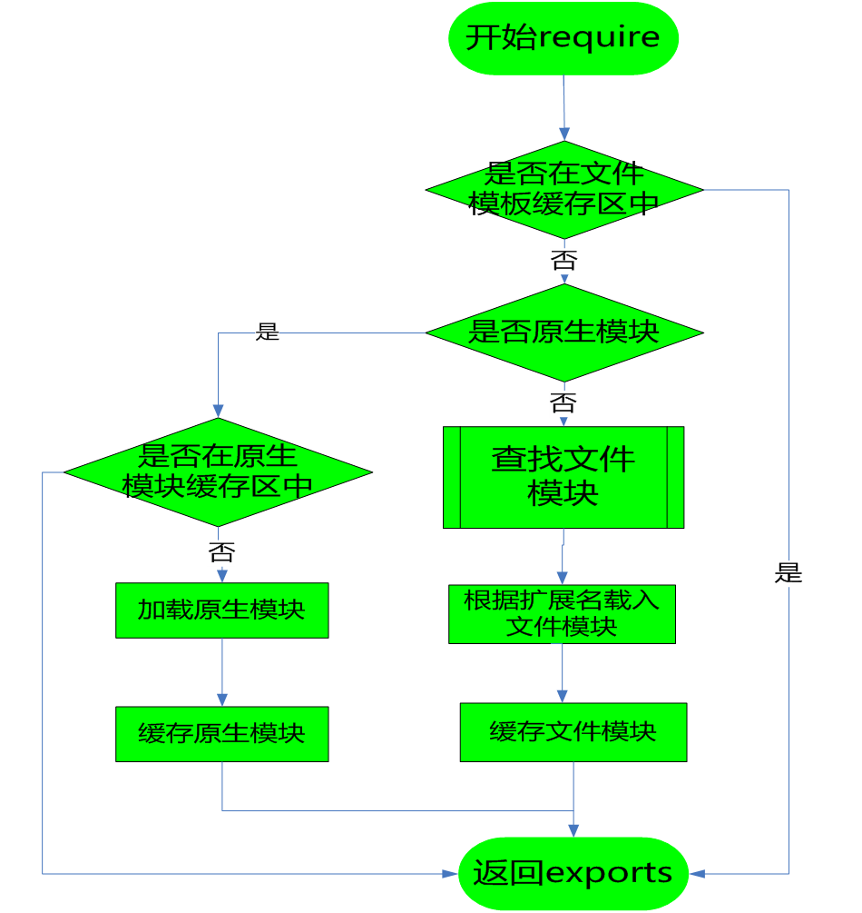

> 文档：[模块](http://nodejs.cn/api/modules.html)

# 引入

## JS 模块化的不足

- JS 没有模块系统，不支持封闭的作用域和依赖管理
- 没有标准库，没有文件系统和IO流API
- 也没有包管理系统

## 模块化的历史进程

1. 命名空间
2. 闭包、自执行函数
3. require.js AMD（淘汰）
4. sea.js CMD（淘汰）
5. node.js CommonJS
6. es6 ES-Module
7. umd amd+cmd+es-module

## CommonJS 规范

- 封装功能
- 封闭作用域
- 可能解决依赖问题
- 工作效率更高，重构方便

## nodejs 中的 CommonJS

- 每个 JS 文件都是一个模块
- require 方法，实现模块加载
- npm 包管理工具，实现模块的自动加载和安装依赖

> lib/vm.js 

# 一、[require](http://nodejs.cn/api/modules.html#modules_require)

> 实现变量私有，底层使用的还是闭包实现

## 加载步骤

1. 找到文件
2. 读取文件模块内容 fs.readFileSync
3. 将其封装在一个函数里立刻执行，Module.wrap 拼接字符串生成函数
    - !function(exports, require, module, __filename, __dirname){}()
    - 函数执行返回的是 module.exports （也就是模块中的 this）
4. 执行后把模块的 module.exports 对象复制给变量

- 部分源码
    ```javascript
    // 获取绝对路径
    var dirname = path.dirname(filename); 
    // 从底层获取 require 方法  
    var require = internalModule.makeRequireFunction.call(this);
    // 参数组：当前模块到处对象、require 方法、当前模块、当前文件绝对路径、当前文件夹绝对路径
    var args = [this.exports, require, this, filename, dirname];
    var depth = internalModule.requireDepth;
    if(depth === 0) stat.cache = new Map();
    // 模块内部，this.exports 等于当前模块导出对象，等于this
    var result = compliedWrapper.apply(this.exports, args);
    if(depth === 0) stat.cache = null;
    return result;
    ```

## 使用同步加载原因

- 同步加载阻塞，可能造成整体效率不如异步加载，但是依然使用了同步加载方式，为什么？
- 模块实现缓存，第一次加载后会缓存 exports 对象，再次加载直接读缓存
- 放在 require.cache 对象中，key 是绝对路径（这样才有复用的意义）

## require 的属性

- require.cache[Object] 模块缓存
- require.resolve[Function] 解析模块，获取模块绝对路径，但不加载
- requrie.main[Module] 入口模块
- require.extensions[Object] 不同文件扩展名的加载方法（v0.10已废弃）
    - node 模块类型
        - js 模块
        - json 模块，找到文件 -> 读取文件内容 -> JSON.parse 转成对象返回
        - node 模块，c++扩展二进制模块，读了直接用

## module 的属性

```javascript
Module {
    id: '.',        // 模块id，入口模块的 id 永远为 .
    exports: {},    // 导出对象，默认是一个空对象
    parent: null,   // 父模块，此模块是由哪个模块来加载的
    filename: 'D:\\XX.js',  // 当前模块的绝对路径
    loaded: false,  // 是否加载完成
    children: [],   // 此模块加载了那些模块
    paths: []       // node_modules 的查找路径，由内向外
}
```

## import 和 require

- import 是静态引用，node 不支持，前端用 webpack 打包后也是转成 require
- require 是动态引用

# 二、模块分类

## 原生模块

- 内置模块放在 node.exe 中，加载速度最快
- http、path、fs、util、events 编译成二进制

## 文件模块

在硬盘的某个位置，加载速度非常慢，文件模块通过名称或路径来加载

- 按类型分
    - 后缀名为 .js 的 JavaScript 脚本文件,需要先读入内存再运行
    - 后缀名为 .json 的 JSON 文件，fs 读入内存 转化成 JSON 对象
    - 后缀名为 .node 的经过编译后的二进制 C/C++ 扩展模块文件,可以直接使用
- 按来源分
    - 自己写，一般通过相对路径或绝对路径加载
    - 第三方，通过名称调用，当前目录或全局的 node_modules 中查找

# 三、模块加载策略



require 到获取 exports 的过程：
- 在模板文件缓存区中，直接拿到 exports
- 不在模板文件缓存区中
    - 原生模块
        - 在原生模板文件缓存区中，直接拿到 exports
        - 不在原生模板文件缓存区中
            1. 加载原生模块
            2. 缓存原生模块
            3. 拿到 exports
    - 文件模块
        1. **查找文件模块**（过程见下节）
        2. 根据扩展名载入
        3. 缓存文件模块
        4. 拿到 exports

# 四、文件模块查找规则


1. 先看 require 写法，获取查找路径
    - require('./xx')
        1. 是否从包加载
        2. 路径为当前路径
    - require('xx')
        1. 查找 module.paths
            - ['', '', '']
            - 从当前目录一直到根目录，每层下的 node_modules 目录均是数组的一项
        2. 查找 global Module 
            - Window 如果在环境变量中设置了 NODE_PATH 变量，并将变量设置为一个有效的磁盘目录，就是全局目录
            - UNIX 操作系统中会从 $HOME/.node_modules $HOME/.node_libraries 目录下寻找
2. 判断查找路径是否为绝对路径
    - 是绝对路径，则清空查找路径，不需要再找
    - 是相对路径，不做操作（保留查找路径）
3. 查看是否已缓存，根据查找路径和文件名
    - 已缓存，则获取实际文件路径，缓存结束查找
    - 未缓存
        1. 直接按文件查，成功，则获取实际文件路径，缓存结束查找
        2. 尝试添加文件扩展名查，成功，则获取实际文件路径，缓存结束查找
        3. 按文件夹查，找文件夹中的 package.json 的 main 对应的文件，成功，则获取实际文件路径，缓存结束查找
        4. package.json 的 main 对应的文件添加文件扩展名查，成功，则获取实际文件路径，缓存结束查找
        5. 找文件夹中的 index(.js/.node) ，成功，则获取实际文件路径，缓存结束查找
        6. 进入下一 module.paths（也就是 node_modules）中查，再顺序中执行上面的步骤

# 五、包 package.json

> [package.json](https://docs.npmjs.com/files/package.json)、[package.json 阮](http://javascript.ruanyifeng.com/nodejs/packagejson.html)

项目 | 描述
-- | --
name | 项目名称
version | 版本号
description | 项目描述
keywords: {Array} | 关键词，便于用户搜索到我们的项目
homepage | 项目url主页
bugs | 项目问题反馈的Url或email配置
license | 项目许可证
author,contributors | 作者和贡献者
main | 主文件
bin | 项目用到的可执行文件配置
repository | 项目代码存放地方
scripts | 声明一系列npm脚本指令
dependencies | 项目在生产环境中依赖的包
devDependencies | 项目在生产环境中依赖的包
peerDependencies | 应用运行依赖的宿主包

# 六、npm

## 命令

```bash
$ npm install <package name>@<version spec> -g
$ npm uninstall <package name>
$ npm update <package name>
```

## 发布 npm 模块

- npm adduser
- npm init 创建 package.json
- npm publish xxx
- npm update xxx
    
- 常见报错：
    - 切换 cnpm 到 npm
        - no_perms Private mode enable, only admin can publish this module -> 
    - 切换 name
        - You do not have permission to publish "npmtest". Are you logged in as the correct user?
    - 需要验证邮箱
        - you must verify your email before publishing a new package: https://www.npmjs.com/email-edit : fornpmtest01
    - 版本号要更新
        - You cannot publish over the previously published versions: 1.0.1. : fornpmtest01

> [npm 模块安装机制简介](http://www.ruanyifeng.com/blog/2016/01/npm-install.html)

# 七、yarn

有兴趣自己查