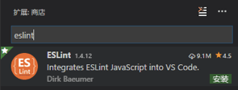
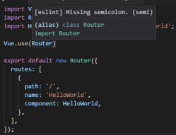
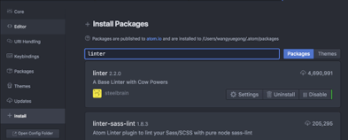
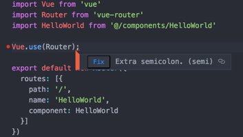
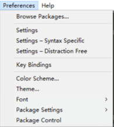
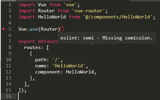
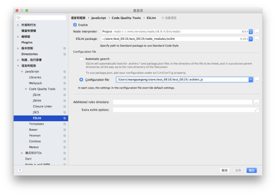
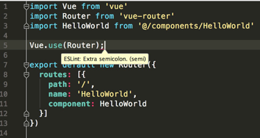

> ESLint + IDE-plugin + Git-hook 代码检查方案

# 一、背景

JavaScript是一门神奇的动态语言，它在带给我们编程的灵活性的同时也悄悄埋下了一些地雷。除了基本的语法错误能在程序一启动的时候被检测到之外，很多隐含的错误都是在运行的时候才突然地蹦出来。除非你的程序有着100%的测试覆盖率，否则说不定哪天就会因为一个 xxx is undefined 而导致程序崩溃，而为了避免这样的错误可能你只需要在提交代码的时候用工具静态分析一下，仅此而已。

## 1、现状

在团队协作中，为避免低级 Bug、产出风格统一的代码，会预先制定编码规范，然后使用 Lint 工具和代码风格检测工具，则可以辅助编码规范执行，有效控制代码质量。一般团队都会有较完善的代码开发规范文档。

然而实际情况是在开发过程中，开发人员很难严格参照开发规范，也并未使用相关功能来进行代码检测，甚至先学怎么关闭 vue 项目中的 ESlint 功能。

## 2、诉求

编写合理的约束规则，借助易于接受的相关工具，制定’懒人’方案，让开发人员能够在开发过程中快速定位问题并解决，以**形成良好的编码风格，增加代码鲁棒性**。

## 3、几种 Lint 工具对比

> 某些常见的代码问题不能被编译器捕获，用于扫描源代码以捕获这些问题的工具都叫 Lint 或 Linter 。

### 3.1 JSLint

JSLint 是最早的代码分析工具之一，它实现了一套严格的默认规则。JSLint 的核心是 Top Down Operator Precedence（自顶向下的运算符优先级）技术实现的 Pratt 解析器，该解析器的处理结果本质上类似于 AST（抽象语法树）。

但随着前端技术发展，JSLint 暴露了不足：`固定规则`和不关注社区反馈。

### 3.2 JSHint

在 JSLint 暴露不足的前提下， JSHint 诞生，其核心实现仍基于 Pratt 解析器的基础上，但进行了很多改进：更多可配置的规则、代码模块化、CLI、测试。JSHint是一个灵活的JavaScript代码分析工具，它很好的平衡了真正的错误和老旧的语法，至今为止仍广泛用于前端项目。

但随着前端爆发式增长带来的需求，使得 JSHint 疲于应付，由于规则检查和 Pratt 解析器深度耦合，使得通过暴露 AST 信息来支持第三方插件的思路无法得以实现。

### 3.3 ESLint

在 JSHint 无法满足的领域，ESLint 应运而生，通过关注点分离的架构使其拥有了良好的可维护性和扩展性、通过将代码解析与代码检查逻辑分开使其支持自定义规则，这些都使其在当前大环境下更加适应需要，如通过调整解析器和插件来满足 bable、react-jsx、vue 语法解析。

ESLint 是一个插件化的 Javascript 代码检测工具，它可以**用于检查常见的 JavaScript 代码错误，也可以进行代码风格检查**，这样我们就可以根据自己的喜好或约定定制一套 ESLint 配置，然后应用到所编写的项目上，从而实现辅助编码规范的执行，有效控制项目代码的质量。

拥有特性：
- ESLint 使用 Espree JavaScript 解析（ECMAScript 解析架构）
- ESLint 使用 AST 评估模式的代码
- ESLint 完全可插入式的,每一个规则是一个插件,支持插件扩展、自定义规则
- 默认规则包含所有 JSLint、JSHint 中存在的规则，易迁移
- 规则可配置性高：可设置「警告」、「错误」两个 error 等级，或者直接禁用
- 包含代码风格检测的规则

提供支持：
- ES6
- AngularJS
- JSX
- Style 检查
- 自定义错误和提示

提供校验：
- 语法错误校验
- 不重要或丢失的标点符号，如分号
- 没法运行到的代码块（使用过 WebStorm 的童鞋应该了解）
- 未被使用的参数提醒
- 漏掉的结束符，如}
- 确保样式的统一规则，如 sass 或者 less
- 检查变量的命名

此处，我们选择 ESLint 并非 JSHint 不再实用，而是出于考虑拥抱未来和工具统一。下面我们来一起看下 ESLint 的基本用法和进阶方案。

参考：[JS Linter 进化史](https://mp.weixin.qq.com/s/juB6QotmECtHHh2e3vRgoQ)

# 二、ESLint 入门

> [中文官网](eslint.cn/)

## 1、安装

### 1.1 本地安装

```bash
$ npm install eslint --save-dev         // 安装依赖
$ ./node_modules/.bin/eslint --init     // 初始化配置 .eslintrc 或 npx eslint --init
$ ./node_modules/.bin/eslint xxx.js     // 测试指定文件
```

### 1.2 全局安装（建议）

```bash
$ npm install -g eslint     // 安装依赖
$ eslint --init             // 初始化配置 .eslintrc
$ eslint xxx.js             // 测试指定文件
```

注意：由于 Node.js 的 require 函数的行为，全局安装的 ESLint 实例只能使用全局安装的 ESLint 插件，本地安装的版本，只能用 本地安装 的插件。不支持混合本地和全局插件。
更多命令行用法，请查看官方文档

## 2、[配置](eslint.cn/docs/user-guide/configuring)

### 2.1 内嵌配置

Configuration Comments - 使用 JavaScript 注释把配置信息直接嵌入到一个代码源文件中。

```javascript
// 1. 指定行禁用规则
alert('foo'); // eslint-disable-line

// eslint-disable-next-line
alert('foo');

// 2. 指定行禁用指定规则 / 插件规则，支持多个
alert('foo'); /* eslint-disable-line no-alert */

/* eslint-disable-next-line no-alert */
alert('foo');

// 3. 指定代码块禁用规则，如果无 enable 则整个文件禁用
/* eslint-disable */

alert('foo');

/* eslint-enable */

// 4. 配置具体规则
/* eslint eqeqeq: "off", curly: "error" */
/* eslint eqeqeq: 0, curly: 2 */
```

### 2.2 [文件配置 .eslintrc.*](eslint.cn/docs/user-guide/configuring#configuration-file-formats)

使用 JavaScript、JSON 或者 YAML 文件为整个目录（处理你的主目录）和它的子目录指定配置信息。可以配置一个独立的 .eslintrc.* 文件，或者直接在 package.json 文件里的 eslintConfig 字段指定配置，ESLint 会查找和自动读取它们，再者，你可以在命令行运行时指定一个任意的配置文件。

使用 JavaScript、JSON 或者 YAML 文件为整个目录（处理你的主目录）和它的子目录指定配置信息。可以配置一个独立的 .eslintrc.* 文件，或者直接在 package.json 文件里的 eslintConfig 字段指定配置，ESLint 会查找和自动读取它们，再者，你可以在命令行运行时指定一个任意的配置文件。

**说明：**

1. 就近原则，优先使用同级目录下的配置文件，没有则向上级目录查找，最终到主目录（通常为~/）或发现一个有{"root": true}的配置；如果有多个，则就近原则覆盖规则
2. 同级目录优先级 .js .yaml .yml .json 无后缀 package.json
3. 可以设置 {"root": true} 来禁止向上级目录查找配置文件，用于限制 ESLint 的影响范围

**可配置项：**

1. extends 继承其他规则
    - 取值可以使字符串或字符串数组（后面的优先级高）
    - 可以继承他人共享的规则，通常通过 npm 包
    - 推荐使用 "extends": "eslint:recommended" 来启用自带的核心规则，并在此基础上调整项目需要
2. **【重要】[env](eslint.cn/docs/user-guide/configuring#specifying-environments)**指定脚本运行环境
    - 每种环境都有一组特定的预定义全局变量
    - 环境并不是互斥的，可以同时定义多个
    - 可以在配置文件中、命令行中、js注释中
    - eg：
        - browser 浏览器环境中的全局变量
        - amd 将 require() 和 define() 定义为像 amd 一样的全局变量
3. **【常用、重要】rules** 规则
    - 简单取值
        - "off" 或 0 - 关闭规则
        - "warn" 或 1 - 开启规则，使用警告级别的错误：warn (不会导致程序退出)
        - "error" 或 2 - 开启规则，使用错误级别的错误：error (当被触发的时候，程序会退出)
    - 数组字面量取值
        - 描述规则选项，[错误等级，处理方式]，如 "quotes": ["error", “double”]，详见各规则说明
4. **【常用】globals 设置全局变量**
    - 将变量设置为 true 将允许变量被重写，或 false 将不允许被重写，如 "globals": {"var1": true, "var2": false }
5. parser 解析器、parserOptions 配置
    - 替换解析器需要满足一定条件，常见的是 babel-eslint 解析器
    - 默认支持 ES5 语法，可以设置 parserOptions 来支持 ES6、JSX，具体参见文档
6. plugins 第三方插件
    - 限于 npm 插件，如果是 jquery 插件等前端插件，建议在 globals 选择中声明
    - plugins 属性值 可以省略包名的前缀 eslint-plugin-，如 vue 项目中使用到了 eslint-plugin-html，配置为 "plugins": ['html']
7. root 设置根目录

## 3、[规则](eslint.cn/docs/rules/)

ESLint 提供了大量的规则来满足不同的需求，且默认关闭，均通过配置来进行开启以满足不同项目的需要。

规则主要涉及 逻辑错误、最佳实践、严格模式、变量声明、nodejs、ES6、代码风格 等，我们可以根据需要来进行设置。

规则不是完全统一的，**需要团队内讨论并制定适用自己团队的规则**。附件中有几份网上看到的推荐规则，可以作为参考。

## 4、忽略 .eslintignore

- 用法同 .gitignore
- 一次只有一个 .eslintignore 文件会被使用，不是当前工作目录下的 .eslintignore 文件将不会被用到
- ESLint总是忽略 /node_modules/* 和 /bower_components/* 中的文件
- 注意代码库的 node_modules 目录，比如，一个 packages 目录，默认情况下不会被忽略，需要手动添加到 .eslintignore

# 三、在 IDE 中使用

每次检验都是用命令行会带来些许不变，一方面参数需要记忆，一方面问题发现延迟。不过大部分的 IDE 都有与之匹配的插件来帮我们完成这些工作（校验和自动修复）。

## 1、vscode

### 1.1 安装插件

安装方法：扩展（ctrl+shift+x） -> 查找指定插件 -> 点击安装

所需插件：ESLint



### 1.2 配置

配置方法：文件 -> 首选项 -> 设置

查看配置：搜索关键字 eslint

添加配置："eslint.autoFixOnSave": true, (建议，保存自动修复)

```javascript
"eslint.validate": [
    "javascript",  //  用eslint的规则检测js文件
    {
        "language": "vue",   // 检测vue文件
        "autoFix": true   //  为vue文件开启保存自动修复的功能
    },
    {
        "language": "html",
        "autoFix": true
    },
],
```

### 1.3 效果

如图，出现错误有个红线，鼠标移入会提示错误



## 2、Atom

### 2.1 安装插件

- 安装方法1：Atom -> Preferences -> Install -> Search -> 查找指定插件 -> Install
- 安装方法2：apm指令（自行查询）

所需插件：linter、linter-eslint



### 2.2 配置

添加配置：linter-eslint 按需勾选 Fix errors on save（建议，保存自动修复）

### 2.3 效果

如图，出现错误有个小红点，鼠标移入会提示错误并提供文档链接（赞，虽然是英文），支持自动修复的还有fix按钮



## 3、sublime

### 3.1 安装插件

安装方法：Preferences -> Pageage Control -> 输入ins -> 选择Install Package -> 查找指定插件 -> 点击安装

所需插件：SublimeLinter、SublimeLinter-eslint、ESLint Formatter



### 3.2 配置

配置方法：Preferences -> Pageage Settings -> 选择插件 -> 选择 Settings -> 根据需求添加配置项

添加配置：ESLint Formatter 插件增加 "format_on_save": true (建议，保存自动修复)

### 3.3 效果

如图，出现错误有个红框，鼠标移入会提示错误



### 3.4 补充说明

- SublimeLinter 读取文件时默认将所有 换行符 转为 LF，暂时无解，建议关闭相关规则
- 推荐全局配置 Preferences -> Settings

```javascript
"draw_white_space": "all",      // 显示 tab 和 空格
"show_encoding": true,          // 在状态栏显示当前编码
"show_line_endings": true       // 在状态栏显示当前文件换行符类型
```

## 4、webstorm

### 4.1 启用并配置

进入配置方法1：Webstorm -> Preferences（或File -> setting）-> Languages&Frameworks -> JavaScript -> Code Quality Tools -> ESLint
进入配制方法2：Webstorm -> Preferences（或File -> setting）-> 搜索 eslint

启用配置：勾选 Enable

修改配置：主要是 configuration file 路径，node 和 eslint 包位置自动查询（全局）



### 4.2 效果

如图，出现错误有个红线，鼠标移入会提示错误



### 4.3 补充说明

- 自动修复方法：文件中右键或文件名右键，选择 Fix Eslint Problems
- 也可以采用插件方式，没必要，而且在 fix 执行时会影响整个项目，不推荐使用

# 四、git-hook 配合

上述方法是在编码过程中来执行约束，当然 ESLint 也可以配合 gulp 、webpack 等工具使用，其中 vue-cli 生成的项目中已经在 webpack 中集成了，不需要额外处理，至于使用 gulp lint 指令就不推荐使用了。所以为了**增加另一层强约束**，考虑通过 git-hook 在 pre-commit 和 pre-push 时来执行校验。

相关的工具有 husky 和 pre-commit ，此处考虑扩展性，选用 husky 来管理所有 git 钩子。

## [husky](https://github.com/typicode/husky)

安装： 
```bash
$ npm install husky@next —save-dev
$ npm install husky@^0.15.0 —save-dev
```

使用：
```json
// package.json
{
  "husky": {
    "hooks": {
      "pre-commit": "npm lint",
      "pre-push": "eslint *.js --fix"
    }
  }
}
```

补充：
- 绕过 git 钩子：git commit --no-verify -m

# 写在最后

初识 ESLint ，也曾被它满屏的 error 震惊，或许关闭是"最快"的处理方法，但 ESLint 检测是必要的，保持良好的代码风格，让代码更强壮。当我们掌握它的规律，再来使用它，你会看到不一样的天空。让我们一起玩转 ESLint。
