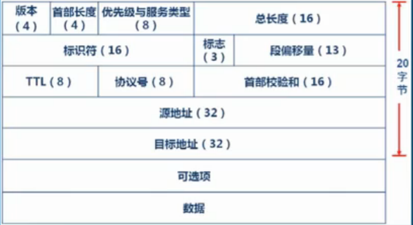
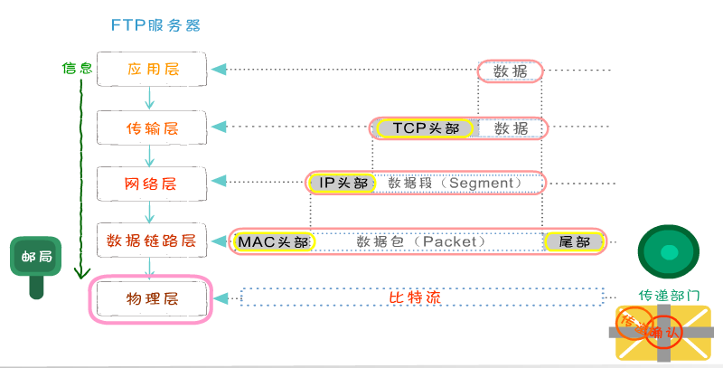

## 网络分析软件

- win 科来网络分析系统
- mac wireshark

# 一、基础理论

## 1.1 协议的概念和作用 #

- 为了让计算机能够通信，计算机需要定义通信规则，这些规则就是协议
- 规则是多种，协议也有多种
- 协议就是 **数据封装格式 + 传输手段**

## 1.2 OSI 七层模型

> Open System Interconnection,适用于所有的网络

### 分层原因

- 分工带来效能
- 将复杂的流程分解为几个功能相对单一的子进程
- 整个流程更加清晰，复杂问题简单化
- 更容易发现问题并针对性的解决问题

### 分层

分层 | 功能
--- | ---
应用层(Application) | 提供网络与用户应用软件之间的接口服务(服务器、浏览器)
表示层(Presentation) | 提供格式化的表示和转换数据服务，如加密和压缩(格式、加密协议、压缩)
会话层(Session) | 提供包括访问验证和会话管理在内的建立和维护应用之间通信的机制()
传输层(Transimission) | 提供建立、维护和取消传输连接功能，负责可靠地传输数据(PC TCP/UDP)
网络层(Network) | 处理网络间路由，确保数据及时传送(路由器分配 IP 给设备，关注通过 IP 寻址)
数据链路层(DataLink) | 负责无错传输数据，确认帧、发错重传等(交换机，数据帧，关注怎么建立连接、操作校验、流量控制)
物理层(Physics) | 提供机械、电气、功能和过程特性(网卡、网线、双绞线、同轴 电缆、中继器等物理设备，关注怎么传输0和1)

# 二、TCP/IP 参考模型

基础说明：
- TCP/IP 是 **传输控制协议/网络互联协议** 的简称，又称 **网络通讯协议**
- 早期的 TCP/IP 模型是一个四层结构，从下往上依次是网络接口层、互联网层、传输层、应用层（OSI 七层模型中的应用层、表示层、会话层）
- 后来借鉴OSI七层参考模型，将网络接口层拆分形成五层结构；从下往上依次是**物理层、数据链路层、网络层、传输层、应用层**

## 常用协议

> TCP/IP 是个协议簇，并不是简单的 tcp + ip 层，主要是由 IP协议(网络层) 和 TCP协议(传输层) 组成，是一个很大的协议集合

- 物理层无特定协议，支持所有的标准和专用的协议
- 数据链路层无特定协议，支持所有的标准和专用的协议
- 网络层定义了 IP(网络互联) 协议
    - 网际协议 IP(Internet Protocal) 负责主机和网络之间**寻址**和路由数据包
    - 地址解析协议 ARP(Address Resolution Protocol) 获得同一物理网络中的硬件主机**MAC地址**，通过 ip 找 mac
    - 反向地址转换协议 RARP(Reverse Address Resolution Protocol) 允许局域网的物理机器从网关服务器的ARP表或者缓存上请求其IP地址，通过 mac 找 ip
    - 网际控制消息协议 ICMP(Internet Control Message Protocol) 发送消息，并报告有关数据包的传送错误**PING**
    - 互联组管理协议 IGMP(Internet Group Management Protocol) IP主机向本地多路广播路由器报告主机组成员
- 传输层定义了 TCP(传输控制协议) 和 UDP(用户数据报) 协议
    - TCP 复杂报文头、可靠、ARQ(超时重传)机制、拥塞处理、单播 
    - UDP 面向报文(简单报文头)、不可靠、高效、单/广播，基于 IGMP
- 应用层定义了 HTTP(超文本传输协议)、FTP(文件传输协议)、DNS(域名系统) 等协议

## 2.1 物理层

- 协议：无特定协议
- 作用：为数据端设备提供传送数据的通路
- 数据传输过程：
    - 激活物理连接，在连接的设备之间连接起来形成通路
    - 传输数据，关心如何打包数据和控制传输速度
    - 关闭物理连接
- 描述：关心的是用什么信号来表示0和1，是否可以双向通信，最初的连接如何建立以及完成连接如何终止，物理层是为数据传输提供可靠的环境

## 2.2 数据链路层

> 数据帧（Frame）：是一种信息单位，它的起始点和目的点都是数据链路层。等于 MAC 头部 + 数据包 + 尾部，主要提供 MAC 地址。

- 协议：无特定协议
- 作用：把源计算机网络层传过来的信息传递给目标主机，把 IP 解析成 MAC (ARP 协议？)
- 数据帧(Frame)相关：
    - 帧是数据链路层的传输单位，由数据组合而成
    - 数据链路的建立、维护和拆除
    - 帧包装、帧传输、帧同步
    - 帧的差错恢复
    - 流量控制
- MAC 地址（局域网寻址？）
    - 在通信过程中是用内置在网卡内的地址来标识计算机身份的
    - 每个网卡都有一个全球唯一的地址来标识自己，不会重复
    - MAC地址48位的二进制组成，通常分为6段，用16进制表示，前24位是供应商标识，后24位是供应商对网卡的唯一编号
        - 问题：TODO 虚拟网卡怎么保证唯一标识
    - 公网没有 MAC 地址库，局域网内部维护 MAC 和 IP 对应关系（不稳定绑定关系）
        - 铁打的 IP ，流水的 MAC 

## 2.3 网络层(互联网层)

> 数据包（Packet）：也是一种信息单位，它的起始和目的地是网络层。等于 IP 头部 + 数据段，主要提供 IP 地址。

- 协议：IP、ARP、RARP、ICMP、IGMP
- 作用：提供路由和选址的工作，给每个机器配一个 IP 地址？
- 选址:
    - 交换机是靠 MAC 来寻址，而 MAC 地址是无层次的，所以要靠 IP 地址来确认计算机的位置，这就是选址
- 路由：
    - 在能够选择的多条道路之间选择一条最短的路径
- 描述：用于把数据从源主机经过若干个中间节点传送到目标主机，并向传输层提供最基础的数据传输服务

### IP 头

> 共20个字节

- 1~4字节 基本信息
    - 4bit 版本
    - 4bit 首部长部
    - 8bit 优先级与服务类型
        - 3bit 优先权字段，数值越小优先级越低
        - 4bit 的 TOS 子字段
            - 分别代表：最小时延、最大吞吐量、最高可靠性和最小费用，同时只能有一个置1
            - Telnet、Rlogin这两个交互应用要求最小的传输时延，FTP文件传输要求最大吞吐量，最高可靠性是指网络管理（SNMP）和路由选择协议。用户网络新闻要求最小费用
        - 1 bit未用位，必须置 0
    - 16bit 数据包总长度
        - 2*16-1=65535字节，也就是 64kb ，包括头和数据
- 5~8字节 确保数据连贯、有序
    - 16bit 标识符 
        - 唯一标识主机发送的每一份数据报
    - 3bit 标志
        - 保留位：一般被置为0
        - 不分片位：表示该数据报是否被分片，如果被置为1，则不能对数据报进行分片，如果要对其进行分片处理，就应将其置为0
        - 更多片位：除了最后一个分片，其他每个组成数据报的片都要将该位置设置为1
    - 13bit 段偏移量
        - 该分片相对于原始数据报开始处位置的偏移量
- 9~12字节 校验数据有效性
    - 8bit TTL(Time to Live生存时间) 
        - 该字段用于表示 IP 数据包的生命周期，可以防止一个数据包在网络中无限循环地发下去。
        - 特指一个 IP 数据包传输时的最大跳步数
        - 每经过一个路由器，TTL 减一，等于0就不再继续传输
    - 8bit 协议号 
        - 用以指示IP数据包中封装的是哪个协议
    - 16bit 首部校验和 
        - 目的主机和网络中的每个网关都要重新计算报头的校验和，一样表示没有改动过.
- 13~16字节
    - 源 IP 地址 4*8 32位
- 17~20字节
    - 目标 IP 地址 4*8 32位

### IP 地址(广域网寻址？)

- 有 IP 地址库，且具有唯一性
- 地址格式：32位二进制组成 8*4 4个字节，4个十进制数 0~255
- 地址组成：网络部分 network + 主机部分 host
- 地址分类：
    - 标准：
        - 由 Internet 地址分配机构来统一分配的，保证 IP 唯一性
    - 特殊：
        - 0.0.0.0(全0)，启动时的ip地址，尚未分配
        - 255.255.255.255(全1)，限制广播地址，可理解为所有网络的所有主机
        - 127.x.x.x，除127.255.255.255外都代表本机
    - 具体：
        - A类
            - 规则，前8 network(0NNNNNNN) + 后24 host
            - network 范围 1~126 2^7，host 范围 2^24-2(不带全0和全1)
            - network 数量最少，主机范围最大，价格最高
            - 私有ip，10.0.0.0 ~ 10.255.255.255
        - B类
            - 规则，前16 network(10NNNNNN) + 后16 host
            - network 范围 128~191 2^(6+8)，host 范围 2^16-2(不带全0和全1)
            - 中等
            - 私有ip，172.16.0.0 ~ 172.31.255.255
        - C类
            - 规则，前24 network(110NNNNN) + 后8 host
            - network 范围 192~223 2^(5+16)，host 范围 2^8-2(不带全0和全1)
            - network 数量最大，主机范围最小，价格最低
            - 私有ip，192.168.0.0 ~ 192.168.255.255

### 子网掩码

- 用途：
    - 将某个 IP 地址划分成网络地址和主机地址两部分
    - 划分子网，使得同一 IP 下也能隔离出不可以互相访问的子网
- 说明：
    - 它是一种用来指明一个 IP 地址的哪些位标识的是主机所在的子网，以及哪些位标识的是主机位的掩码
    - 子网掩码不能单独存在，它必须结合IP地址一起使用
- 规范：
    - 子网掩码也是32个二进制位
    - 对应 IP 的网络部分用 1 表示(连续的1)
        - 1的个数决定子网的个数，也就是子网的 ID 
        - 网络部分相同的才属于同一子网，才可以相互访问
    - 对应 IP 的主机部分用 0 表示(连续的0)
        - 0的个数决定子网的容量，也就是子网主机 IP 地址范围
        - 2**N - 2，因为规定每个子网的第一个IP地址为网段地址，最后一个IP地址为广播地址，都不可用
    - IP 地址和子网掩码做逻辑与运算得到网络地址
        - 0和任何数相与都是0
        - 1和任何数相与都等于任何数本身
- 缺省值：
    - A类 255.0.0.0
    - B类 255.255.0.0
    - C类 255.255.255.0
- 表示方式:
    - 通过与IP地址格式相同的点分十进制表示
        - 如 255.0.0.0 或255.255.255.128
    - 在IP地址后加上"/"符号以及1-32的数字，其中1-32的数字表示子网掩码中网络标识位的长度
        - 如 192.168.1.1/24 的子网掩码也可以表示为255.255.255.0
- 补充：
    - RFC950 规范下，不能使用第一个和最后一个子网
        - 第一个子网的网络地址和主网络的网络地址是重叠的，最后一个子网的广播地址和主网络的广播地址也是重叠的，会引起混乱
    - CIDR 规范下，不再限制

## 2.4 传输层（TCP 面试）

> 段（Segment）：通常是指起始点和目的地都是传输层的信息单元。等于 TCP 头部 + 数据，主要提供端口号。

- 协议：TCP、UDP
    - TCP(Transimision Control Protocal)
        - 传输控制协议
        - 可靠的、面向连接的协议
        - 传输效率低
    - UDP(User Datagram Protocal)
        - 用户数据报协议
        - 不可靠的、无连接的服务
        - 传输效率高
- 作用：提供了一种端到端的连接
    - 扩展：带宽上限的问题，访问量激增的时候会打满贷款，造成服务宕机（DOS 攻击，拒绝服务攻击）

### 2.4.1 TCP 

#### 基本特点

- 是**面向连接的、可靠的**进程到进程通信的协议（端口号）
    - 保证双向的接收和发送都正常
    - 并非实际物理连接
    - 靠端口号确认具体进程
- TCP提供全双工服务，即数据可在同一时间双向传播
- TCP将若干个字节构成一个分组，此分组称为报文段(Segment)

#### 数据可靠性

- 对可靠性要求高的上层协议，实现可靠性的保证
- 如果数据丢失、损坏的情况下如何保证可靠性
    - 而网络层只管传递数据，成功与否并不关心

#### TCP 功能

- 将数据进行**分段打包**传输
- 对每个数据包**编号控制顺序**
- 运输中丢失、重发和丢弃处理
- **流量控制**避免拥塞

#### TCP 数据包封装

> 默认20个字节，可以比对 IP 头看

- 1~4字节
    - 16bit 源端口号
        - 发送 TCP 进程对应的端口号，0~65535(2^16-1)，所以端口号范围就是这个
        - 发送方端口号是进行随机端口
    - 16bit 目标端口号
        - 目标端接收进程的端口号
        - 目标端口号决定了接收方哪个程序来接收 
            - eg：80 http 、443 https 、 21 FTP 、
    - 计算机通过端口号识别访问哪个服务，比如 http 服务或 ftp 服务
- 5~8字节
    - **32bit 序列号** sequence number
        - 用途：
            - TCP 用序列号对数据包进行标记，以便在到达目的地后重新重装
            - 发送时顺序发送，但是接收顺序不固定，所以需要标识数据顺序，以便数据不会出现错乱
        - 规则：
            - 初始值，在建立连接时通常由计算机生成一个随机数作为序列号的初始值 
                - 主机 A 和主机 B 的序列号没有任何关系，各自随机生成
            - 后续值，假设当前序列号为 s，发送数据长度为 l，则下次发送数据时的序列号为 s + l
- 9~12字节
    - **32bit 确认号** acknowledment number
        - 用途：
            - 用于确认这个位置以前所有的数据都已被正常接收
        - 规则：
            - 等于下一次应该接收到的数据的序列号
            - 假设发送端的序列号为 s，接收数据的长度为 l，那么接收端返回的确认应答号也是 s + l
        - 说明：
            - 首次发送请求是 0 （此时 ACK=0），作为请求响应时，才需要用确认号来向对方确认（此时 ACK=1）
            - 正确情况下，确认号应该是下次对方的序列号
- 13~16字节 基本信息
    - 4bit 首部长部 header length
        - 单位：4 字节
        - 默认：值是 5，表示 TCP 首部的长度为 5*4字节 = 20 字节
    - 6bit 保留
    - **六个控制位** flags
        - 对 TCP 的连接、传输和断开进行指挥，均为置 1 有效
        - 1bit URG urgent 紧急位（优先级）
            - 表示紧急数据的末尾在 TCP 数据部分中的位置
            - 通常在暂时中断通信时使用（比如输入 Ctrl + C）
            - 配合后面的 16bit 紧急指针使用
        - 1bit ACK acknowledgement 确认位
            - 确认序列号有效位，表明该数据包包含确认数据
            - 补：
                - 建立连接时，后两次握手需要将这个值设为 1 ，表明已成功收到数据；过程中数据长度为 1
                - 断开连接时，每次挥手都需要设为1
        - 1bit PSH push 急迫位
            - 缓存区将满，立刻传输数据 
        - 1bit RST reset 重置位
            - 连接断了重新连接
        - 1bit SYN synchronous 同步位
            - 请求建立连接
            - 补： 
                - 建立连接时，前两次握手要将这个值设为 1，表明是要建立连接
        - 1bit FIN finish 终止位
            - 发送端完成位，提出断开连接的一方把 FIN 置为 1 表示要断开连接
            - 补：
                - 断开连接时，1、3次挥手要将这个值设为1，表明是要断开连接
    - **16bit 窗口大小**
        - 用途：用于 TCP 传输的流量控制（性能优化）
        - 规则：
            - 窗口值，说明本地可接收数据段的数目
                - 窗口值的大小是可变的
                - 从应答号开始可以接受多少个 8 位字节，用于决定对方同时可发送的数据量
                - 窗口大小为 0 时可以发送窗口探测。
            - 当网络通畅时将这个窗口值变大加快传输速度，当网络不稳定时减少这个值可以保证网络数据的可靠传输
- 17~20字节 校验
    - 16bit 校验和
        - 用途：用于 TCP 传输的差错控制
        - 规则：
            - TCP校验和的计算包括TCP首部、数据和其它填充字节
            - 在发送TCP数据段时，由发送端计算校验和，当到达目的地时又进行一次检验和计算
            - 如果两次校验和一致说明数据是正确的，否则将认为数据被破坏，接收端将丢弃该数据
    - 16bit 紧急指针

#### 握手和断开

- 三次握手（连接）
    1. 主机A SYN ，发出连接请求
    2. 主机B SYN ACK ，响应收到主机 A 连接请求，发出连接请求（确认主机 A -> 主机 B 正常）
    3. 主机A ACK ，响应收到主机 B 连接请求（确认主机 B -> 主机A 正常）
- 四次挥手（断开）
    1. 主机A ACK FIN ，发出断开请求
    2. 主机B ACK ，响应收到主机 A 断开请求
        - 注：如果主机 B 还有还数据未发送，则该响应不能省略，不能等待数据发完后只发送 3 ，因为不立即响应的话，主机 A 会一直发送请求
    3. 主机B ACK FIN ，主机 B 确认可以断开后（等将剩余数据发送完后），发出断开请求
        - 注：如果主机 B 还有还数据未发送，则主机 B 不能立即断开连接，需要确认数据已发送完成才断开，此时不能和 2 合并；如果没有数据了可以直接合并，省略 2
    4. 主机A ACK ，响应收到主机 B 断开请求

### 2.4.2 UDP

#### 基本特点

- UDP 是一个无连接、不保证可靠性的传输层协议
    - 发送端不关心发送的数据是否到达目标主机、数据是否出错等，收到数据的主机也不会告诉发送方是否收到了数据
    - 本身不可靠，由上层协议来保障可靠性
- 传输效率高
    - 首部结构简单，在数据传输时能实现最小的开销，如果进程想发送很短的报文而对可靠性要求不高可以使用

#### UDP 数据包封装

> 默认16个字节，可以比对 TCP 看

- 1~4字节
    - 16bit 源端口号
    - 16bit 目标端口号
- 5~8字节
    - 16bit UDP 长度
        - 包含数据的长度，可以算出数据的结束位置
    - 16bit UDP 校验和
        - 可选的差错控制

#### UDP 应用

- QQ
- 视频直播
- TFTP 简单文件传输协议(短信)

## 2.5 应用层（HTTP）

> 消息（message）：是指起始点和目的地都在网络层以上（经常在应用层）的信息单元。最终源数据。

常见协议：
- HTTP 超文件传输协议
- FTP 文件传输协议
- SMTP(发送邮件)和POP3(接收邮件)

## 2.6 案例：各层的实际作用

> 数据 -> 传输层(包) -> 网络层(段Segment) -> 数据链路层(帧)

### 发送方从高层到低层封装数据

1. 应用层：把各式各样的数据如字母、数字、汉字、图片等转换成二进制，**数据**
2. 传输层：分割上层数据成小数据段，并为每个分段后的数据封装 TCP 报文头部（关键端口号），组合成**数据段**
    - 端口号用于标识上层的协议或应用程序，确保上层数据的正常通信
    - 计算机可以多进程并发运行，如发邮件的同时可以通过浏览器浏览网页，这两种应用通过端口号进行区分
3. 网络层：给数据段加上 IP 报文头部（关键 IP 地址），组合成**数据包**
    - IP 地址用于标识网络的逻辑地址
4. 数据链路径层：给数据包加上 MAC 头部（关键 MAC 地址）和尾部，组成**数据帧**
    - MAC 地址就是固化在硬件设备内部的全球唯一的物理地址
5. 物理层：将上面层层封装后的二进制数据**比特流转换成电信号**在网络中传输

### 接收方从低层到高层解封数据

1. 物理层：先把电信号转成二进制数据，并将数据传送至数据链路层
2. 数据链路层：把 MAC 头部拆掉，并将剩余的数据传送至网络层
3. 网络层：把 IP 头部拆掉，并将剩余的数据送至传输层
4. 传输层：把 TCP 头部拆掉，将真实的数据传送至应用层
5. 应用层：使用真实数据

### 真实网络环境的补充

- 发送方和接收方中间可能会有多个硬件中转设备
- 中间可能会增加交换机和路由器
    - 交换机属于数据链路层，MAC 和 IP 的对应关系
    - 路由器属于网络层，IP 寻址，分配子网 IP 
- 数据在传输过程中不断地进行封装和解封装的过程，每层设备只能处理哪一层的数据

## 补充：域名和 DNS 

### 域名

- 根域
    - 一般认为全球有13台根逻辑域名服务器
- 顶级域
    - 用于指示某个国家/地区、组织使用的名称的类型名称
    - 包括 组织域、国家/地区域
        - cn 中国
        - com 商业公司
        - net 网络公司
        - edu 教育机构
        - gov 非军事政府机构
        - Mil 军事政府机构
- 二级域名
    - 个人或组织在网上使用的注册名称
    - eg: test.com
- 子域
    - 已注册的二级域名派生的域名
    - eg: www.test.com

### DNS 服务器

> Domain Name Service ，DNS 服务器进行域名和与之对应的 IP 地址转换的服务器

- IP地址不易记忆
- 早期使用Hosts文件解析域名
    - 主要名称重复
    - 主机维护困难
- DNS(Domain Name System 域名系统)
    - 分布式
    - 层次性

查找过程：
1. 客户端向 **本地 DNS 服务器** 发出请求，要 www.163.com 的 IP 地址，本地有缓存则直接返回，没有则进入2
2. 本地 DNS 服务器向 **DNS 根服务器** 发出请求，返回 **.com域服务器** 地址
3. 本地 DNS 服务器向 .com域服务器 发出请求，返回 **163.com域服务器** 地址
4. 本地 DNS 服务器向 163.com域服务器 发出请求，返回域名的 IP 地址 1.1.1.1
5. 本地 DNS 服务器向客户端回复域名 www.163.com 对应的 IP 地址是1.1.1.1，并写入到缓存

## 扩展资料

- [视频：IP包的传送方式](https://www.bilibili.com/video/av2275959/)
- [面试-计算机通识-网络](https://yuchengkai.cn/docs/cs/)
- [通过讲故事搞定前端网络知识](https://juejin.im/post/5c125dcd5188253141436458)
- [故事：TCP/IP 之 大明王朝邮差](https://mp.weixin.qq.com/s?__biz=MzAxOTc0NzExNg==&mid=2665513094&idx=1&sn=a2accfc41107ac08d74ec3317995955e#rd)

## TCP 拥塞处理、滑动窗口