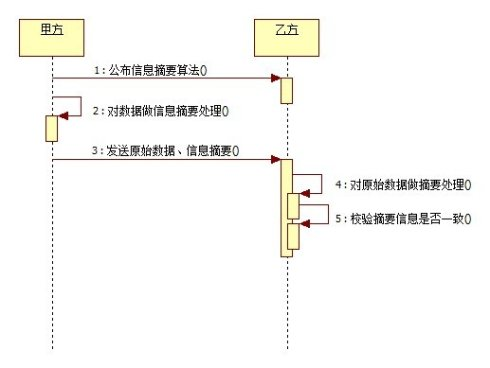
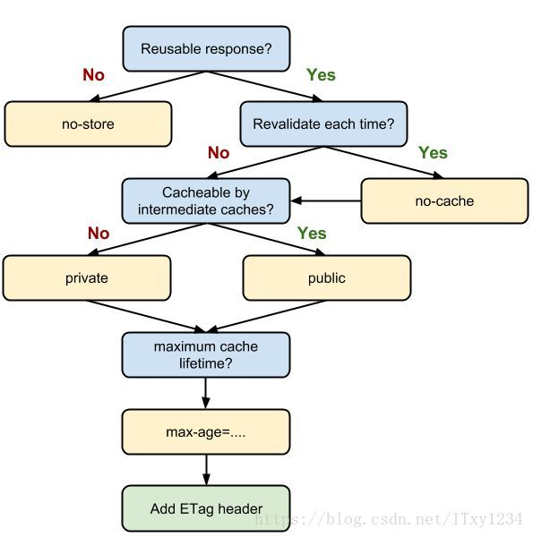

> 项目地址：https://github.com/MoonWang/node-http-static-server

尚未实现：断点续传(2.4)、加密(3.2)、权限(3.3)

使用 Node 中的 http 模块实现一个静态文件服务器，主要功能点如下：

# 一、基本服务

## 1.1 区分文件及文件夹

1. 访问文件
    - 返回文件即可
        ```javascript
        // 发送静态文件给客户端
        sendFile(req, res, filepath, statObj) {
            // code 200 默认，可以不写，content-type 需要设置
            res.setHeader('Content-Type', mime.getType(filepath));
            fs.createReadStream(filepath).pipe(res);
        }
        ```
2. 访问文件夹
    - 返回一个页面（handlebars 模板引擎生成）展示当前目录下的内容
        ```javascript
        // 请求文件夹，需要用模板引擎返回文件列表
        let files = await readdir(filepath);
        // 根据模板页的数据要求，迭代 files
        files = files.map(file => ({
            name: file,
            url: path.join(pathname, file)
        }));
        let html = this.list({
            title: pathname,
            files
        });
        res.setHeader('Content-Type', 'text/html');
        res.end(html);
        ```

## 1.2 命令行启动 + 发布 npm 包

- 命令行启动
    1. 使用 yargs 书写启动文件 www
        - 服务器启动默认配置放在 config.js 中
        - 服务器启动自定义配置可以在启动时传入
    2. 配置 package.json 启动脚本 bin 
        - 本地包全局使用 npm link
            - 会在 npm 启动路径下对应生成两个启动文件，用于适配不同系统
        - 全局包安装后直接全局可用
- 发布 npm 包
    ```bash
    $ npm adduser
    $ npm publish
    ```

## 1.3 压缩

1. 请求文件时，根据请求头 `Accept-Encoding` 来获取浏览器支持的压缩方式
2. 根据不同的压缩方式，选择不同压缩方法，在读流和写流输出之间通过 pipe 进行压缩转换
3. 不支持压缩时，沿用原来的读流、写流操作

## 1.4 缓存

1. 能放到服务器，说明强缓存失效，所以需要判断的只有协商缓存是否可用
    - http1.1 规范，请求头 if-none-match 和文件内容生成的 ETag 对比
    - http1.0 规范，请求头 if-modified-since 和文件最后修改时间 Last-Modified 对比
2. 根据判断结果
    - 缓存可用，则返回 304
    - 缓存不可用，则设置4个缓存相关响应头，然后正常返回资源

报错记录：
- 错误1：Error: Can't set headers after they are sent.
    - 分析
        - 处理HTTP请求时，服务器会先输出响应头，然后再输出主体内容
        - 一旦输出过一次响应头（如执行过 res.writeHead() 或 res.write() 或 res.end()），再尝试通过 res.setHeader() 或 res.writeHead() 来设置响应头时（有些方法比如 res.redirect() 会调用 res.writeHead()），就会报这个错误。
    - 原因
        - 使用了 fs.createReadStream 的方式来流式生成 ETag ，但是后续的判断使用的同步写法，导致了流读完时，请求已经 end
    - 解决
        - 使用 promise 在读流触发 end 事件后再 resolve ，然后执行后续判断操作
- 错误2：设置 cache-control 后不生效，依然发起请求触发协商缓存判断
    - 原因
        - 手动刷新会强制浏览器走服务器，新窗口打开能看到是 200 from cache 
        - 但是 qf 的网站刷新是可以走缓存的，什么原因？TODO 待定

## 1.5 多语言

> 两种思路：客户端驱动(用户手选)、服务端驱动(基于 Accept-Language 请求头实现)

1. 根据 Accept-Language 请求头获取浏览器支持的语言及权重
2. 根据权重从高到低，查找本地支持的语言包
3. 获取语言包，处理资源并响应

```javascript
let http = require('http');
let server = http.createServer(request);
server.listen(8080);
// 语言包
const lanPack = {
    en: { title: 'welcome' },
    zh: { title: '欢迎光临' },
    default: 'zh'
}
function request(req, res) {
    let acceptLanguage = req.headers['accept-language'];
    if (acceptLanguage) {
        const lans = acceptLanguage.split(',')
            .map(function (item) {
                let values = item.split(';');
                let name = values[0];
                let q = values[1] ? parseFloat(values[1].split('=')[1]) : 1;
                return {
                    name, q
                }
            })
            .sort((a, b) => b.q - a.q); // 降序，先匹配优先级最高的

        let lan = lanPack.default;
        for (let i = 0; i < lans.length; i++) {
            // 使用语言包匹配到的第一个
            if (lanPack[lans[i].name]) {
                lan = lans[i].name;
                break;
            }
        }
        // 此处只是将单一文本返回，实际应该是根据 title 获取对应语言包，应用于整个页面
        res.end(lanPack[lan].title);
    }
}
```

## 1.6 防盗链

> 从一个网站跳转，或者网页引用到某个资源文件时，HTTP 请求中带有 `Referer` 表示来源网页的URL

- 通过检查请求头中的 Referer 来判断来源网页的域名
    - 特例：用浏览器直接访问图片地址是没有 Referer 的，即直接用图片地址不会命中防盗链
- 如果不是本域且来源域名不在白名单内，则返回错误提示，在白名单则正常处理

```javascript
// 防盗链白名单
const whiteList = [
    '192.168.0.1',
    'localhost'
];
let refer = req.headers['referer'] || req.headers['refer'];
let type = mime.getType(filepath);
if (refer && /\bimage\b/.test(type)) {
    // 获取 refer 地址和请求源 url，判断是否相同，如果不同是否在白名单中
    let referHostname = url.parse(refer, true).hostname;
    let curretnHostName = url.parse(req.url, true).hostname;
    if (referHostname != curretnHostName && whiteList.indexOf(referHostname) == -1) {
        res.setHeader('Content-Type', 'image/jpg');
        fs.createReadStream(path.join(this.config.root, 'images', 'forbidden.jpg')).pipe(res);
        return;
    }
}

res.setHeader('Content-Type', mime.getType(filepath));
fs.createReadStream(filepath).pipe(res);
```

# 二、常规功能详解

## 2.1 压缩 compress

> [zlib](http://nodejs.cn/api/zlib.html) 是 Node 提供进行压缩及解压缩处理的模块，压缩文件以后可以减少体积，加快传输速度和节约带宽

### 压缩流对象

此时，压缩和解压缩对象都是一个可读可写 transform 转换流，继承自 duplex 双工流

方法 | 说明
-- | --
zlib.createGzip | 返回 Gzip 流对象，使用 Gzip 算法对数据进行压缩处理
zlib.createGunzip | 返回 Gzip 流对象，使用 Gzip 算法对压缩的数据进行解压缩处理
zlib.createDeflate | 返回 Deflate 流对象，使用 Deflate 算法对数据进行压缩处理
zlib.createInflate | 返回 Deflate 流对象，使用 Deflate 算法对数据进行解压缩处理

基本用法：
```javascript
let fs = require('fs');
let path = require('path');
let zlib = require('zlib');

function gzip(src) {
    fs.createReadStream(src)
        .pipe(zlib.createGzip())
        .pipe(fs.createWriteStream(path.join(__dirname, src + '.gz')));
}

function gunzip(src) {
    fs.createReadStream(src)
        .pipe(zlib.createGunzip())
        .pipe(fs.createWriteStream(path.join(__dirname, path.basename(src, '.gz'))))
}
```

在 http 中的应用

> 要不要压缩、用什么格式，需要由客户端决定，根据 accept-encoding 请求头来获取可用压缩格式

```javascript
let http = require('http');
let path = require('path');
let url = require('url');
let zlib = require('zlib');
let fs = require('fs');

// mime模块，设置 Content-Type 头 ，需要安装 npm i mime
let mime = require('mime');

// 为了使用 async/await 大法，需要包装现有方法
let { promisify } = require('util');
let stat = promisify(fs.stat);

http.createServer(request).listen(8080);
async function request(req, res) {
    // 获取访问文件的信息 
    let { pathname } = url.parse(req.url);
    let filepath = path.join(__dirname, pathname);
    try {
        // 判断是否存在文件，不存在会进入 catch
        await stat(filepath); 
        // 可以根据不同的文件内容类型返回不同的 Content-Type
        res.setHeader('Content-Type', mime.getType(pathname));
        // 为了兼容不同的浏览器，Node 把所有的请求头全转成了小写
        let acceptEncoding = req.headers['accept-encoding'];
        // 内容协商，根据浏览器的支持类型来设置
        // Accept-Encoding: gzip, deflate, br
        if (acceptEncoding) {
            if (acceptEncoding.match(/\bgzip\b/)) {
                res.setHeader('Content-Encoding', 'gzip');
                fs.createReadStream(filepath)
                    .pipe(zlib.createGzip())
                    .pipe(res);
            } else if (acceptEncoding.match(/\bdeflate\b/)) {
                res.setHeader('Content-Encoding', 'deflate');
                fs.createReadStream(filepath)
                    .pipe(zlib.createDeflate())
                    .pipe(res);
            } else {
                fs.createReadStream(filepath)
                    .pipe(res);
            }
        } else {
            fs.createReadStream(filepath)
                .pipe(res);
        }
    } catch (e) {
        res.statusCode = 404;
        res.end();
    }
}
```

### 压缩字符串 

> zlib.gzip、zlib.unzip 也是基于流实现

```javascript
let zlib = require('zlib');
let str = 'hello';
zlib.gzip(str, (err, buffer) => {
    // 压缩后数据长度不是一定会变小，所以压缩有适用场景
    console.log(buffer.length);
    zlib.unzip(buffer, (err, data) => {
        console.log(data.toString());
    });
});
```

## 2.2 加密 crypto

> [crypto](http://nodejs.cn/api/crypto.html) 是 Node 中实现加密和解密的模块，使用 OpenSSL 类库作为内部实现加密解密的手段（OpenSSL是一个经过严格测试的可靠的加密与解密算法的实现工具），包括对 OpenSSL 的哈希、HMAC、加密、解密、签名、以及验证功能的一整套封装

### 散列(哈希)算法

> 散列算法也叫哈希算法，用来把任意长度的输入变换成固定长度的输出，常见的有 md5、sha1 等

特点：
- 相同的输入会产生相同的输出
- 不同的输出会产生不同的输出
- 任意的输入长度输出长度是相同的
    - md5 输出32位，sha1 输出40位（相对更安全）
- 不能从输出推算出输入的值

过程：
1. 甲方 公布信息摘要算法
2. 甲方 对数据进行信息摘要处理
3. 甲方 发送原数数据+信息摘要 给乙方
4. 乙方 用甲方提供的算法对原始数据进行信息摘要处理
5. 乙方 校验两个摘要信息是否一致，验证原始数据正确性



存在问题：因为算法是公开的，针对密码破解，出现了彩虹表，可以碰撞暴力破解

常见用途：
- 可以校验下载的文件是否被改动，常用于安装包校验
- 密码加密（扩展可以查看 进阶-性能安全-web漏洞分析）
- 响应头设置值 Content-MD5 ，是响应体的 md5 值

API：
- crypto.getHashes() 查看支持的散列算法
- [crypto.createHash(algorithm[, options])](http://nodejs.cn/api/crypto.html#crypto_crypto_createhash_algorithm_options)
    - 创建并返回 Hash 实例
    - algorithm 是一个可用的摘要算法，例如 sha1、md5、sha256
- [HASH 类](http://nodejs.cn/api/crypto.html#crypto_class_hash)
    - 不能直接 new 创建实例
    - hash.update(data[, inputEncoding])
        - 根据 data 更新(增加) hash 的内容
        - 因为流的特点，该方法可以多次调用（输出前）
            - eg: 在可读流的 data 事件监听函数中调用，可以多次调用
    - hash.digest([encoding])
        - 输出摘要内容，输出后则不能再添加摘要内容，不能再次使用该 Hash 对象
            - eg: 在可读流的 end 事件监听函数中调用，在最后只调用一次

### HMAC 算法（加盐）

> HMAC 算法将散列算法与一个密钥结合在一起，以阻止对签名完整性的破坏

过程：
1. 甲方 构建秘钥
    - 注意秘钥的保存，不要泄露
2. 甲方 发送秘钥给 乙方
3. 甲方 使用秘钥对数据摘要
4. 甲方 发送原始数据+信息摘要给 乙方
5. 乙方 使用秘钥对原始数据进行摘要计算
6. 乙方 验证两个摘要信息是否一致


API：
- [crypto.createHmac(algorithm, key[, options])](http://nodejs.cn/api/crypto.html#crypto_crypto_createhmac_algorithm_key_options)
    - algorithm 是一个可用的摘要算法，例如 sha1、md5、sha256
    - key 是一个字符串，如一个 PEM 格式的密钥
- [Hmac 类](http://nodejs.cn/api/crypto.html#crypto_class_hmac)
    - hash.update(data[, inputEncoding])
    - hash.digest([encoding])
- PEM 格式秘钥
    - 生成指令 $ openssl genrsa -out rsa_private.key 1024
        - 最后个参数是字节数
    - PEM 是 OpenSSL 的标准格式，OpenSSL 使用 PEM 文件格式存储证书和密钥，是基于 Base64 编码的证书
    - window 需要下载 openssl ，mac 自带

### 对称加密

> blowfish 算法是一种对称的加密算法，对称的意思就是加密和解密使用的是同一个密钥

API：
- [加密 crypto.createCipheriv(algorithm, key, iv[, options])](http://nodejs.cn/api/crypto.html#crypto_crypto_createcipheriv_algorithm_key_iv_options)
    - 参数
        - algorithm 是一个可用的摘要算法，如 blowfish
        - key 是一个字符串
        - iv 初始化向量，暂未使用
    - 返回
        - Cipher 实例
    - 如果用管道流处理，则不需要用下面的 update + final
        - input.pipe(cipher).pipe(output);
- [Cipher 类](http://nodejs.cn/api/crypto.html#crypto_class_cipher)
    - cipher.update(data[, inputEncoding][, outputEncoding])
        - 输入参数2指定 data 的编码格式，值必须是 'utf8', 'ascii', 或 'latin1'
        - 没有参数2时， data 必须是 buffer , TypedArray , 或 DataView
        - 输出参数3指定加密数据的输出格式，可以是 'latin1', 'base64' 或 'hex'
        - 同样可以调用多次，蛋不能在 final() 之后调用
    - cipher.final([outputEncoding])
        - 返回加密后的内容，最终输出时 update() + final()
        - 如果参数是 'latin1', 'base64' 或 'hex'，返回字符串
        - 如果没有参数，则返回Buffer
- [解密 crypto.createDecipheriv(algorithm, key, iv[, options])](http://nodejs.cn/api/crypto.html#crypto_crypto_createdecipheriv_algorithm_key_iv_options)
    - 同加密
    - 如果用管道流处理，则不需要用下面的 update + final
        - input.pipe(decipher).pipe(output);
- [Decipher 类](http://nodejs.cn/api/crypto.html#crypto_class_decipher)
    - decipher.update(data[, inputEncoding][, outputEncoding])
        - 和 Cipher 类似，但输入输出的编码格式与之相反
    - decipher.final([outputEncoding])
        - 返回解密后的内容，最终输出时 update() + final()

存在问题：私钥如何安全传递？

### 非对称加密算法

> https 有使用

- 非对称加密算法需要两个密钥：公开密钥(publickey)和私有密钥(privatekey)
- 公钥与私钥是一对，如果用公钥对数据进行加密，只有用对应的私钥才能解密，如果私钥加密，只能公钥解密
- 因为加密和解密使用的是两个不同的密钥，所以这种算法叫作非对称加密算法

为私钥创建公钥：
```bash
$ openssl rsa -in rsa_private.key -pubout -out rsa_public.key
```

API:
- crypto.publicEncrypt(key, buffer) 公钥加密
- crypto.privateDecrypt(privateKey, buffer) 私钥解密
- crypto.privateEncrypt(privateKey, buffer) 私钥加密
- crypto.publicDecrypt(key, buffer) 公钥解密

### 签名

在网络中，私钥的拥有者可以在一段数据被发送之前先对数据进行签名得到一个签名 通过网络把此数据发送给数据接收者之后，数据的接收者可以通过公钥来对该签名进行验证,以确保这段数据是私钥的拥有者所发出的原始数据，且在网络中的传输过程中未被修改。


```javascript
let private = fs.readFileSync(path.join(__dirname, 'rsa_private.key'), 'ascii');
let public = fs.readFileSync(path.join(__dirname, 'rsa_public.key'), 'ascii');
let str = 'zhufengpeixun';
let sign = crypto.createSign('RSA-SHA256');
sign.update(str);
let signed = sign.sign(private, 'hex');
let verify = crypto.createVerify('RSA-SHA256');
verify.update(str);
let verifyResult = verify.verify(public,signed,'hex'); //true
```

## 2.3 缓存 cache

### 缓存作用

- 减少了冗余的数据传输，节省了带宽(网费)
- 减少了服务器的负担，大大提高了网站的性能
- 加快了客户端加载网页的速度

### 缓存分类

- 强制缓存 
    1. 如果生效，则不需要和服务器交互
        - 缓存数据库在浏览器
    2. 优先级高于对比缓存，可同时存在


- 对比缓存(协商缓存)
    1. 不管是否生效，都需要与服务端发生交互（进行比较判断）
    2. 第一次访问服务器时，服务器返回`资源和缓存规则`，客户端把资源缓存到本地缓存数据库
    3. 第二次访问服务器时，客户端将备份的`缓存标识`发送给服务器，服务器根据缓存标识进行判断
        - 是最新资源，返回 304 状态码，通知客户端比较成功，可以使用缓存数据
        - 不是最新资源，返回 200 状态码，并返回新的资源和缓存规则，客户端根据新的缓存规则缓存数据
    


### HTTP1.0 实现对比缓存：最后修改时间 Last-Modified

- 相关 HTTP 标识
    - Last-Modified
        - 响应时告诉客户端此资源的最后修改时间，随文件修改时间改变而改变
    - If-Modified-Since
        - 请求时告诉服务端自己缓存的资源最后修改时间
- 判断过程
    1. 客户端判断资源过期后，使用 Cache-Control 标识的 max-age（先判断强缓存）
    2. 发现缓存资源具有 Last-Modified 声明，则再次向服务器请求时带上头 If-Modified-Since
    3. 服务器收到请求后发现有头 If-Modified-Since 则与被请求资源的最后修改时间进行比对
        - 若最后修改时间较新，说明资源有被改动过，则响应 200 表示已更新，并响应最新的资源内容和规则
        - 若最后修改时间和 If-Modified-Since 一样，说明资源没有修改，则响应 304 表示未更新，通知浏览器使用缓存

```javascript
let http = require('http');
let fs = require('fs');
let path = require('path');
let mime = require('mime');
http.createServer(function (req, res) {
    let file = path.join(__dirname, req.url);
    fs.stat(file, (err, stat) => {
        if (err) {
            // 文件不存在
            return sendError(err, req, res, file, stat);
        } 

        let ifModifiedSince = req.headers['if-modified-since'];
        // 有指定请求头，且最后修改时间未改变，则返回304
        if (ifModifiedSince && ifModifiedSince == stat.ctime.toGMTString()) {
            res.writeHead(304);
            res.end();
        } else {
            send(req, res, file, stat);
        }
    });
}).listen(8080);
// 返回文件并更新时间标识
function send(req, res, file, stat) {
    // 写给客户端，下次才能带上，才可能触发304
    res.setHeader('Last-Modified', stat.ctime.toGMTString());
    res.writeHead(200, { 'Content-Type': mime.getType(file) });
    fs.createReadStream(file).pipe(res);
}
// 返回错误，文件不存在
function sendError(err, req, res, file, stat) {
    res.writeHead(400, { "Content-Type": 'text/html' });
    res.end(err ? err.toString() : "Not Found");
}
```

最后修改时间存在问题：
- 最后修改时间不确定
    - 某些服务器不能精确得到文件的最后修改时间，这样就无法通过最后修改时间来判断文件是否更新
- 修改时间精确度不够（秒级）
    - 某些文件的修改非常频繁，在秒以下的时间内进行修改. Last-Modified只能精确到秒
- 内容可能未修改
    - 一些文件的最后修改时间改变了，但是内容并未改变，我们不希望客户端认为这个文件修改
- 不同 CDN 不统一
    - 如果同样的一个文件位于多个 CDN 服务器上的时候内容虽然一样，修改时间不一样

### HTTP1.1 实现对比缓存：ETag

- 相关 HTTP 标识
    - ETag
        - 实体标签的缩写，根据实体内容生成的 hash 字符串，可以标识资源的状态，随内容变化而改变
    - If-None-Match
        - 请求时告诉服务端自己缓存的资源 hash 字符串
- 判断过程
    1. 客户端判断资源过期后，使用 Cache-Control 标识的 max-age（先判断强缓存）
    2. 发现缓存资源具有 ETag 标识，则再次向服务器请求时带上头 If-None-Match
    3. 服务器收到请求，将请求头中的 If-None-Match 跟服务器中此文件计算而得的 ETag 相比较
        - 如果值不一样，则服务器将发送该文档的最新版本给浏览器客户端
        - 如果值是一样的，则缓存可用，则响应 304 Not Modified 表示缓存未修改过，可以使用缓存

```javascript
let http = require('http');
let fs = require('fs');
let path = require('path');
let mime = require('mime');
let crypto = require('crypto');
http.createServer(function (req, res) {
    let file = path.join(__dirname, req.url);
    fs.stat(file, (err, stat) => {
        if (err) {
            return sendError(err, req, res, file, stat);
        } 
        let ifNoneMatch = req.headers['if-none-match'];
        // 1. 文件比较小的时候，可以用 fs.readFile 来读文件，回调中根据内容来生成 hash 值
        // 2. 文件非常大的时候，可以用 fs.createReadStream 流读取文件，data 事件中 update md5值，end 事件进行判断
        // 上述处理方式虽然慢点，但是保证内容和 ETag 一一对应，有的会用 stat.ctime 来创建 md5 ，这样虽然生成很快，但依然会存在前面的问题
        let out = fs.createReadStream(filepath);
        let md5 = crypto.createHash('md5');
        out.on('data', data => {
            md5.update(data);
        });
        out.on('end', () => {
            // 根据文件内容生成 信息摘要值 作为 ETag
            let etag = md5.digest('hex');
            if (ifNoneMatch && ifNoneMatch == etag) {
                res.writeHead(304);
                res.end();
            } else {
                send(req, res, file, etag);
            }
        });
    });
}).listen(8080);
function send(req, res, file, etag) {
    // 写给客户端，下次才能带上，才可能触发304
    res.setHeader('ETag', etag);
    res.writeHead(200, { 'Content-Type': mime.getType(file) });
    fs.createReadStream(file).pipe(res);
}
function sendError(err, req, res, file, etag) {
    res.writeHead(400, { "Content-Type": 'text/html' });
    res.end(err ? err.toString() : "Not Found");
}
```

### 强缓存实现方法

- 相关 HTTP 标识
    - Cache-Control(http1.1)
        - 指明当前资源的有效期，控制浏览器是否直接从浏览器缓存取数据还是重新发请求到服务器取数据
        - 优先级高于 Expires
        - 取值
            - no-cache 需要使用对比缓存验证数据，强制向源服务器再次验证
            - no-store 所有内容都不会缓存，强制缓存和对比缓存都不会触发
            - max-age=60 缓存内容将在60秒后失效
            - private 客户端可以缓存
            - public 客户端和代理服务器都可以缓存
            - eg: Cache-Control:private, max-age=60, no-cache
    - Expires(http1.0)
        - 服务器响应消息头字段，是服务器的时间，基本不用了
- 判断过程
    1. 第一次请求完成后，浏览器会将文件缓存到Cache目录
    2. 第二次请求时浏览器会先检查 Cache 目录下是否含有该文件，没有则直接请求
    3. 如果有缓存，且还没到Expires设置的时间，即文件还没有过期，直接使用缓存，而不再发送请求
    4. 如果过期了则发起请求（如果有 ETag、Last-Modified 就会带上，判断缓存）

```javascript
let http = require('http');
let fs = require('fs');
let path = require('path');
let mime = require('mime');
http.createServer(function (req, res) {
    let file = path.join(__dirname, req.url);
    fs.stat(file, (err, stat) => {
        if (err) {
            sendError(err, req, res, file, stat);
        } else {
            send(req, res, file);
        }
    });
}).listen(8080);
function send(req, res, file) {
    // http 1.0 标准，基本不用了，使用为了兼容低版本浏览器
    // 设置过期时间
    let expires = new Date(Date.now() + 60 * 1000);
    res.setHeader('Expires', expires.toUTCString());
    // 设置强缓存时间，单位 s ，http1.1 标准
    res.setHeader('Cache-Control', 'max-age=60');
    res.writeHead(200, { 'Content-Type': mime.getType(file) });
    fs.createReadStream(file).pipe(res);
}
function sendError(err, req, res, file, etag) {
    res.writeHead(400, { "Content-Type": 'text/html' });
    res.end(err ? err.toString() : "Not Found");
}
```

### 实际判断过程


### 最佳 Cache-Control 策略



## 2.4 断点续传

# 三、增强功能详解

## 3.1 代理服务器

代理（英语：Proxy），也称网络代理，是一种特殊的网络服务，允许一个网络终端（一般为客户端）通过这个服务与另一个网络终端（一般为服务器）进行非直接的连接。一些网关、路由器等网络设备具备网络代理功能。

意义：
- 保障隐私安全，防止攻击
- 建立日志体系
- 缓存静态资源

分类：
- 正常代理，代理内网用户访问外网服务器
- 反向代理，代理外网用户访问内网服务器

### 第三方包 http-proxy

```bash
$ npm install http-proxy --save
```
```javascript
let proxy = require('http-proxy');
let http = require('http');
let proxyServer = proxy.createProxyServer();

let server = http.createServer(function (req, res) {
    proxyServer.web(req, res, {
        target: 'http://localhost:9000'
    });
}).listen(8000);
```

### 伪方法实现

```javascript
function proxy(req, res, options) {
    let { host, port, pathname } = url.parse(req.url);
    let opts = {
        host: options.target,
        port: options.port,
        method: req.method,
        path: pathname,
        header: req.headers
    }
    http.request(opts, response => response.pipe(res));
}
```

### 虚拟主机

通过 Host 请求头，实现多个网站共用一个端口，多个网站共用一个服务器（nginx 核心功能就是这个）

```javascript
let http = require('http');
let httpProxy = require('http-proxy');
let proxy = httpProxy.createProxyServer();

let hosts = {
    'a.moon.cn': 'http://localhost:8000',
    'b.moon.cn': 'http://localhost:9000'
};
let server = http.createServer(function (req, res) {
    let host = req.headers['host'];
    host = host.split(':')[0];
    let target = hosts[host];
    proxy.web(req, res, {
        target
    });
}).listen(80);
```

## 3.2 加密

## 3.3 权限

# 四、命令行工具详解 

> JS 实现可执行脚本文件

## 4.1 基本实现

### window 下

- 编写 xxx.js 文件
    - 书写 js 代码
- 编写 .bat 启动文件
    ```bash
    // test.bat
    node ./test.js %1
    ```
- 命令行执行 test 即可执行 test.js 文件
    - node 命令在环境变量中，所以可以执行
- 可以通过 %1 获取第一个参数，依次类推可获取其他参数，然后传递

### mac 下

- 编写 xxx 文件
    - 注意：这个文件不需要文件后缀；不再需要一个 xx.js 文件
    - 需要在顶部添加标识，用于解释可执行文件调用哪个命令来执行
    ```javascript
    #! /usr/bin/env node
    console.log(process.argv);
    ```
- 设置权限
    ```bash
    chmod 755 test
    ```
- 普通执行
    - 需要 ./test 带上路径才能执行
- 常规执行
    - (不建议)可以把 test 的路径加入环境变量 PATH
    - (建议)可以在当前目录下创建一个 package.json ，然后执行 npm link 
        ```javascript
        {
            name: 'test',
            "bin":{
                "test": "test"
            }
        }
        ```
    - 现在可以直接 test 执行了

### 获取命令行参数

```javascript
#! /usr/bin/env node
console.log(precess.argv);
```
- 原生 precess.argv 
    - 通过 precess.argv 获取参数数组，[Node路径, 当前路径, 参数1...]
    - 测试 test moon
        ```javascript
        // process.argv
        [ 
            '/usr/local/Cellar/node/11.8.0/bin/node',
            '/Users/store/nodejs/test.js',
            'moon'
        ]
        ```
- 工具 **yargs** 
    - 通过 requrie('yargs').argv 获取参数对象
    - 测试 test --name moon
        ```javascript
        // argv
        {
            _: [], 
            name: 'moon', 
            '$0': 'test.js'
        }
        ```

## 4.2 yargs 用法

### 安装 

```bash
$ npm install yargs --save
```

### 获取命令行参数

```javascript
let argv = require('yargs').argv;
// node test --name moon
console.log(argv.name);
```

参数转换原理、简单实现思路：

```javascript
let argv = {};
let args = process.argv;
// node test --name moon
for (let i = 2; i < args.length; i++) {
    let val = args[i];
    if (val.startsWith('--')) {
        argv[val.slice(2)] = args[++i];
    }
}
exports.argv = argv;
```

### 指定别名

```javascript
let argv = require('yargs')
    .alias('n','name')
    .argv;
// node test -n moon
console.log(argv.n);
```

### 获取非连词线开头参数（下划线属性）

```javascript
let argv = require('yargs').argv;
// node test a --name moon b c
console.log(argv._); // ['a', 'b', 'c']
```

### 命令行参数配置

- 按配置分类设置
    ```javascript
    #!/usr/bin/env node
    let argv = require('yargs')
        .demand(['n'])  // 是否必选
        .default({ n: 'moon' }) // 默认值
        .describe({ n: "你的名字" }) // 提示
        .argv;
    console.log(argv); 
    ```
- 设置 option
    - option 方法允许将所有的配置写入配置对象
    ```javascript
    #!/usr/bin/env node
    let argv = require('yargs')
        .option('n', {
            alias: 'name',  // 别名 -n, --name
            demand: true,   // 必填
            default: 'moon',// 默认
            describe: '请输入你的名字',// 提示
            type: 'string', // 数据类型
            boolean: true
        }).argv;
    console.log(argv);
    ```
- 设置开关参数
    - 当某些参数不需要，只起到开关作用时，可以用 boolean 指定这些参数返回布尔值
    - 参数 private 总是返回一个布尔值
        - 即有 -private 拿到 true，没有时拿到 false
    ```javascript
    #!/usr/bin/env node
    let argv = require('yargs')
        .boolean(['private'])
        .argv;
    console.log(argv);    
    ```

### 帮助信息

```javascript
#!/usr/bin/env node
let argv = require('yargs')
    .option('n',{
        alias: 'name',
        demand: true,
        default: 'moon',
        describe: '名字',
        type: 'string'
    })
    .usage('使用帮助：') // 显示在帮助信息的顶部
    .example('test -n moon','使用 test 传参 n=moon') // 提供例子
    .help('h') // 显示帮助信息，没测试出来
    .alias('h','help')
    .epilog('copyright 2019') // 显示在帮助信息尾部
    .argv;
// 测试 node test --help
```