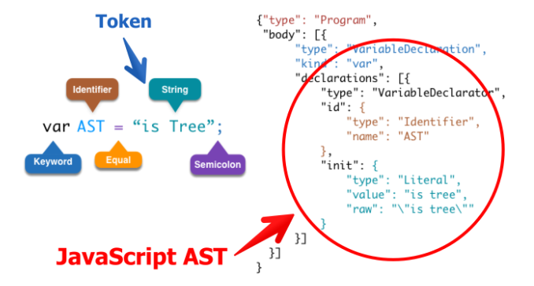
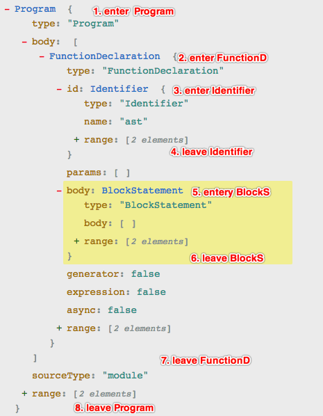
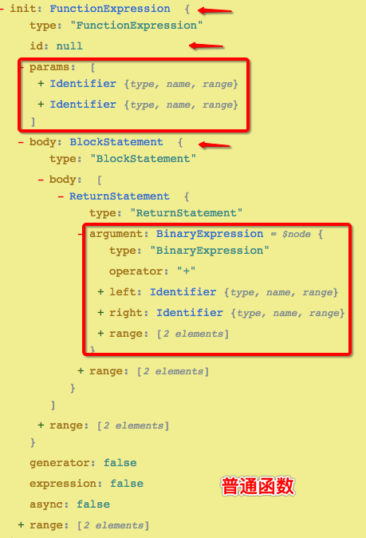
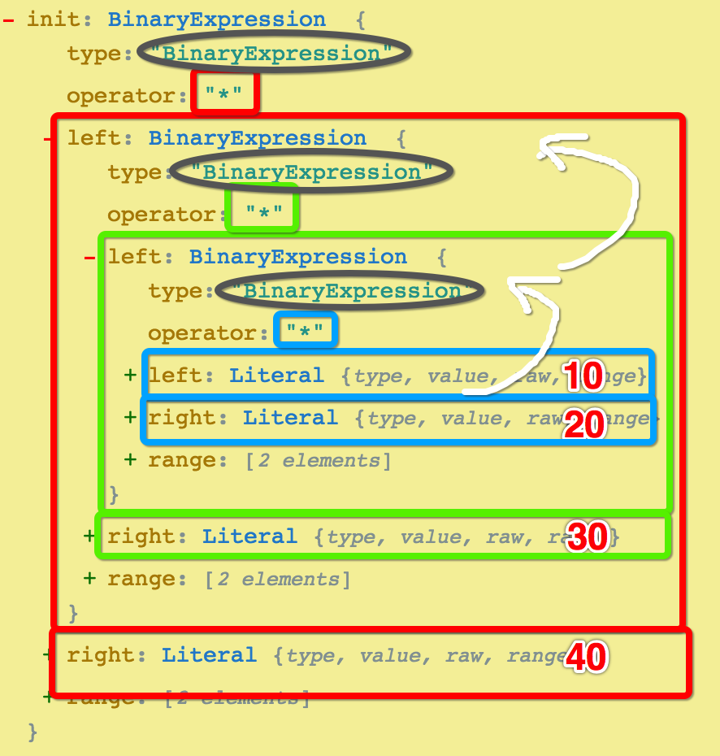
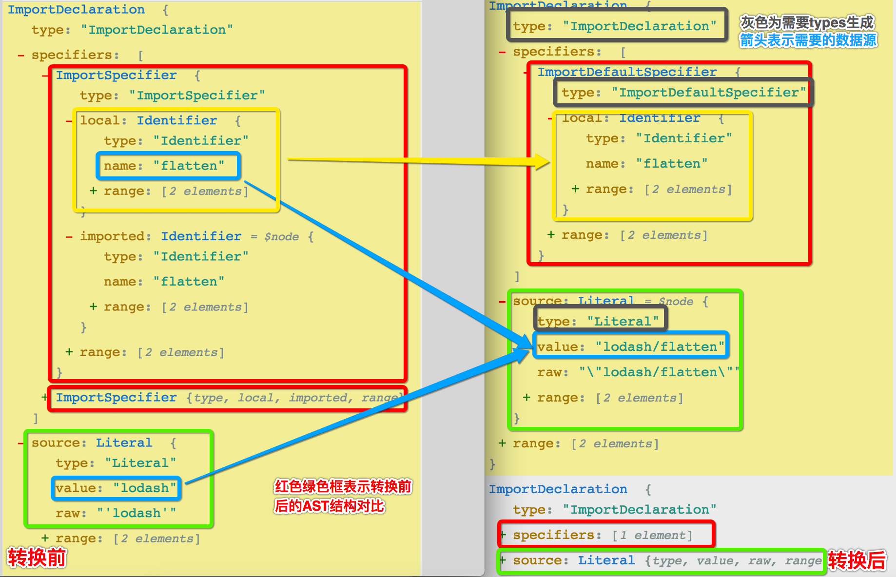

> [在线转换 AST](https://astexplorer.net/) 、 [可视化 AST](http://resources.jointjs.com/demos/javascript-ast)

# 一、概念

> 抽象语法树(Abstract Syntax Tree)

## 1. 定义

在计算机科学中，抽象语法树（abstract syntax tree或者缩写为AST），或者语法树（syntax tree），是源代码的抽象语法结构的树状表现形式，这里特指编程语言的源代码。

Javascript 的语法是为了给开发者更好的编程而设计的，但是不适合程序的理解。所以需要通过 JavaScript Parser 把代码转化为 AST 来更适合程序分析，浏览器编译器一般会把源码转化为 AST 来进行进一步的分析等其他操作。



## 2. 用途

webpack 和 Lint 等很多的工具和库的核心都是通过 AST 抽象语法树这个概念来实现对代码的检查、分析等操作的。AST 定义了代码的结构，通过操纵这颗树，我们可以精准的定位到声明语句、赋值语句、运算语句等等，实现对代码的分析、优化、变更等操作。

- 代码语法的检查、代码风格的检查、代码的格式化、代码的高亮、代码错误提示、代码自动补全等
    - 如 JSLint、JSHint 对代码错误或风格的检查，发现一些潜在的错误
    - IDE 的错误提示、格式化、高亮、自动补全等等
- 代码混淆压缩
    - UglifyJS 等
- 优化变更代码，改变代码结构使达到想要的结构
    - 代码打包工具 webpack、rollup 等等
    - CommonJS、AMD、CMD、UMD 等代码规范之间的转化
    - CoffeeScript、TypeScript、JSX 等转化为原生 Javascript

# 二、JavaScript Parser - esprima

> JavaScript Parser，把 js 源码转化为抽象语法树的解析器

浏览器会把 js 源码通过解析器转为抽象语法树，再进一步转化为字节码或直接生成机器码。一般来说每个js引擎都会有自己的抽象语法树格式，MDN 提供了详细 SpiderMonkey AST format (FireFox)的详细说明，算是业界的标准。

## 1. 常用 Parser

- esprima（常用）
- acorn（webpack）
- traceur
- shift

## 2. esprima

```bash
$ npm i esprima estraverse escodegen -S
```
- 通过 esprima 把源码转化为 AST
- 通过 estraverse 遍历并更新 AST
- 通过 escodegen 将 AST 重新生成源码

```javascript
const esprima = require('esprima'); // 解析成 AST 
const estraverse = require('estraverse'); // 遍历更新 AST
const escodegen = require('escodegen'); // AST 转源码

let code = 'function ast() {}';
// 源码解析成 AST 
let ast = esprima.parseModule(code);

// 遍历的过程类似深度优先，且每个节点都会经历一进一出，如下图所示
estraverse.traverse(ast, {
    enter (node, parent) {
        console.log('enter ', node.type);
        if (node.type == 'Identifier') node.name += '_enter';
    },
    leave (node, parent) {
        console.log('leave ', node.type);
        if (node.type == 'Identifier') node.name += '_leave';
    }
});

// AST 重新生成源码
let rst = escodegen.generate(ast);

console.log(rst); // function ast_enter_leave() {}
```

estraverse 转换的执行过程：


# 三、使用 babel 转换箭头函数

## 1. 基础说明

```bash
$ npm i babel-core babel-types -S
```

- babel-core 
    - 核心库，用来实现核心的转换引擎（自身并不处理转换细节）
- babel-types
    - 可以实现类型判断
    - 可以生成 AST 节点

```javascript
// 访问者模式 Visitor 对于某个对象或者一组对象，不同的访问者，产生的结果不同，执行操作也不同
// 该访问者可以对特定的类型的节点进行处理，以 key (AST 中的节点名称) 为判断依据
let visitor = {
    // 表示要处理 init: ArrowFunctionExpression 节点，即箭头函数
    // 有两种写法
        // 如果要分别处理 entry 和 leave ，则 ArrowFunctionExpression 为一个对象，包含两个函数
        // 如果不需要区分，则可以直接把 ArrowFunctionExpression 声明成一个处理函数
    ArrowFunctionExpression(path){}
};
babel.transform(code, {
    plugins:[
        { visitor }
    ]
})
```

## 2. 实现思路

了解了上面的基础知识后，就可以开始着手实现箭头函数向普通函数的转换。前面提到了 AST 可以用于不同规范的代码转换，所以想要实现要求，我们就考虑先把`箭头函数转成 AST` ，然后使用其中的某些`通用信息`（和普通函数公用的，如参数、返回值等），重新生成`普通函数的 AST` ，然后产出标准代码，就实现了从箭头函数到普通函数的转换。

1. 对比箭头函数和普通函数的 AST ，获取其中相同的信息
    - 使用 https://astexplorer.net/ 转化两种写法，进行差异对比
    - 其中 params 相同、箭头函数 body 和普通函数 returnStatement 的 argument 相同
2. 使用 babel-types 库生成新的 AST 
    - 从文档中查找相关的方法 https://babeljs.io/docs/en/babel-types
    - functionExpression、blockStatement、returnStatement

<div style="display: flex;">
    
    
</div>

## 3. 代码实现

```javascript
let babel = require('babel-core');
let types = require('babel-types');
let code = `let sum = (a,b)=>a+b`;
// 该访问者可以对特定的类型的节点进行处理，以 key (AST 中的节点名称) 为判断依据
let visitor = {
    // 关注箭头函数节点
    ArrowFunctionExpression(path) {
        let params = path.node.params;
        // 生成块语句，作为普通函数的 body
        let blockStatement = types.blockStatement([
            // 用箭头函数的 body 生成普通函数所需的返回声明
            types.returnStatement(path.node.body)
        ]);
        // 生成普通函数的语法：t.functionExpression(id, params, body, generator, async)
        // 根据对比两种函数的 AST ，进行参数所需数据的获取
        let func = types.functionExpression(null, params, blockStatement, false, false);
        // 执行替换
        path.replaceWith(func);
    }
}
// 插件的固有格式
let arrowPlugin = { visitor };
// babel 内部先把代码转成 AST ，然后进行遍历
let result = babel.transform(code, {
    plugins: [
        arrowPlugin
    ]
})
console.log(result.code);
```

# 四、实现一个简单表达式预计算 babel 插件

> [Babel 插件开发指南](https://github.com/brigand/babel-plugin-handbook/blob/master/translations/zh-Hans/README.md#asts)

## 1. 插件说明

```javascript
// 转换前
const result = 10 * 20 * 30 * 40;
// 转换后
const result = 240000;
```

## 2. 实现分析

依然从解析后的 AST 入口，查看其树形结构规则及关键词，搜索对应的 types 方法，用之生成新的 AST ，最后转换生成新的 JS 代码。

从下图看，一个运算表达式会被拆分成多层嵌套的结构，每个 BinaryExpression 都有 left 、right 、operator ，但只有最内层的表达式 left 和 right 都是数字，外层的是表达式，所以替换执行应该是`从内向外递归进行`。



## 3. 插件实现

```javascript
// cal-plugin.js
let babel = require('babel-core');
let types = require('babel-types');
let visitor = {
    BinaryExpression(path){
        let node = path.node;
        // 只有 left 和 right 都是数字才是最内层的，从最内层开始执行计算
        if(!isNaN(node.left.value) && !isNaN(node.right.value)){
            // 用 AST 中相关字段拼接成可执行语句，并获取执行结果
            let result = eval(node.left.value + node.operator + node.right.value);
            // 用执行结果进行替换，从图中看数值节点是 Literal 文字，这里使用 numericLiteral 数字格式的文字
            path.replaceWith(types.numericLiteral(result));
            // 向外递归运算安
            if(path.parentPath && path.parentPath.node.type == 'BinaryExpression'){
                visitor.BinaryExpression.call(null, path.parentPath);
            }
        }
    }
}
module.exports = { visitor };
```

```javascript
// cal-test.js
const babel = require('babel-core');
const result = babel.transform(`let sum = 10 * 20 * 30 * 40;`,{
    plugins:[
        require('./cal-plugin')
    ]
});
console.log(result.code);
```

# 五、实现一个按需加载的 babel 插件

> 功能和用法类似于 antd 中的按需加载插件 [babel-plugin-import](https://github.com/ant-design/babel-plugin-import/blob/master/src/Plugin.js#L127)

## 1. 效果说明

```javascript
// 转换前 
import { flatten, concat } from 'lodash';
// 转换后 
import flatten from "lodash/flatten";
import concat from "lodash/flatten";
```
- 使用前 打包结果：bundle.js  484 KiB    main  [emitted]  main
- 使用后 打包结果：bundle.js  23.7 KiB   main  [emitted]  main

## 2. 实现分析

- 使用 https://astexplorer.net/ 转化两种写法，进行差异对比
- 使用 https://babeljs.io/docs/en/babel-types 文档查找相关的方法



1. 需要监听处理的节点类型为 `ImportDeclaration` (左图)
2. 需要处理的 `specifiers` 需要从 `ImportSpecifier` 转为 `ImportDefaultSpecifier` 类型
3. 生成后的 `ImportDeclaration` 由两部分组成：`specifiers:ImportDefaultSpecifier` `source:stringLiteral`
4. 其中数据来源为：
    - 转换后 `specifiers[0].importDefaultSpecifier.local` 来自转换前 `specifiers[i].local `
    - 转化后 `source.value` 由转换前 `source.value + '/' + specifiers[i].local.name `


## 3. 插件实现

```javascript
let babel = require('babel-core');
let types = require('babel-types');
let visitor = {
    ImportDeclaration(path, ref = { opts: {} }) {
        // ref.opts = { "library": "lodash" }; // 测试时用，正常应该是 bebel 传入
        const { node } = path;
        if (!node) return;
        // ImportDeclaration.source 即开发者 import 引入的包名称，此处是 lodash
        const { value } = node.source;
        // 从 .babelrc 中配置的参数项，获取插件作用库的范围，此处是 lodash
        const { library } = ref.opts;
        // 获取转换前的 specifiers ，遍历它来生成对应数量的 importDeclaration (即新的导入语句)
        const { specifiers } = node;
        if (value == library && !types.isImportDefaultSpecifier(specifiers[0])) {
            let newImports = specifiers.map(specifier => (
                // 语法：t.importDeclaration(specifiers, source)
                types.importDeclaration(
                    // 此处 specifiers 就只有一个元素
                    // 语法：t.importDefaultSpecifier(local) 
                    [ types.importDefaultSpecifier(specifier.local) ], 
                    // source 的值是拼接出来的
                    // 语法：t.stringLiteral(value)
                    types.stringLiteral(`${node.source.value}/${specifier.local.name}`)
                )
            ));
            path.replaceWithMultiple(newImports);
        }
    }
};

// 测试代码
let result = babel.transform(`import { flatten, concat } from 'lodash';`, {
    plugins: [{
        visitor
    }]
});
console.log(result.code);

// 发布代码
module.exports = { visitor };
```

### 补充

开发完成且本地测试完成后，需要发布成 npm 包，然后安装并配置 `.babelrc` 文件来引入该插件

```json
// .babelrc
{
    "presets": [ 
        "env",
        "stage-0"
    ],
    "plugins": [
        [
            "extract", { "library": "loadash" }
        ]
    ]
}
```

> 编译顺序为首先 plugins 从左往右，然后 presets 从右往左

在 Babel 编译 ES6 到 ES5 的过程中，默认只转换新的 JavaScript 语法，而不转换新的 API，所以在需要运行在低版本浏览器的时候，需要 polyfill ES5 不支持的特性。

babel-runtime 内置包中就包含了这些 polyfill ，但是如果每当要转译一个 api 时都要手动加上require('babel-runtime') 会比较麻烦，而 babel-plugin-transform-runtime 的主要的功能是为 api 提供沙箱的垫片方案，不会污染全局的 api ，因此适合用在第三方的开发产品中。