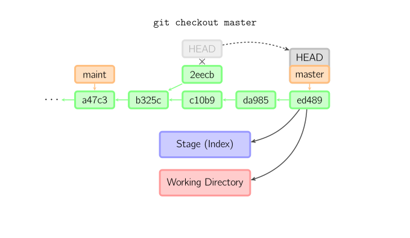
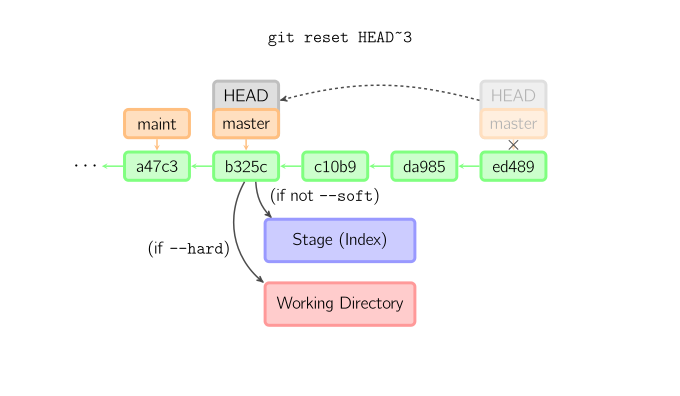
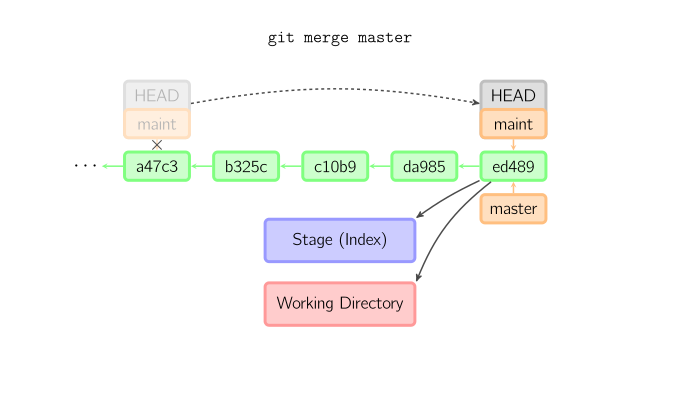
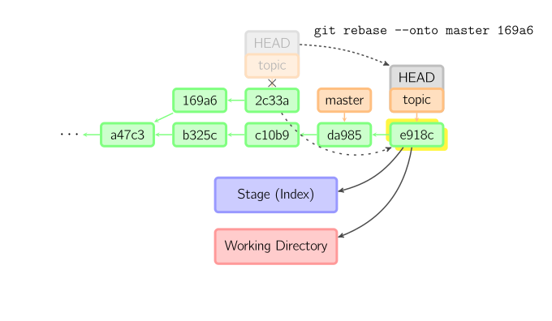

<h1>图解 git 中最常用命令</h1>
> 用配图的方式，理解常用 git 命令的执行，加深理解。但是有部分说明可能有问题，待勘误！
>
> 引用自 https://github.com/geeeeeeeeek/git-recipes/wiki/4.1-图解-Git-命令#detached

[TOC]

# 一、基本用法

上面的四条命令在工作目录、stage 缓存（也叫做 index 索引）和 commit 历史之间复制文件。

- `git add [files]` 把工作目录中的文件加入 stage 缓存
- `git commit` 把 stage 缓存生成一次 commit，并加入 commit 历史
- `git reset -- [files]` 撤销最后一次 `git add files`，你也可以用 `git reset` 撤销所有 stage 缓存文件（带文件名就撤销单个文件缓存）
    - TODO：测试有误？
- `git checkout -- [file]` 把文件从 stage 缓存复制到工作目录，用来丢弃本地修改
    - TODO：测试有误？跟具体文件名才对

你可以用 `git reset -p`、`git checkout -p` 或 `git add -p` 进入交互模式，也可以跳过 stage 缓存直接从 commit 历史取出文件或者直接提交代码。

- `git commit -a `相当于运行 `git add` 把所有当前目录下的文件加入 stage 缓存再运行 `git commit`。
- `git commit files` 进行一次包含最后一次提交加上工作目录中文件快照的提交，并且文件被添加到 stage 缓存。
- `git checkout HEAD -- [file]` 回滚到复制最后一次提交。
    - TODO：测试有误？

# 二、约定

后文中以下面的形式使用图片：

绿色的5位字符表示提交的 ID，分别指向父节点。分支用橙色显示，分别指向特定的提交。当前分支由附在其上的 `_HEAD_` 标识。

这张图片里显示最后 5 次提交，`_ed489_` 是最新提交。 `_master_` 分支指向此次提交，另一个 `_maint_` 分支指向祖父提交节点。

# 三、命令详解

## 1、Diff 差异比较

有许多种方法查看两次提交之间的变动，下面是其中一些例子。

## 2、Commit 提交修改

> 提交时记录的是放在暂存区域的快照，每次提交都是对项目作一次快照，以后可以回到这个状态，或者进行比较

提交时，Git 用 stage 缓存中的文件创建一个新的提交，并把此时的节点设为父节点。然后把当前分支指向新的提交节点。下图中，当前分支是 `_master_`。

### 2.1 普通 commit

在运行命令之前，`_master_` 指向 `_ed489_`，提交后，`_master_` 指向新的节点`_f0cec_` 并以 `_ed489_` 作为父节点。

### 2.2 可能产生冲突的 commit

即便当前分支是某次提交的祖父节点，Git 会同样操作。下图中，在 `_master_` 分支的祖父节点 `_maint_` 分支进行一次提交，生成了 `_1800b_`。

这样，`_maint_ `分支就不再是 `_master_` 分支的祖父节点。此时，[merge](#merge)  或者 [rebase](#rebase) 是必须的。

### 2.3 修改最后一次提交的 commit

如果想更改最后一次提交，使用 `git commit --amend`。Git 会使用与当前提交相同的父节点进行一次新提交，旧的提交会被取消。

另一个例子是[分离HEAD提交](#detached)，在后面的章节中介绍。

## 
3、Checkout 检出 - 修改工作区

> 字面意思就是检出，从某个源（可以为缓存区、当前分支的某个历史节点、某个分支的最新节点、某个标签、远程分支）上检出一个或所有文件，覆盖到缓存区和工作区（如果是从缓存区检出则只覆盖工作区，但是`一定覆盖工作区`）
>
> 用目标节点中文件状态覆盖工作目录中的部分或全部文件，部分情况下还会覆盖缓存区，

`git checkout` 命令用于从历史提交（或者 stage 缓存）中拷贝文件到工作目录，也可用于切换分支。

### 3.1 检出某个文件

> 至少需要指定文件名，如果还指定了节点，则覆盖缓存区和工作区；如果没指定节点，则以缓存区为源

当给定某个文件名（或者打开 `-p` 选项，或者文件名和 -p 选项同时打开）时，Git 会从指定的提交中拷贝文件到 stage 缓存和工作目录。比如，`git checkout HEAD~ foo.c` 会将提交节点 `_HEAD~_`（即当前提交节点的父节点）中的 `foo.c` 复制到工作目录并且加到 stage 缓存中。

如果命令中没有指定提交节点，则会从 stage 缓存中拷贝内容。注意当前分支不会发生变化。

### 3.2 检出某个本地分支

当不指定文件名，而是给出一个（本地）分支时，那么 `_HEAD_` 标识会移动到那个分支（也就是说，我们「切换」到那个分支了），然后 stage 缓存和工作目录中的内容会和 `_HEAD_` 对应的提交节点一致。新提交节点（下图中的 `a47c3`）中的所有文件都会被复制（到 stage 缓存和工作目录中）；只存在于老的提交节点（`ed489`）中的文件会被删除；不属于上述两者的文件会被忽略，不受影响。

### 3.3 其他情况检出一个分离头节点

如果既没有指定文件名，也没有指定分支名，而是一个标签、远程分支、SHA-1 值或者是像 `_master~3_` 类似的东西，就得到一个匿名分支，称作 `_detached HEAD_`（被分离的 `_HEAD_` 标识）。这样可以很方便地在历史版本之间互相切换。比如说你想要编译 1.6.6.1 版本的 Git，你可以运行 `git checkout v1.6.6.1`（这是一个标签，而非分支名），编译，安装，然后切换回另一个分支，比如说 `git checkout master`。然而，当提交操作涉及到「分离的 HEAD」时，其行为会略有不同，详情见在[下面](#detached)。

## 
4、分离头指针

### 4.1 临时分支的特性1

当 `_HEAD_` 处于分离状态（不依附于任一分支）时，提交操作可以正常进行，但是不会更新任何已命名的分支。你可以认为这是在更新一个匿名分支。

### 4.2 临时分支的特性2

> 一旦切换分支以后，没及时处理，这个临时分支就可能没有了，这是优点（丢弃的时候不用额外处理）也是缺点（想要的时候找不回来），所以需要善用这一特性

一旦此后你切换到别的分支，比如说 `_master_`，那么这个提交节点（可能）再也不会被引用到，然后就会被丢弃掉了。注意这个命令之后就不会有东西引用 `_2eecb_`。

### 4.3 保存临时分支

但是，如果你想保存这个状态，可以用命令 `git checkout -b name` 来创建一个新的分支。

## 
5、Reset - 修改工作区

### 5.1 指定目标节点

`git reset` 命令把当前分支指向另一个位置，并且有选择的变动工作目录和索引。也用来在从历史commit历史中复制文件到索引，而不动工作目录。

 如果不给选项，那么当前分支指向到那个提交。如果用 `--hard` 选项，那么工作目录也更新（`相当于清空了工作区本地修改`），如果用 `--soft` 选项，那么都不变。

### 5.2 常用清空工作区和缓存区的方式（使用默认节点）

如果没有给出提交点的版本号，那么默认用 `_HEAD_`。这样，分支指向不变，但是索引会回滚到最后一次提交，如果用 `--hard` 选项，工作目录也同样。

### 5.3 针对具体文件

如果给了文件名(或者 `-p` 选项), 那么工作效果和带文件名的 [checkout](#checkout) 差不多，除了索引被更新。

TODO ：测试有误？

## 
6、Merge

### 6.1 简单合并

`git merge` 命令把不同分支合并起来。合并前，索引必须和当前提交相同。如果另一个分支是当前提交的祖父节点，那么合并命令将什么也不做。

另一种情况是如果当前提交是另一个分支的祖父节点，就导致 `_fast-forward_` 合并。指向只是简单的移动，并生成一个新的提交。

### 6.2 三方合并

否则就是一次真正的合并。默认把当前提交（`_ed489_` 如下所示）和另一个提交（`_33104_`）以及他们的共同祖父节点（`_b325c_`）进行一次[三方合并](http://en.wikipedia.org/wiki/Three-way_merge)。结果是先保存当前目录和索引，然后和父节点 `_33104_` 一起做一次新提交。

## 
7、Rebase

`git rebase` 是合并命令的另一种选择。合并把两个父分支合并进行一次提交，提交历史不是线性的。rebase 在当前分支上重演另一个分支的历史，提交历史是线性的。

本质上，这是线性化的自动的 [cherry-pick](#cherry-pick)。

上面的命令都在 `_topic_` 分支中进行，而不是 `_master_` 分支，在 `_master_` 分支上重演，并且把分支指向新的节点。注意旧提交没有被引用，将被回收。

要限制回滚范围，使用 `--onto` 选项。下面的命令在 `_master_` 分支上重演当前分支从 `_169a6_` 以来的最近几个提交，即 `_2c33a_`。

同样有 `git rebase --interactive` 让你更方便的完成一些复杂操作，比如丢弃、重排、修改、合并提交。

## 
8、Cherry Pick

`git cherry-pick` 命令「复制」一个提交节点并在当前分支做一次完全一样的新提交。

TODO：没用过，体会不到

