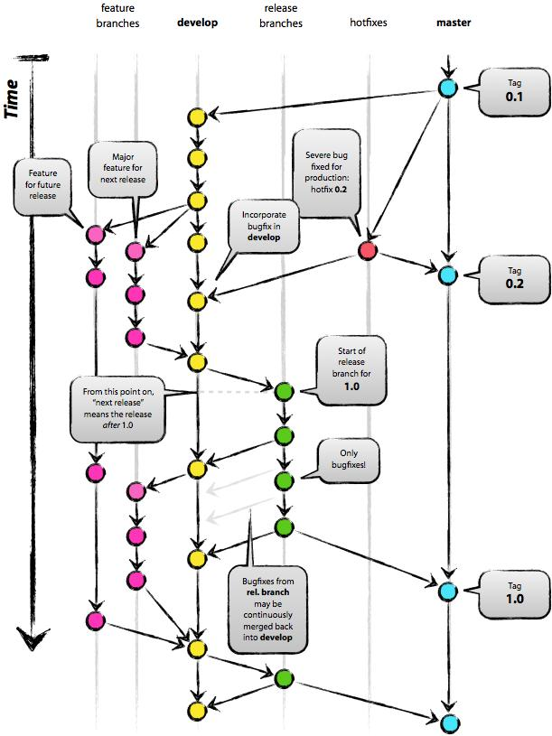
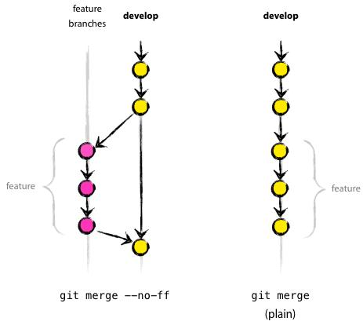

# 前端代码分支管理规范 v1.0

> GIT，在技术层面上，绝对是一个无中心的分布式版本控制系统，但在管理层面上，建议保持一个中心版本库（origin）。



## 1、matser 主分支

- 分支说明
    - 该分支代码与线上运行版本代码保持一致
    - 该分支只作为线上版本留档，不作为发布源码
    - 确保团队成员从该分支获取的代码是稳定运行代码
- 分支维护
    - 仅 teamleader 拥有该分支合并权限
    - 仅线上发布成功后，允许合并代码到该分支，并打上版本标签

## 2、develop/dev 开发分支

- 分支说明
    - 该分支代码由开发人员持续迭代
    - 该分支支撑前后端开发联调环境，与当前在测版本保持一致，对应发布 dev 版本
    - 确保团队成员从该分支获取的代码是（在测版本）最新开发代码
- 分支维护
    - 仅 项目成员 拥有该分支合并权限
    - 仅 teamleader 拥有该分支回滚权限
    
## 3、release 发布（测试）分支

- 分支说明
    - 该分支代码与当前测试环境代码保持一致
    - 该分支支撑测试环境，对应发布 test 版本 
- 分支维护
    - 仅 teamleader 拥有该分支合并权限
    - 仅联调并自测通过后，允许合并代码到该分支，测试进行中不允许合并 
    
## 4、hotfix 热修复（补丁）分支

- 分支说明
    - 该分支从 matser 检出当前最新线上运行版本代码
    - 该分支同时支撑联调及测试环境，对应发布 hotfix 版本
    - 该分支名称固定，修复完成后可删除，不做留档 
- 分支维护
    - 仅 teamleader 拥有该分支合并权限
    - 仅 相关开发人员 拥有检出 master 最新代码及维护权限
    - 仅线上发布成功后，允许将该分支合并到 matser 和 develop 分支
    
## 5、feature 功能（多版本并行）分支

- 分支说明
    - 该分支为支持多版本并行开发
    - 该分支从 develop/dev 检出当前最新开发版本代码，命名为 develop/dev + 版本号
    - 该分支在当前版本测试过程中不允许合并到 develop/dev 分支
- 分支维护
    - 仅 相关开发人员 拥有检出 develop 最新代码及维护权限
    - 仅功能测试并审核通过后，或当前版本测试完成并上线后，允许将该分支合并到 develop/dev 分支

### 补充

- 目前多版本并行开发的项目不多，具体细节可在实际使用时另行修订 
- 检出：
    ```bash
    $ git checkout -b myfeature develop
    ```
- 合并：
    ```bash
    $ git checkout devleopgit merge --no-ff myfeature
    $ git branch -d myfeaturegit push origin develop
    ```
    - --no-ff，即 not fast forward，其作用是，要求git merge即使在fast forward条件下也要产生一个新的merge commit
    - 要求采用 --no-ff 的方式进行分支合并，其目的在于，希望保持原有 “Feature branches” 整个提交链的完整性

    
    
## 6、其他分支

- 分支说明
    - 其他分支只存自傲与开发者本地
- 分支维护
    - 拥有者本人
    
## 参考

- [GIT分支管理是一门艺术](http://kb.cnblogs.com/page/132209/)