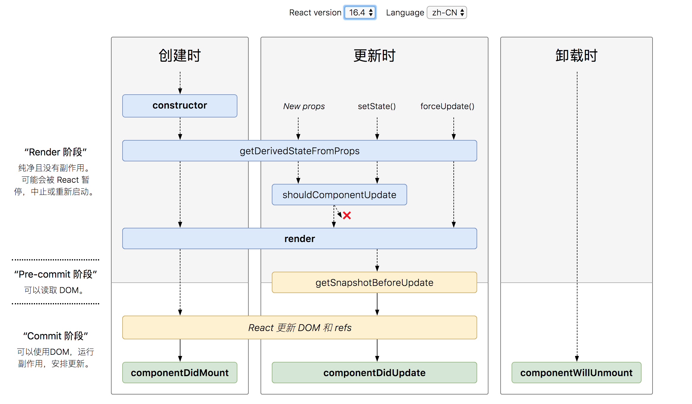

> [React 中文文档](https://react.docschina.org/docs/hello-world.html)

# React 基础知识

## 一、 React 相关包

```bash
$ npm i react react-dom -S
```

- react.js 
    - React 的核心库
- react-dom.js 
    - 提供与 DOM 相关的功能，会在 window 下增加 ReactDOM 属性
    - 内部重要方法 ReactDOM.render() 实现元素渲染

## 二、 JSX 说明

是一种 JavaScript 的语法扩展，看上去像 JS 和 HTML 混合的模板语言，但事实上完全是在 JavaScript 内部实现的。在编译之后，JSX 其实会被转化为普通的 JavaScript 对象。

### 1、 JSX 表达式

- JSX 中的表达式要包含在大括号 {} 中
- JSX 增加换行和锁紧来增加代码可读性，此时需要用 () 包裹，避免分号自动插入的 bug
- JSX 本身也是一种表达式（会被编译成普通 js 对象）
    - 可以在 if 、for 语句中使用 JSX
    - 可以把 JSX 赋值给变量
    - 可以把 JSX 当作函数的参数、返回值
- <{来判断是表达式还是js
    - { 表达式，只能放表达式，不能放 JS 语句，因为一定需要有返回值
    - < JSX、XML

### 2、 JSX 属性

- 属性值为字符串
    ```javascript
    <div tabIndex="0"></div>
    ```
- 属性值为变量
    - 此时不要再加引号，会被识别为字符串而非表达式
    ```javascript
    
    ```
        
注意：JSX 并不是 HTML ，所以在 JSX 中属性不能包含关键字，如：class 需要写成 className ， for 需要写成 htmlFor，并且属性名需要采用驼峰命名法。

### 3、 JSX 转译

> JSX -> React.createElement() -> React Object ，等待被 React 读取转换成 DOM

JSX 其实只是一种语法糖，Babel 转译器会把 JSX 转换成一个名为 `React.createElement()` 的方法调用。

```javascript
// 二者作用相同
const element = (
    <h1 className="greeting">
        Hello, world!
    </h1>
);
// 语法：React.createElement(component, props, ...children)
const element = React.createElement(
    'h1',
    { className: 'greeting' },
    'Hello, world!'
);
```

React.createElement() 这个方法首先会进行一些避免bug的检查，之后会返回一个类似下面例子的对象：

```javascript
// 注意: 以下示例是简化过的（不代表在 React 源码中是这样）
const element = {
  type: 'h1',
  props: {
    className: 'greeting',
    children: 'Hello, world'
  }
};
```

这样的对象被称为 “React 元素”。它代表所有你在屏幕上看到的东西。**React 通过读取这些对象来构建 DOM 并保持数据内容一致**。

#### 为什么编写组件的时候必须引入 React ？

由于 JSX 编译成 `React.createElement` 方法的调用，所以在你的 JSX 代码中，React 库必须也始终在作用域中。即使没有用到它。

### 4、 JSX 防 XSS 攻击

可以放心的在 JSX 中使用用户输入，内部做了处理，在渲染前会过滤输入值，所有内容渲染前都会被转换成字符串，来有效防止 XSS 跨站脚本攻击。

## 三、 ReactDOM.render()

前面提到了， JSX 会被 babel 编译成 React.createElement() ，然后生成 React Object，最后把它们都传递给 ReactDOM.render() 的方法来将其渲染到页面上。

```javascript
ReactDOM.render(JSX, document.getElementById('root'));
```

在实际生产开发中，大多数 React 应用只会调用一次 ReactDOM.render() ，DOM 的更新通过`有状态组件`内部实现。

### 模拟 render 实现

```javascript
// ReactElement 就是虚拟 dom 的概念
// type 表示节点类型，props 表示节点属性
function ReactElement(type, props) {
    this.type = type;
    this.props = props;
}
let React = {
    // 语法：React.createElement(component, props, ...children)
    createElement(type, props = {}, ...childrens){
        childrens.length === 1 ? childrens = childrens[0] : void 0;
        return new ReactElement(type, {...props, children: childrens });
    }
};
let render = (eleObj, container)=>{
    // 先取出第一层 进行创建真实dom
    let { type, props } = eleObj;
    let elementNode = document.createElement(type); // 创建第一个元素
    for(let attr in props){ // 循环所有属性
        if(attr === 'children') { // 如果是 children 表示有嵌套关系
            if(typeof props[attr] == 'object') { // 看是否是只有一个文本节点
                props[attr].forEach(item => { // 多个的话循环判断 如果是对象再次调用render方法
                    if(typeof item === 'object') {
                        render(item, elementNode)
                    } else { //是文本节点 直接创建即可
                        elementNode.appendChild(document.createTextNode(item));
                    }
                })
            } else { // 只有一个文本节点直接创建即可
                elementNode.appendChild(document.createTextNode(props[attr]));
            }
        } else if(attr === 'className') { // class 属性特殊处理
            elementNode.setAttribute('class',props[attr]);
        } else {
            elementNode.setAttribute(attr,props[attr]);
        }
    }
    container.appendChild(elementNode)
};
```

## 四、组件声明、props、state

### 1、函数定义组件

> 在 v16.8 Hooks 出现之前，functional component 只能使用 props 。有了 Hooks 之后，可以使用 props 、 state 、 context 、 refs 、生命周期函数等。关于 Hooks 后面专门开一章学习。

简单例子：
```javascript
function Welcome(props) {
    return <h1>Hello, {props.name}</h1>;
}
```

React 元素除了可以是 DOM 标签外，还可以是自定义组件，自定义组件渲染过程大致如下：

1. render 发现一个用户自定义组件（首字母必须大写）
    - 大写字母开头的标签名表示用户自定义组件，小写字母开头的标签名表示原生 DOM 标签
    - eg：<div \/> 表示一个DOM标签， <Welcome /> 表示一个组件
2. 把 JSX 的属性封装成一个 props 对象
3. 把 props 作为参数传递给自定义组件，获取一个 React 元素形式的返回值
4. 用 render 方法把此 React 元素渲染到页面上
        
### 2、类定义组件

简单例子：
```javascript
class Welcome extends React.Component {
    // 类组件应始终使用 props 调用基础构造函数
    constructor(props) {
        super(props);
        this.state = {date: new Date()};
    }

    render() {
        return (
            <div>
                <h1>Hello, {this.props.name}</h1>
                <h2>It is {this.state.date.toLocaleTimeString()}.</h2>
            </div>
        );
    }
}
```

类组件渲染流程大致如下：

1. ReactDOM.render() 方法调用组件 Xxx
2. 封装 props 属性
3. 找到 Xxx 类的定义，传入 props 实例化，初始化 state
4. 调用实例的 render 方法获得返回元素，将该元素渲染到页面中，成为真实 DOM 
5. 渲染完成调用 componentDidMount 生命周期钩子函数(生命周期后面详细解释)，执行并判断是否需要重新渲染(通过 setState() 来调度UI更新)

### 3、关于 render 返回值

- React 15
    - 只可以返回单一组件
    - 也就是说即使你返回的是一个 string ，也需要用 div 标签包住
- React 16 
    - 支持返回五类
        - React elements
        - Array (v16.0) 和 Fragments (v16.2)
        - Portal (v16.0)
        - String / numbers (v16.0)
        - boolean / null

注意：无论返回的形式是怎么样的，都要`保持 render 是一个纯函数`。所以要求我们不要改 state 的状态，同时不要直接跟浏览器直接交互，让它每次调用生成的结果都是一致的。

### 4、 Props VS State

**props**：

- 可以理解为函数的参数
    - props 是从外部传递组件的数据
    - 组件通过定义自己能够接受的 props 来定义自己的对外公共接口
- props 的只读性
    - 所有的 React 组件必须像纯函数那样使用它们的 props ，这是一条严格规则
    - 不能从组件内修改 props 来触发自身的更新
- props 是一种父级向子级传递数据的方式
    - 可以传字符串、数字
    - 可以传数组，对象
    - 可以传回调函数
- 属性指定方式
    - 字符串常量
        - `<MyComponent message="hello world" />` 等价于 `<MyComponent message={'hello world'} />`
    - js 表达式
        - `<MyComponent foo={1 + 2 + 3 + 4} />`
        - 注意：if 语句和 for 循环并不是表达式
    - 传递变量
        - <MyComponent message={this.state.count} />
        - 注意：注意此时不要加引号，会被当成字符串
    - 展开属性
        - `<Greeting {...props} />`
    - 属性默认为 True
        - `<MyTextBox autocomplete /`> 等价于 `<MyTextBox autocomplete={true} />`
        - 虽然因为符合 HTML 用法而得到支持，但在理解上容易和 `ES6 对象简写`混淆，不建议用

**state**：

- 可以理解为函数的内部变量
- 有状态组件
    - state 用于组件保存、控制以及修改自己的状态，使组件动态的响应并改变组件的输出
    - state 只能在 constructor 中初始化
    - state 需要可序列化
- state 可改变
    - 可以通过修改 state 来触发组件重新渲染
    - 不能直接修改 state ，使用 this.setState() 方法
- state 要保持精简
    - 无关 render 的不要放在 state 上，而应该保存在 this 上
    - 如果在 state 里添加冗余数据或计算所得数据，经常需要手动保持数据同步
- **setState 注意事项** 
    1. setState 可以是异步的
        - this.setState((prevState, props) => ({ }));
        - 在连续调用 setState 时，若需要上次执行结果作为当前执行依据时，可以用这种方式
        - 两个连用相当于 this.setState({}, function() { this.setState({})})
    2. 状态更新合并
        - 可以局部更新，不必更新整个 state
        - 浅合并，大概相当于 Object.assign({}, this.state, newState)
        - 不是每次都会触发更新，内部会合并

### 5、数据自上向下流动

- 一个组件不可能知道另一个组件是有状态还是无状态，所以状态 state 是局部的，其他组件不可访问
- 一个组件可以传递给其子组件数据，子组件通过 props 获取改数据内容，但不知道数据来源（state、props、用户输入）
- 所以 state 是组件特有，其中的数据可以通过 props 传递来影响其子组件，这就是`自上向下`或`单向`数据流

## 五、生命周期

### 1、旧版 

v15：


- 装载过程 Mount
    - 组件第一次在 DOM 树中渲染的过程，经历了 constructor -> componentWillMount -> render -> componentDidMount
    - constructor
        - 无状态组件不需要 constructor 
        - 主要做两件事，初始化 state、绑定成员函数的 this 环境
    - ~~getInitialState、getDefaultProps 在 constructor 之后，已经废弃了~~
        - 两者只在 React.createClass 中才有
        - ES6版本 直接设置 this.state = {}、static defaultProps = {}
    - **render**
        - 一定要主动实现的函数，没有默认实现
        - 一定要有返回结果，用于构造 DOM 对象
            - 不渲染的组件也要有，并且返回 null 或 false
            - 需要渲染的组件，render 要是一个纯函数，不能产生任何副作用，如调用 setState
    - componentWillMount、componentDidMount
        - 一个 render 之前，一个 render 之后
        - 执行区别，多个组件一起调用时，will 和 render 成对出现，所有 render 结束以后才开始执行 did
        - will 可以在服务端调用，did 只能在浏览器调用，因为没有服务端没有 DOM 也就完成不了装载操作  
- 更新过程 Update
    - 组件重新渲染的过程，经历了 componentWillReceiveProps -> shouldComponentUpdate -> componentWillUpdate -> render -> componentDidUpdate
    - componentWillReceiveProps(nextProps)
        - 只要父组件 render 函数调用，子组件都会触发这个函数，无论 props 是否改变；但是 setState 不会触发
        - 这里注意 JSX 中直接把匿名函数赋值给 onClick 的方法，会因为每次渲染都创造一个新的匿名方法对象，而引起子组件的不必要更新。
        - 性能优化点：判断 nextProps 和 this.props 是否相同，有变化时才需要调用 this.setState 更新内部状态
    - **shouldComponentUpdate(nextProps, nextState)**
        - 一定要有返回结果，用于决定组件什么时候不需要渲染，默认返回 true 更新
        - 性能优化点：通过判断条件主动返回 false 来避免不必要的重新渲染，来提高渲染速度（大型引用感觉尤为明显）
        - 执行 setState 时，直到这个函数，state 依然是上一次的值，所以可以对比 nextState 和 this.state
    - componentWillUpdate、componentDidUpdate
        - 一般在 componentDidUpdate 中可以执行其他 UI 库代码
        - 虽然 did 会在服务端调用，但是一般用不到，服务端渲染基本不会经历更新过程，如果用了可能是程序写错了。
- 卸载过程 Unmount
    - 组件从 DOM 中删除的过程，经历 componentWillUnmount
    - 常用于主动清理非 react 方法创造的 dom 元素、定时器等

### 2、新版 

v16.3：

- 删掉了 componentWillReceiveProps、componentWillMount、componentWillUpdate，替换为一个静态方法 getDerivedStateFromProps，不能访问 this，强制约束使用纯函数，不要搞什么副作用（如ajax）
- 更新时，render 后新增了一个 getSnapshotBeforeUpdate ，返回的数据被当做 componentDidUpdate 参数3，也不要乱用


v16.4：

- 修复 Updating 阶段的时候，无论使用 setState 还是 forceUpdate ，都不调用 getDerivedStateFromProp




- 装载过程 Mount
    - constructor -> getDerivedStateFromProps -> render -> componentDidMount
    - constructor
    - `getDerivedStateFromProps`
        - 静态方法，不允许访问 this，也就不能执行副作用，强制约束
    - render
    - componentDidMount
- 更新过程 Update
    - getDerivedStateFromProps -> shouldComponentUpdate -> render -> getSnapshotBeforeUpdate -> componentDidUpdate
    - `getDerivedStateFromProps`
        - 静态方法，不允许访问 this，也就不能执行副作用，强制约束
        - 任何情况下的更新都会触发，props、state
    - **shouldComponentUpdate(nextProps, nextState)**
        - 依然重要
    - getSnapshotBeforeUpdate
        - 新增声明周期，官方建议是处理 scroll，不要乱用
        - 执行之时DOM元素还没有被更新，给了一个机会去获取DOM信息，计算得到一个snapshot，这个snapshot会作为componentDidUpdate的第三个参数传入。
    - componentDidUpdate(prevProps, prevState, snapshot)
        - 一般在 componentDidUpdate 中可以执行其他 UI 库代码
        - 虽然 did 会在服务端调用，但是一般用不到，服务端渲染基本不会经历更新过程，如果用了可能是程序写错了。
- 卸载过程 componentWillUnmount

## 六、事件处理

### 1、与 DOM 元素的事件处理的区别

1. 属性命名
    - React 事件绑定属性的命名采用驼峰式写法，而不是小写(onclick -> onClick)
2. 属性值
    - 采用 JSX 语法需要传入一个函数作为事件处理函数，而不是一个字符串(DOM元素的写法)
3. 阻止默认
    - 显示调用 e.preventDefault() ，而不是 return flase
        - event 不是原生的，是合成事件，不存在兼容问题
4. 事件绑定
    - 在元素初始渲染的时候提供一个监听器，而不是 addEventListener 添加监听
5. this 绑定
    - 在 class 声明的组件中，类的方法默认是不会绑定 this ，需要手动绑定
    - 绑定方式
        - 在 constructor 中 bind 绑定
            - 即 this.xxx = this.xxx.bind(this)
        - (`推荐`)用属性初始化器 (public class fields syntax) 绑定
            - 即 xxx = () => { ... } 
            - 实验性语法，借助 babel 处理
        - (`不建议`)回调函数中用箭头函数
            - 即 onClick={(e) => this.handleClick(e)}
            - 存在性能问题，每次渲染都会创建一个匿名函数，可能引发不必要的子组件重新渲染

### 2、事件传参

- 可以用 arrow functions
- 可以用 Function.prototype.bind

```javascript
class Popper extends React.Component{
    constructor(){
        super();
        this.state = {name:'Hello world!'};
    }

    // 如果在调用的时候没有 bind ，在声明的时候可以用属性初始化器

    preventPop(name, e){    //事件对象e要放在最后
        e.preventDefault();
        alert(name);
    }
    
    render(){
        return (
            <div>
                <p>hello</p>
                <a href="https://reactjs.org" onClick={this.preventPop.bind(this,this.state.name)}>Click</a>
            </div>
        );
    }
}
```

## 七、条件渲染

- 元素变量
    - 渲染内容在 render 方法外进行逻辑判断，用变量接收渲染内容
    - 渲染时作为一个元素直接使用 { variable }
- 与运算符
    - { condition && expression }
    - 条件 true 时，执行渲染；为 false 时，React 会忽略并跳过
- 三目运算符
    - { condition ? expression1 : expression2 }
    - 说明：条件过于复杂时，就需要考虑提取组件了
- 阻止
    - 返回 null 可以阻止
    - 不会影响该组件生命周期方法的回调

## 八、列表渲染的 keys

> keys 关乎重新渲染的性能，此处只需知道存在意义及使用注意事项，后面会详细说明其作用

- 作用：
    - key 可以在 DOM 中的某些元素被增加或删除的时候帮助 React 识别哪些元素发生了变化
- 取值
    - key 最好是这个元素在列表中拥有的一个独一无二的字符串
    - 列表项目的顺序可能会变化时，不建议用 index 作为 key
- 说明
    - 特殊属性，从 props 中获取不到 key
    - 在数组上下文中用才有意义，即 key 要加在循环产出组件那层，而不是组件的内部
    - key 只需要兄弟元素间唯一，并不是全局唯一

## 九、表单 

### 1、受控组件

HTML 表单元素与 React 中的其他 DOM 元素有所不同，因为表单元素生来就保留一些内部状态。大多数情况下，我们都会构造一个处理提交表单并可访问用户输入表单数据的函数。实现这一点的标准方法是使用一种称为`受控组件`的技术。

受控组件：表单元素的值受组件的状态控制，状态 `value` 的改变都有绑定对应处理函数 `onChange` ，这样就可以`直接修改`或`验证用户输入`，也可以用于实现`双向数据绑定`。

```javascript
class Xxx extends React.Component {
    constructor(props) {
        super(props);
        this.state = {value: ''};
    }
    handleChange = event => {
        // 可以在这里直接修改或验证用户输入，从而使得表单元素受控
        this.setState({value: event.target.value});
    }
    render() {
        // 显示的 value 属性始终为 React 数据源上的值
        // 每次输入都会触发 onChange 来更新 state ，从而更新显示
        return (
            <div>
                <input type="text" value={this.state.value} onChange={this.handleChange} />
                {this.state.value}
            </div>
        )
    }
}
```

存在既有意义，受控组件和非受控组件应用场景不同，不能直接说哪个更好。受控组件虽好，但是有时候会很繁琐，因为需要给每种变化方式都提供一个事件处理函数。当与第三发库集成时，受控组件也不好用。

### 2、其他表单项

1. textarea 标签用 value 属性来代替文本内容，如果不配置 onChange 方法会变成只读
2. select 标签用 select 上的 value 属性替代选项中的 selected 
3. file input 标签因为 value 只读，所以是个非受控组件(此时可以用 refs 获取值) 

### 3、多输入解决

当有处理多个受控的 input 元素时，可以通过给每个元素添加一个 `name` 属性，来让处理函数根据 `event.target.name` 的值来选择做什么

```javascript
class Xxx extends React.Component {
    constructor(props) {
        super(props);
        this.state = {
            xx: true,
            yy: ''
        };
    }
    handleChange = event => {
        const target = event.target;
        const value = target.type === 'checkbox' ? target.checked : target.value;
        const name = target.name;

        // ES6当中的`计算属性名` computed prototy name 语法，相当于借用中间变量来更新
        this.setState({
            [name]: value
        });
    }
    render() {
        return (
            <div>
                <input type="checkbox" name="xx" checked={this.state.xx} onChange={this.handleChange} />
                <input type="text" name="yy" value={this.state.yy} onChange={this.handleChange} />
            </div>
        )
    }
}
```

## 十、 refs

### 1、适用场景

- 非受控组件操作
- 集成第三方 DOM 库
- 直接操作子组件，调用子组件方法
- 在典型数据流外强制修改子组件
- 处理焦点、文本选择、媒体控制
- 触发强制动画

### 2、用法

- 最早版本：`String 类型的 Refs`
    - 设置：`<div ref="xx" />`
    - 获取：`this.refs.xx` 
    - 说明：不建议用，存在问题，会被移除
- 中期版本：`回调 refs`
    - 设置：`<div ref={input => this.xx = input} />`
        - 函数会在虚拟 DOM 转成真实 DOM 并插入页面后立刻调用，参数为真实 DOM 
        - 更新期间它会被调用两次，第一次参数是 null ，之后参数是 DOM 元素
        - 因为在每次渲染中都会创建一个新的函数实例
    - 获取：`this.xx`
        - ref 值是 DOM 元素
- 最新版本(v16.3)：`React.createRef()`
    - 设置：`this.xx = React.createRef();` + `<div ref={this.xx} />`
        - 先在 constructor 中使用 React.createRef() 创建 refs
        - 通知 React 将 <div> ref 关联到构造器中创建的 xx 上
    - 获取：`this.xx.current`
        - 当一个 ref 属性被传递给一个 render 函数中的元素时，可以使用 ref 中的 current 属性对节点的引用进行访问
        - ref 的值取决于节点的类型
            - 普通 HTML 元素，React.createRef() 将接收底层 DOM 元素作为其 current 属性以创建 ref 
            - 自定义类组件，ref 对象将接收该组件已挂载的实例作为它的 current 
            - 暂时还不能在函数式组件上使用 ref 属性，因为它们没有实例，至于 Hooks 的影响后面单独研究

### 3、注意事项

- 如果可以通过声明式实现，则尽量避免使用 refs

## 十一、 props 属性检验及默认值

> 注意: React.PropTypes 自 React v15.5 起已弃用。请使用 prop-types 库代替。

### 1、属性检验

用的时候查就行了，基本上就是涉及 props 类型、取值、是否必须。现成的不满足要求就看下最下的自定义验证器。

```javascript
import PropTypes from 'prop-types';

MyComponent.propTypes = {
    // 你可以将属性声明为以下 JS 原生类型
    optionalArray: PropTypes.array,
    optionalBool: PropTypes.bool,
    optionalFunc: PropTypes.func,
    optionalNumber: PropTypes.number,
    optionalObject: PropTypes.object,
    optionalString: PropTypes.string,
    optionalSymbol: PropTypes.symbol,

    // 任何可被渲染的元素（包括数字、字符串、子元素或数组）。
    optionalNode: PropTypes.node,

    // 一个 React 元素
    optionalElement: PropTypes.element,

    // 你也可以声明属性为某个类的实例，这里使用 JS 的instanceof 操作符实现。
    optionalMessage: PropTypes.instanceOf(Message),

    // 你也可以限制你的属性值是某个特定值之一
    optionalEnum: PropTypes.oneOf(['News', 'Photos']),

    // 限制它为列举类型之一的对象
    optionalUnion: PropTypes.oneOfType([
        PropTypes.string,
        PropTypes.number,
        PropTypes.instanceOf(Message)
    ]),

    // 一个指定元素类型的数组
    optionalArrayOf: PropTypes.arrayOf(PropTypes.number),

    // 一个指定类型的对象
    optionalObjectOf: PropTypes.objectOf(PropTypes.number),

    // 一个指定属性及其类型的对象
    optionalObjectWithShape: PropTypes.shape({
        color: PropTypes.string,
        fontSize: PropTypes.number
    }),

    // 你也可以在任何 PropTypes 属性后面加上 `isRequired` 后缀，这样如果这个属性父组件没有提供时，会打印警告信息
    requiredFunc: PropTypes.func.isRequired,

    // 任意类型的数据
    requiredAny: PropTypes.any.isRequired,

    // 你也可以指定一个自定义验证器。它应该在验证失败时返回一个 Error 对象而不是 `console.warn` 或抛出异常。
    // 不过在 `oneOfType` 中它不起作用。
    customProp: function (props, propName, componentName) {
        if (!/matchme/.test(props[propName])) {
            return new Error(
                'Invalid prop `' + propName + '` supplied to' +
                ' `' + componentName + '`. Validation failed.'
            );
        }
    },

    // 不过你可以提供一个自定义的 `arrayOf` 或 `objectOf`验证器，它应该在验证失败时返回一个 Error 对象。 
    // 它被用于验证数组或对象的每个值。验证器前两个参数的第一个是数组 或对象本身，第二个是它们对应的键。
    customArrayProp: PropTypes.arrayOf(function (propValue, key, componentName, location, propFullName) {
        if (!/matchme/.test(propValue[key])) {
            return new Error(
                'Invalid prop `' + propFullName + '` supplied to' +
                ' `' + componentName + '`. Validation failed.'
            );
        }
    })
};
```

如果用Babel 转换器，也可以在 React 组件类中声明 `propTypes` 作为类静态属性，如下：

```javascript
class Greeting extends React.Component {
    static propTypes = {
        optionalArray: PropTypes.array,
    }
}
```

### 2、属性默认值

```javascript
class Greeting extends React.Component {}

Greeting.defaultProps = {
    name: 'Stranger'
};
```

如果用Babel 转换器，也可以在 React 组件类中声明 `defaultProps` 作为类静态属性，如下：

```javascript
class Greeting extends React.Component {
    static defaultProps = {
        name: 'stranger'
    }
}
```

说明：defaultProps 用来确保 this.props.name 在父组件没有特别指定的情况下，有一个初始值。类型检查发生在 defaultProps 赋值之后，所以`类型检查也会应用在 defaultProps 上`面。
