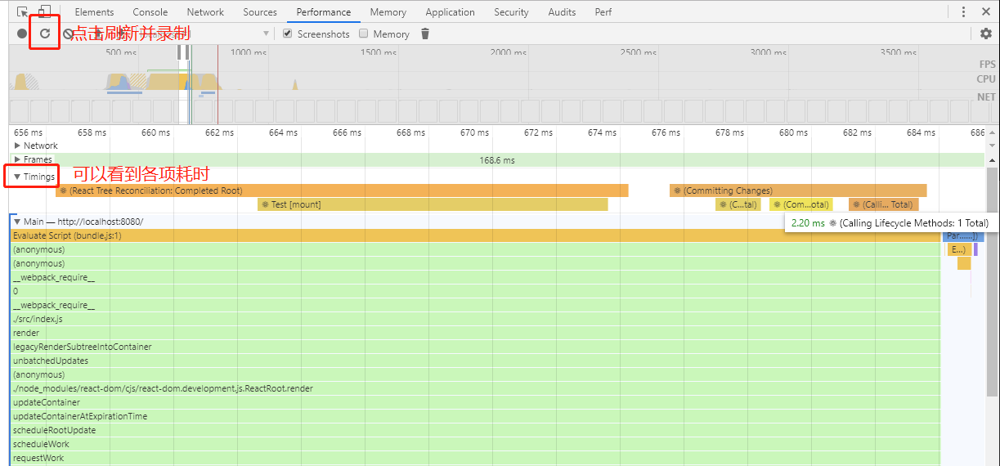
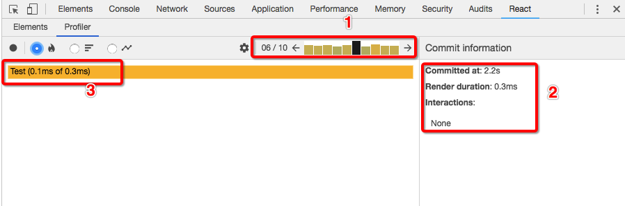
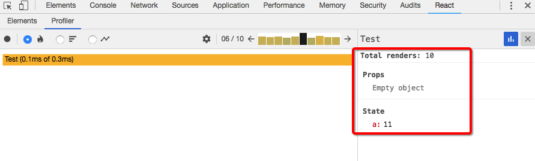

# React 进阶知识

## 一、优化性能

Virtual DOM 在性能上已经实现了非常大的突破，但是在我们的开发中依然存在着可以优化的点。下面会说明常见优化项，以及使用工具来查看优化效果

### 1、避免重新渲染

shouldComponentUpdate 可能是 React 组件生命周期函数中除了 render 函数之外最重要的一个函数了，render 函数决定`组件渲染处什么`，shouldComponentUpdate 函数决定`什么时候不需要重新渲染`。

React 组件类的父类 Component 提供了 shouldComponentUpdate 的默认实现方式，返回 true ，所以默认每次更新都是会调用所有生命周期函数的，这也包括调用 render 函数。但是在实际中，组件并不是每次都需要重新渲染的，所以为了达到的更好的性能，我们需要定义好组件的 shouldComponentUpdate 函数，让它在需要的时候返回 false 来通知 React 不要继续更新，以此来节省大量的计算资源。


#### 实现方式一：单组件手动定制优化 

手动定制可以针对性提高性能，但普适性不强。

```javascript
shouldComponentUpdate(nextProps, nextState) {
    if (this.props.color !== nextProps.color) {
      return true;
    }
    if (this.state.count !== nextState.count) {
        return true;
    }
    return false;
}
```

#### 实现方式二：批量简单处理

可以通过 React.PureComponent 来统一添加该逻辑，内部实现采用的是`浅比较`。普适性强，但是可能出现误导情况。

虽然深比较看上去更可靠，但是同时更浪费内存和更耗性能，而且也不能简单的递归所有层次的字段，毕竟传进来的 props 对象结构是组件无法管控和预料的，所以浅比较是一个普遍被接受的做法。

```javascript
class PureComponent extends Component {
    shouldComponentUpdate(nextProps, nextState) {
        for(let prop in nextProps) {
            if(nextProps[prop] != this.props[prop]) {
                return true;
            }
        }
        for(let key in nextState) {
            if(nextState[prop] != this.state[prop]) {
                return true;
            }
        }
        return false;
    }
}
```

#### 实现方式三：浅比较 + 不可变数据

两个思路：

- 主动维护数据不可变
    - 数组中的某些方法会返回全新数组
    - ES6 的展开语法深拷贝
    - Object.assign 拷贝只有一层的对象
- 借助工具维护
    - 核心功能：
        - 可以基于共享部分对象来创建新的对象，可以更高效拷贝对象，而且原始集合依然存在
    - 特点：
        - 不可变(Immutable): 一个集合一旦创建，在其他时间是不可更改的。
        - 持久的(Persistent): 新的集合可以基于之前的结合创建并产生突变，例如：set。原来的集合在新集合创建之后仍然是可用的。
        - 结构共享(Structural Sharing): 新的集合尽可能通过之前集合相同的结构创建，最小程度地减少复制操作来提高性能。
    - Immutable.js 
        - 库比较大
        - 支持类型全面
        - 语法和常规不太一致
    - seamless-immutable.js
        - 精简库
        - 只支持 Object 和 Array
        - 语法更贴近常规开发

### 2、性能分析工具

1. 打开 chrome 工具 Performance ，点击 Record 或者 Start profiling and reload page
2. 执行需要分析的动作，录制时间不要太长，会崩
3. 查看 Timing 下的 React 各事件的耗时

?react_perf 这个查询参数作用待补充。



> v16.5 提供了对新的 React Developer Tools - Profiler 的支持，可以通过收集每个组件的渲染耗时，来帮助我们找到 ReactApp 的渲染瓶颈，并且整个界面更加清爽清晰。



录制操作同上，简单说一下该工具
1. 区域1，显示每次 commit 耗时，黑色是当前选中，可以点选具体
2. 区域2，显示当前选中的 commit 发生在第几s，render 阶段耗时多久
3. 区域3，表示这次 commit 里每一个组件的耗时，点击具体的组件，右边就是显示具体内容，如下图



## 二、 Reconciliation 调和

### 1、Virtual DOM 

React 利用 Virtual DOM 使得每次渲染都只重新渲染最少的 DOM 元素，以此实现`尽量减少 DOM 操作`这一重要性能优化点。

相对于 DOM 树是对 HTML 的抽象，那我们就可以把 Virtual DOM 看作是对 DOM 树的抽象。前面提到 JSX 会被 Babel 解析成 React.createElement() 方法的调用来生成 React 元素对象，这些对象会被渲染成真实 DOM ，而在构建真实 DOM 树之前，首先构建的就是 Virtual DOM 。

当前每次更新，从上到下渲染 React 组件时，会对比这一次产生的 Virtual DOM 和上一次渲染的 Virtual DOM ，对比差异，然后只修改差异部分对应的 DOM 树，以此实现性能大幅优化。

### 2、Diffing 差分算法

> 上面提到的，找出两棵树的所有不同点的过程就叫做 `Reconciliation 调和`，所使用的算法就是 `Diffing 算法`。

对比两个 N 个节点的树形结构的算法，时间复杂度是 O(N³)，这时执行时间的增长率是非常可怕的，React 并没有采用这种算法。实际采用的算法需要的时间复杂度是 O(N)，这应该是最低时间复杂度的情况了。虽然这种算法肯定不是最精准的，但是对于 React 应对的场景来说，绝对是**性能和复杂度的最好折衷**。当开发者配合一些基本要求时，这种算法效率就可以得以体现。

下面看一下 React 取属性结果差异算法。其调和算法并不复杂，当 React 需要对比两个 Virtual DOM 树形结构时，从根节点开始递归往下比对，每个节点都是其下子树的根节点，所以这个对比算法可以从 Virtual DOM 树的任一个节点开始执行。下面是不同情况的处理方式

- （根）节点类型不同：卸载后重新装载
    - 树结构根节点类型不同时，认为改动很大，直接弃用原来的树形结构（先卸载），然后重新构建新的 DOM 树（再装载）
    - 这种是空间换时间的方式，以重新装载的空间浪费，降时间复杂度从 O(N³) 降到 O(N)
    - 开发者需要注意，避免作为包裹功能的节点类型随意改变（一般也不改变这个）
- （根）节点类型相同：只更新
    - 子节点类型为 DOM 元素型，会保留并更新修改的部分
    - 子节点类型为 React 组件类型，根据新节点 props 更新组件实例（**shouldComponentUpdate** 函数返回 false 时会截止更新，所以是个性能优化关键点）
- 多个子组件的情况
    - React 没有采用找出两个子组件序列不同之处的处理方式，因为两个序列的差异算法时间复杂度是 O(N²)
    - 采用直接挨个比较每个子组件，只要同位置组件不同，就会触发强制更新，这种也是空间换时间
    - 但是上面的方法可以继续优化，开发者主动给子组件添加 key（需要是子组件序列中的**唯一不变**的 ID），对于不变的子组件，通过用原 props 启动更新实现更新操作的拦截，所以不能用 index 。

## 三、 Context 上下文对象

前面学习了 props ，可以用于父组件向子组件传递数据。但是当我们需要跨越多层组件进行数据传递时， props 的维护将变得非常困难，此时就需要另外一个解决方案。

> Context 通过组件树提供了一个传递数据的方法，从而避免了在每一个层级手动的传递 props 属性。

### 1、旧版使用

```javascript
import React, { Component } from 'react';
import PropTypes from 'prop-types';
export default class HomePage extends Component {
    // 1. 父组件定义 childContextTypes 子上下文类型
    static childContextTypes = {
        color: PropTypes.string,
        setColor:PropTypes.func
    }
    // 2. 父组件定义 getChildContext 方法用来返回上下文对象
    getChildContext() {
        return {
            color: this.state.color,
            setColor: this.setColor
        }
    }
    constructor() {
        super();
        this.state = { color: 'red' };
    }
    // 类似 props ，状态不能子组件改，只能自己改，所以要声明一个修改方法并通过 context 传递
    setColor = (color)=>{
        this.setState({color});
    }
    render() {
        return (
            <div>
                <Content />
            </div>
        )
    }
}

class Content extends Component {
    // 3. 在需要接受的子组件中定义 contextTypes 上下文类型，接收哪个就定义哪个，不定义是拿不到的
    static contextTypes = {
        color: PropTypes.string,
        setColor: PropTypes.func
    }
    render() {
        console.log(this.context);
        return (
            <div>
                <h1 style={{ color: this.context.color }}>我是内容</h1>
                <button onClick={()=>this.context.setColor('green')}>变绿</button> 
                <button onClick={()=>this.context.setColor('yellow')}>变黄</button> 
            </div>
        )
    }
}
```

### 2、新版使用(v16.3)

> v16.6 简化了获取 context 的方式，可以省略外层包裹 <Consumer> ，直接用 this.context 获取

API：
- React.createContext
    - `const { Provider, Consumer} = React.createContext(defaultValue);`
    - 使用默认 context 取值创建两个组件
- Provider 提供者
    - `<Provider value = {/* some value */}>`
    - 可以显示传入 value 属性，用于覆盖上级组件数传下来的值及 defaultValue
- Consumer 消费者
    - `<Consumer> {value => /* render something based on the context value */} </Consumer>`
    - 该组件接收一个`函数作为子节点`，函数接收当前 context 的值并返回一个 React 节点
    - value 取值有函数作用域的感觉
        - 参数 value 将等于组件树中上层 context 的最近的 Provider 的 value 属性
        - 如果上层组件树种没有 Provider ，那么就是 defaultValue

```javascript
// context.js 单独文件提供两个组件
// 创建 context 实例
export const ThemeContext = React.createContext({
    background: 'red',
    color: 'white'
    toggleTheme: () => {},  // 说明：同 props 不可变性一样， context 修改不能由组件完成，而应该传入一个函数
});
```

```javascript
// app.js
import React from 'react';
import ReactDOM from 'react-dom';
import {ThemeContext} from './context';

// 调用 Provider 组件，接受 value 值，可以传给其后代中的 Consumer
class App extends React.Component {
    render () {
        return (
            <ThemeContext.Provider value={{background: 'green', color: 'white'}}>
                <Header />
            </ThemeContext.Provider>
        );
    }
}
// 中间组件，上层组件树中有个 Provider ，下层组件树种有个 Consumer 
class Header extends React.Component {
    render () {
        return (
            <Title>Hello React Context API</Title>
        );
    }
}
// Consumer 可以订阅 context 变化，接受一个函数作为子节点，context 作为函数的参数
class Title extends React.Component {
    render () {
        return (
            <ThemeContext.Consumer>
                {context => (
                    <h1 style={{background: context.background, color: context.color}}>
                        {this.props.children}
                    </h1>
                )}
            </ThemeContext.Consumer>
        );
    }
}
```

### 2、说明

不要滥用 context ，会使组件的复用性变差。一定要是多个层级的多个组件需要访问相同数据的场景下再用。

eg： Redux 使用 context 添加唯一的全局 store ； UI 框架的主题、语言

一般来说，如果你只是单纯的想避免需要传很多次 props 的话，可以直接使用 `Composition (组合)` 会更好，eg：

```javascript
// JSX 标签内的任何内容都将通过 children 属性传入
function FancyBorder(props) {
    return (
        <div className={'FancyBorder FancyBorder-' + props.color}>
            {props.children}
        </div>
    );
}
function WelcomeDialog() {
    return (
        <FancyBorder color="blue">
            <h1 className="Dialog-title">  Welcome </h1>
            <p className="Dialog-message"> Thank you for visiting our spacecraft! </p>
        </FancyBorder>
    );
}
```

```javascript
// 当需要在组件中有多个入口，这种情况下可以使用自己约定的属性，而不是 children
function SplitPane(props) {
    return (
        <div className="SplitPane">
            <div className="SplitPane-left">
                {props.left}
            </div>
            <div className="SplitPane-right">
                {props.right}
            </div>
        </div>
    );
}

function App() {
    return (
        <SplitPane
            left={ <Contacts /> }
            right={ <Chat /> } 
        />
    );
}
```

## 四、高阶组件 HOC Higher Order Components

> 高阶组件（HOC）是 React 中的高级技术，用来`重用组件逻辑`。但高阶组件本身并不是 React API 。它`只是一种模式`，这种模式是由 React 自身的组合性质必然产生的。

具体而言，**高阶组件就是一个函数，且该函数接受一个组件作为参数，并返回一个新的组件。**所以高阶组件并不是一个组件。

```javascript
const EnhancedComponent = higherOrderComponent(WrappedComponent); // 语义化说明
const NewComponent = higherOrderComponent(OldComponent); // 简单说明
```

注意，高阶组件既不会修改输入组件，也不会使用继承拷贝它的行为。而是，高阶组件`组合（composes）`原始组件，通过用一个容器组件`包裹（wrapping）`原始组件。高阶组件就是一个没有副作用的`纯函数`。

问题：**为什么不能修改输入组件？**

在使用高阶组件这一模式时，约定不能修改输入组件，因为一旦出现修改，那么再应用其他高阶组件时，`修改可能会被覆盖`，这样会出现不可控的情况。而如果想要修改变得可控，使用者就必须知道内部的实现方式，才能保证不出现冲突，而这会泄露了组件的`抽象性`。

```javascript
import React, {Component} from 'react';

// 1. 参数1必须是组件，其他参数根据需要来，这不就是柯里化吗
export default (WrappedComponent, name) => {
    class HighOrderComponent extends Component{
        constructor() {
            super();
            this.state = { data: null };
        }

        // 2. 提取的通用操作，可以根据入参做一些事情
        componentWillMount() {
            // 执行通用操作
        }

        // 3. 渲染原组件，并将所需数据传入，但是并不修改原始组件，而是组合
        // 传递的数据可以是公共逻辑处理后的，也可以是通用 props 属性
        render() {
            return <WrappedComponent data={this.state.data}/>
        }
    }
    return HighOrderComponent;
}
```

### 1、几个约定

1. 不修改输入组件，采用组合方式
    ```javascript
    render() {
        return <WrappedComponent {...this.props}/>
    }
    ```
2. 贯穿传递不相关 props 属性给输入组件
    ```javascript
    render() {
        // extraProp 是专门给高阶组件用的，剩余的不相关属性应该统一贯穿传递
        const { extraProp, ...passThroughProps } = this.props;

        // 由高阶组件统一传入 props 属性，一般都是具有通用定义的状态值、由 extraProp 获得的数据、通用的方法
        const injectedProp = someStateOrInstanceMethod;

        return (
            <WrappedComponent
                injectedProp={injectedProp} // 高阶组件增加的 props
                {...passThroughProps} // 贯穿传递的 props 
            />
        );
    }
    ```
3. compose 组合，柯里化（有用）
    ```javascript
    // 简写后的 redux connect 用法，这也是一个高阶函数，返回的是一个高阶组件，这个高阶组件再去接收一个组件类型的参数
    const ConnectedComment = connect(commentSelector, commentActions)(Comment);

    // 拆分后表现
    const enhance = connect(commentListSelector, commentListActions); // 获取一个高阶组件
    const ConnectedComment = enhance(CommentList); // 获取一个最终想要的组件，传入了指定的 props

    // 补充，有种 @connect 装饰器语法，所以这个其实就是装饰者模式
    ```
4. 为了便与调试，可以加个通用字段标识创建后的组件名（没用过）
    ```javascript
    function withSubscription(WrappedComponent) {
        class WithSubscription extends React.Component {/* ... */}
        WithSubscription.displayName = `WithSubscription(${getDisplayName(WrappedComponent)})`;
        return WithSubscription;
    }

    function getDisplayName(WrappedComponent) {
        return WrappedComponent.displayName || WrappedComponent.name || 'Component';
    }
    ```  

### 2、 几个警告 

1. 不要在render方法内使用高阶组件
    - 每一次渲染都会创建一个新的组件版本，新旧版本组件不是全等 === 
    - 不全等时，会先完全卸载，而不是使用 diff 算法进行局部更新，性能非常差
2. 静态方法会丢失，需要做拷贝
    - 虽然原始组件被包裹于一个容器组件内，但这也就意味着新组件会没有原始组件的任何静态方法
    - 拷贝静态方法，需要知道要拷贝什么方法，或者用 `hoist-non-react-statics` 自动拷贝
        ```javascript
        import hoistNonReactStatic from 'hoist-non-react-statics';
        function enhance(WrappedComponent) {
            class Enhance extends React.Component {/*...*/}
            hoistNonReactStatic(Enhance, WrappedComponent);
            return Enhance;
        }
        ```
3. refs 不能传递其引用
    - 不是像 key 一样，refs 是一个伪属性，React 对它进行了特殊处理
    - 高阶组件的 refs 会指向最外层容器组件实例，而不是被包裹的组件
    - v16.3 版本的 `React.forwardRef` 可以实现传递
        ```javascript
        function logProps(Component) {
            class LogProps extends React.Component {
                render() {
                    const {forwardedRef, ...rest} = this.props;
                    return <Component ref={forwardedRef} {...rest} />;
                }
            }

            function forwardRef(props, ref) {
                return <LogProps {...props} forwardedRef={ref} />;
            }
            return React.forwardRef(forwardRef);
        }   
        ```

## 五、 Portals 插槽

> v16.0 提供，主要是为了解决将子节点`渲染到父组件以外 DOM 节点`的诉求，如对话框。

出现之前的问题描述：
1. 最终渲染产生的 html 存在于 JSX 产生的 HTML 中，定位容易出问题
2. 层级关系不清晰，dialog实际是独立在app之外的

```javascript
// child：可渲染的 React 子元素    container：一个 DOM 元素
ReactDOM.createPortal(child, container);
```

项目比较少用，一般在 UI 框架中用的多。

```javascript
const modalRoot = document.getElementById('modal-root');

class Modal extends React.Component {
    constructor(props) {
        super(props);
        this.el = document.creatElement('div');
    }
    componentDidMount() {
        modalRoot.appendChild(this.el);
    }
    componentWillUnmount() {
        modalRoot.removeChild(this.el);
    }
    render() {
        return ReactDOM.createPortal(this.props.children, this.el);
    }
}
```

## 六、 Error Boundaries 错误边界

> v16.0/v16.6 提供，为了解决`单组件报错而影响全局 UI 无法显示`的问题。可以参考 try catch 理解。工作机制类似与 `catch{}` ，只是应用于组件。

错误边界是`用于捕获其子组件树 JavaScript 异常，记录错误并展示一个回退的 UI` 的 React 组件，而不是整个组件树的异常。错误边界在渲染期间、生命周期方法内、以及整个组件树构造函数内捕获错误。

### 1、无法捕获的错误

- 事件处理
    - 所以内部代码的稳健性还需要自行保证， try catch 搞起来
- 异步代码
    - setTimeout 、 requestAnimationFrame 的回调函数
- 服务端渲染
- 错误边界自身抛出来的错误
    - 只能捕获组件在树中比他低的组件的错误
    - 如果无法捕获，会向上冒泡

### 2、使用方式说明

```javascript
// 定义
class ErrorBoundary extends React.Component {
    constructor(props) {
        super(props);
        this.state = { hasError: false };
    }

    // 1. 可以配合 render 来渲染一个回退 UI （即出错时的渲染内容）v16.6 新增的
    static getDerivedStateFromError(error) {
        return { hasError: true };
    }
    // 2. 可以记录报错信息，进行日志上报（是在出错后）
    componentDidCatch(error, info) {
        logErrorToMyService(error, info);
    }

    render() {
        if (this.state.hasError) {
            return <h1>Something went wrong.</h1>;
        }
        return this.props.children; 
    }
}
```

```javascript
// 像普通组件一样使用，
<ErrorBoundary>
    <MyWidget />
</ErrorBoundary>
```

### 3、放在哪里用

其实错误边界的粒度并没有固定标准，完全由开发者自己决定。但是有个说明，从 React 16起，任何未被错误边界捕获的错误将导致卸载整个 React 组件树。

个人感觉，应该至少放一个最顶层的错误边界用于 catch 全局错误，至少能给用户一些提示。而针对于核心业务逻辑组件，应该单独处理错误边界，并嵌入日志上报收集的能力，以便更好的改进应用。至于最佳实践，还需继续保持关注并实践。

## 七、 Fragments 片段

> v16.2 提供，在需要返回一个子元素列表时，`不再在 DOM 中增加额外节点`，HTML 嵌套也就没那么深那么难看了，也可以避免一些无效情况的产生，如 tr、td 标签。

```javascript
// 用法一：空 JSX 标签，该语法不能接受键值或属性。<></> 是 <React.Fragment/> 的语法糖。
render() {
    return (
        <>
            <td>Hello</td>
            <td>World</td>
        </>
    );
}
// 用法二：语义化标签，可以接受唯一属性 key
render() {
    return (
        <React.Fragment>
            <td>Hello</td>
            <td>World</td>
        </React.Fragment>
    );
}
```

## 八、 Hooks

> v16.8 它就是最靓的仔