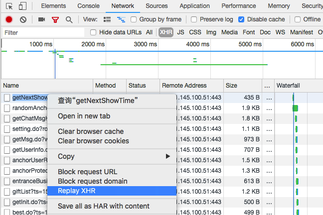
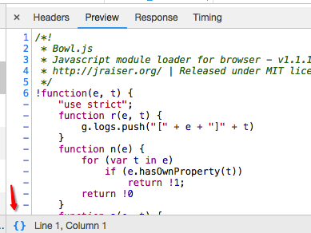
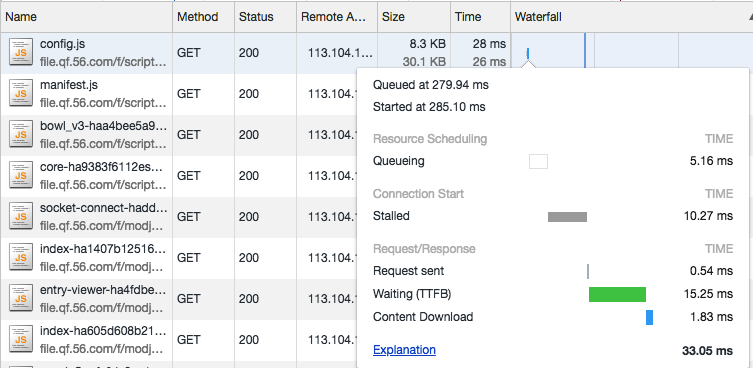
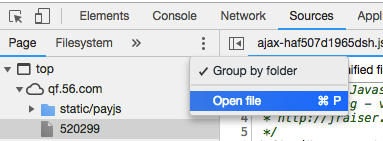

# 零、Command 命令菜单

爽一把，打开新世界的大门~

## 菜单唤起

- 快捷键：[Ctrl]+[Shift]+[P] (or [⌘]+[Shift]+[P] on Mac)
- 界面入口：开发者工具右上角，选择 Run command 

## 功能分类

Panel、Drawer、Appearance、Console、Debugger、DevTools、Elements、Help、Mobile、Navigation、Network、Performance、Persistence、Rendering、Settins、Sources

## 截屏 screenshot

- 截全屏 Capture full size screenshot
- 截某节点 Capture node screenshot

## 其他关键词

主题切换 theme 、面板切换 layout 、控制台显示时间戳 timestamps

# 一、Console 控制台

> 记录开发者开发过程中的日志信息，且可以作为与 JS 进行交互的命令行 Shell

## 1.1 $ 相关

- $ + 数字
    - 对应 Elements 中选中的 html 节点的引用关系，自动更新
        - 等同于使用 W3C DOM 规范中的 document.getxx 
    - $0 一直对应当前（最后一次引用）的节点
    - $1 依次类推，从现在往前推
    - 用途不甚明显
- **$ 和 $$**
    - 使用前提：页面中没有定义过哦 $ 变量（如 jQuery）
    - $ 相当于 document.querySelector 的别名
        - 测试：$('div') == document.querySelector('div')
    - $$ 约等于 document.QuerySelectorAll ，不同于其结果 Node list ，此处会返回一个节点数组
        - 测试：Array.from(document.querySelectorAll('div'))[0] === $$('div')[0]，数组肯定不相等
- **$_**
    - 对上次执行的结果的引用
        - 多步计算测试时，可以偷懒不用不复制上一步执行结果
- $i
    - 在 console 中加载 npm 库，需要插件支持(Console Importer)，没插件直接报错
    - 使用：$i('jquery')

## 1.2 copy

- copy(xxx)
    - 可以复制参数到其他地方使用
    - 直接配合上面的 copy($_)、copy($0) 复制长文本有点用

## 1.3 保存堆栈跟踪

- 右键选择 save as
    - 会保存 console 中所有信息到一个 log 文件
    - 可以通过筛选，只保存需要的
    - 用途可能在于让测试保留报错的堆栈信息

## 1.4 console 系列方法

- console.dir 
    - 显示对象属性、方法
    - 可用于打印 DOM 节点具体信息
- console.table 
    - 表格显示数据
    - 表格可缩放、排序，参数2可指定展示列名
- console.trace 
    - 访问调用堆栈
- console.time + console.timeEnd 
    - 计时
- consoel.assert 
    - 断言，参数1为 false 时显示参数2（带有堆栈跟踪信息）

## 1.5 **Custom Formatters 自定义转换器**

有这么个情况，使用 console.log 打印对象时，经常会和预期不符，常见表现如下图：


> 原因：在 console 中打印出的对象，在打印之前，都是以引用的形式保存的

~~一般情况下呢，我们直接用 JSON.stringify 打出来长长的字符串，但是它没缩进啊，瞅着很不舒服啊。~~

其实 [JSON.stringify](https://developer.mozilla.org/zh-CN/docs/Web/JavaScript/Reference/Global_Objects/JSON/stringify) 是可以通过参数3来指定缩进用的空白字符串个数的。

所以，我们可以用 Custom Formatters 自定义转换器，来定制打印格式。

### 启用 Custom Formatters

1. 打开设置面板
    - 快捷键：F1
    - 界面入口：开发者工具右上角，选择 Settings
2. 勾选设置项
    - Console 大类
    - Enable custom formatters 选项

### 设置 Custom Formatters

formatter 是一个最多有三个方法的对象：
- header — 处理如何展示在 console 的日志中的主要部分 (基本就用这一个)
    - 如果 return null 则使用默认的转换方式，即默认格式打印
    - 返回了一个 JsonML (译者注：JsonML: JSON Markup Language JSON 标记语言)数组，组成：
        - 标签名
        - 属性对象，可以定制炫酷的样式
        - 内容 (文本值或者其他元素)
- hasbody — 如果你想显示一个用来展开对象的 ▶ 箭头，返回 true，此时要设置 body 
- body - 定义将会被显示在展开部分的内容中

```javascript
window.devtoolsFormatters = [{
    header: function(obj){
        return ['div', {}, `${JSON.stringify(obj, null, 4)}`]
    },
    hasBody: function(){
        return false;
    }
}]
```

一个逗比的例子：
```javascript
window.devtoolsFormatters = [{
    header: function(obj){
      if (!obj.__clown) {
        return null;
      }
      delete obj.__clown;
      const style = `
        color: red;
        border: dotted 2px gray;
        border-radius: 4px;
        padding: 5px;
      `
      const content = `🤡 ${JSON.stringify(obj, null, 2)}`;

      try {
        return ['div', {style}, content]
      } catch (err) { // for circular structures
        return null;  // use the default formatter
      }
    },
    hasBody: function(){
        return false;
    }
}]

console.clown = function (obj) {
  console.log({...obj, __clown: true});
}

console.log({message: 'hello!'});   // normal log
console.clown({message: 'hello!'}); // a silly log
```

## 1.6 异步 console

- console 是异步的，默认被 async 包裹，可以直接在控制台中使用 await 关键字，省去书写 Promise 的烦恼
- eg：await fetch('www.baidu.com/api')

## 1.7 显示时间戳

- 在命令菜单中搜索 timestamps ，选择启用，即可显示 hh:mm:ss.xxx 
- 关闭的话重新选择一次

## 1.8 **打印变量值时展示对应变量名**

将打印的参数包装在大括号中，即可将参数列表转变为对象打印，因为 ES6 中引入了 `enhanced object literal(增强对象文字面量)`


如果将上面的方法替换成 `console.table` 可以更直观展示


## 1.9 查看页面刷新前的日志

console 右上角 ⚙︎ 勾选 Preserve log

# 二、Elements 元素

> 查找网页源代码 HTML 中的任一元素，手动修改任一元素的属性和样式且能实时在浏览器里面得到反馈

## 2.1 移动元素

- **拖拽**
    - 选中某个 DOM 元素，直接拖拽到目标位置，相应的样式会重新计算，不需要修改页面模板
- 位移
    - 类似 IDE 中，[ctrl] + [⬆] / [ctrl] + [⬇] ( [⌘] + [⬆] / [⌘] + [⬇] on Mac)
    - 扩展：其实还有更像编辑器的功能，复制、粘贴不说了，还可以撤销、充值做修改

## 2.2 隐藏元素

- 选中某个 DOM 元素，点击 h 键，显示就隐藏了
- 效果等同于 visibility:hidden; 页面中还会占位
- 一般用于截图时屏蔽某些东西，如果想去掉元素，可以用删除键

## 2.3 [取色器 Color picker](https://juejin.im/post/5c10d9d1f265da611819028)

这个理解不深，只会取色，有需要看原文吧


## 2.4 [阴影编辑器 Shadow editor](https://juejin.im/post/5c137ac3f265da617974b675)

测试效果很方便，当然个人觉的 CSS-shadow 属性的学习也挺有帮助的。


## 2.5 定时函数编辑器 Timing function editor / 贝塞尔编辑器 Cubic bezier editor

简直炫酷，可以用于贝塞尔曲线的不同取值效果的查看学习。


## 2.6 快速插入上面几种样式规则的按钮


## 2.7 调节数字取值的快捷键

- +/- 1 ↑/↓
- +/- 0.1 ⌥↑/⌥↓
- +/- 10 ⇧↑/⇧↓

## 2.8 expand recursively 递归展开节点

不需要按个点击节点前的 ▷ 级联按钮，可以一次性递归展开所有子节点


## 2.9 DOM breakpoints (DOM 断点)

设置 DOM 断点，可以监听到节点被添加或者移除，或属性被改变。


# 三、Network 网络

> 从发起网页页面请求 Request 后分析 HTTP 请求后得到的各个请求资源信息（包括状态、资源类型、大小、所用时间等），可以根据这个进行网络性能优化

## 3.1 **replay XHR requests** (不刷页面时重新发送 XHR 的请求)



## 3.2 查看请求调用堆栈

添加 initiator 显示


将鼠标悬停到指定请求的 initiator 信息上，即可查看完整调用堆栈，点击可以跳转到源

## 3.3 查看页面加载时间

- DOMContentLoaded 
    - 事件会在页面上 DOM 完全加载并解析完毕之后触发，不会等待CSS、图片、子框架加载完成
    - 对应 Overview 和 Waterfall 上蓝色竖线标记
- Load
    - 事件会在页面上所有 DOM、CSS、JS、图片完全加载完毕之后触发
    - 对应 Overview 和 Waterfall 上红色竖线标记

## 3.4 查看资源详情时格式化压缩代码

pretty print 优质打印，在资源详情中 Preview 或 Response 栏左下角有个 {} ，点击进行模式切换



## 3.5 分析资源在请求的生命周期内各部分时间花费信息



- Resource Scheduling 资源调度
    - Queuing 排队
        - 排队的时间花费
        - 可能由于该请求被渲染引擎认为是优先级比较低的资源（图片）、服务器不可用、超过浏览器的并发请求的最大连接数
- Connection Start 连接开始
    - Stalled 停滞
        - 从 HTTP 连接建立到请求能够被发出送出去(真正传输数据)之间的时间花费
        - 包含用于处理代理的时间，如果有已经建立好的连接，这个时间还包括等待已建立连接被复用的时间
- Request/Response 请求响应
    - Request sent 
        - 发起请求的时间
    - **Waiting (Time to first byte (TTFB))**
        - 最初的网络请求被发起到从服务器接收到第一个字节这段时间
        - 它包含了 TCP 连接时间，发送 HTTP 请求时间和获得响应消息第一个字节的时间
        - 时间花费如果超过200ms，则应该考虑对网络进行性能优化了
    - Content Download 
        - 内容下载，获取 Response 响应数据的时间花费

## 3.6 查看资源的发起者(请求源)和依赖项

- 操作
    - 按住 shift 把光标移动到目标资源名称上
- 请求源
    - 目标资源是由哪个对象或进程发起的
    - 标为绿色
- 依赖项
    - 目标资源请求过程中引发了哪些资源
    - 标为红色


## 3.7 查看页面加载前的记录

勾选 `Preserve lop` 选项，即可查看页面刷新前的请求，如测试 form 表单提交时，可以查看请求具体内容

# 四、Sources 源代码

> 断点调试 JS

## 4.1 条件断点 Conditional breakpoints

设置条件断点的主要目的是减少循环执行的次数，使其只在某些情况下执行。

1. 右击一个已经设置的断点并且选择 Edit breakpoint(编辑断点)
2. 输入一个执行结果为 true 或者 false 的表达式
    - 条件满足时，断点才会暂停代码执行
    - 它的值并不需要明确的为 true 或者 false ，尽管那个弹出框的描述是这样说
    - 表达式中，可以获取到任何这段代码可以获取到的东西，即这一行的作用域

## 4.2 **炫酷黑科技，线上打印 log**

下面我们来看下怎么在线上代码中插入执行 console.log 来打印，功能实现基于上面的「条件断点」 

解释：
- 每一个条件都必须经过判断 - 也就是 - 运行 - 每当应用执行到这一行
- 并且如果条件返回的是 false 的值(例如. undefined )，并不会暂停

操作：
- 插入：在编辑断点时，将需要的 console.log 写到条件中
- 移除：右侧 Breakpoints section 列表中可以右键批量删除断点条件

缺点：
- 压缩的代码好像不好使


## 4.3 XHR/fetch 断点

1. sources 面板 XHR/fetch breakpoints 栏，点击右侧 + 
2. 填写需要拦截的url，可以是部分
    - 不填就全部拦截
    - 填写拦截指定


## 4.4 快速打开文件

快捷键 ⌘ + P ，用部分路径搜索文件



# 五、**Performance 性能**

> 记录并分析在网站的生命周期内所发生的各类事件，以此可以提高网页的运行时间的性能。(低版本:  Timeline)

# 六、**Memory 内存**

> 比 Performance 能提供的更多信息，比如记录 JS CPU 执行时间细节、显示 JS 对象和相关的 DOM 节点的内存消耗、记录内存的分配细节。利用这个面板你可以追踪网页程序的 `内存泄漏` 问题，进一步提升程序的 `JavaScript 执行性能`。(低版本: Profiles)

# 其他

## Application 应用

> 记录网站加载的所有资源信息，包括存储数据（Local Storage、Session Storage、IndexedDB、Web SQL、Cookies）、缓存数据、字体、图片、脚本、样式表等

## Security 安全

> 通过该面板可以去调试当前网页的安全和认证等问题并确保您已经在你的网站上正确地实现 HTTPS ，安全的绿色，不安全的红色

## Audits

> 对当前网页进行网络利用情况、网页性能方面的诊断，并给出一些优化建议。比如列出所有没有用到的CSS文件等

## Drawer

- 打开平行选项卡 Drawer
    - 开发者工具右上角，选择 Hide console drawer
    - 快捷键 Esc
- Drawer 界面左上角可以选择更多选项卡
    - Animations
    - Changes 查看 css 调试记录
        - 类似 git 进行差异变化的展示
    - Console 控制台
        - 完全一样的控制台
    - Coverage 获取冗余代码摘要-细节信息
        - 可以跑一段时间，看下哪些代码没有执行到，包括 js、css
    - Network conditions 模拟网络状态
        - Network 中也有
    - Performance monitor
    - Quick source 极简版 source
        - 可能用处不大
    - Remote devices
    - Rendering
    - Request blocking
    - Search
    - Sensors 传感器
        - 选择经纬度模拟特定位置
        - 模拟 3D 空间中设备位置
    - What’s new

# 参考链接

- [【译】你不知道的Chrome调试工具技巧 系列](https://juejin.im/post/5c09a8151882521c81168a2)
- [Chrome开发者工具中文文档 Breack易站](https://www.breakyizhan.com/chromeconsole/1249.html)
- [优化关键渲染路径(performance调优实战)](https://mp.weixin.qq.com/s/PyRQk2saDqGoGhDZ_0ICUQ)
- [网站性能优化 之 Chrome DevTools 系列](https://www.jianshu.com/p/504bde348956)
- [Chrome Devtools Performance使用指南](https://mp.weixin.qq.com/s/oR64gtwvSs4ogv12GRpE4w)
- [前端调试清单之优化网络资源](https://mp.weixin.qq.com/s/HCpRfab0spfB9mi2qfSo-w)
- [Chrome DevTools - 性能监控](https://mp.weixin.qq.com/s/hXLIR7ZZ30jNCuJuQZ9RiA)

# 一些插件

- Google 翻译 (阅读)
- Vue.js devtools (调试)
- React Developer Tools (调试)
- Redux DevTools (调试)
- QR Code Generator 二维码生成器(调试)
- Axure RP Extension 设计稿 (协作)
- Charset 修改编码
- Octotree 快速查看 GitHub 代码
- Proxy SwitchyOmega 代理管理、切换
- Allow Copy 允许复制
- OneTab 减少内存，将标签页转换成列表