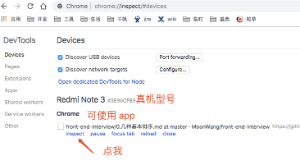

> 查看下文以前，要有2个概念，**静态资源代理**（网络环境）和 **PC 调试真机**（硬件设备），这是两个相辅但独立的两项内容。

# 一、静态资源代理（网络环境）

## 1、需求场景

实际开发中，经常需要**真机访问 PC 上的本地代码**，以便真机能快速响应更新，避免每次更改都需要先发布后验证。

## 2、调试实现

### 2.1 思路

其实解决思路很简单，就是 PC 启动本机代理服务，手机设置 wifi 代理指向 PC ，此时手机每次网络访问都会经过 PC ，PC 设置 host 即可影响到手机的实际访问。

### 2.2 具体

#### 2.2.1 PC 开启代理服务（获取 ip + 端口号）

window 下，可以使用 ccproxy ，非常简单，中文界面，看着设置就行。默认已经开启并设置好了代理，直接看配置拿 ip 和 端口号即可。

mac 下，可以使用 charles ，英文界面，凑合也能看懂，如果只开代理则不用配置，help - SSL proxying - Mobile device xx 查看 ip 和端口号即可。

#### 2.2.2 手机设置 wifi 代理（设置 ip + 端口号）

安卓，进入 wifi  设置，选择当前连接，进入更多设置，配置代理（不同机型可能有差异，自行百度）。

IOS ，进入 wifi 设置，选择当前连接，进入更多设置，配置代理（手动）。

## 3、补充

暂无

# 二、PC 调试真机（硬件设备）

## 1、需求场景

实际开发中，在真机上调试并不是非常方便，想看请求详情需要抓包、想看控制台和元素面板需要用类似 vConsole 第三方工具且非常不方便，所以需要**在 PC 上展示控制台**来提高调试效率。

## 2、调试实现

### 2.1 思路

这个也不能叫思路，应该说借助浏览器自带的能力实现调试，chrome 和 safari 都有所支持，使用方式和适用场景有所差异。

### 2.2 具体

#### 2.2.1 chrome + android

1. 安卓机，需要先开启开发者模式（每款开启方式不同，自行百度）
    - 设置 - 开发者选项 - USB 调试开启
2. 使用 usb 线连接到 PC 并根据提示操作
3. 安卓机打开 chrome 浏览器
4. PC 上 chrome 浏览器访问 chrome://inspect/#devices 
5. 真机链接成功后，会看到如下界面
    
6. 点击 inspect 即可打开调试窗口（类似一个完整的浏览器，还可以投射手机屏幕）
    - 但是这个东西需要翻墙，因为需要加载一些东西，不翻墙的用法需要找人买，没去研究
    - 如果没有翻墙工具，可以下载这个 chrome 插件 ，https://github.com/MoonWang/ChromeAppHeroes 搜索 setup VPN
    - 加载完成调试窗口以后，要把翻墙工具关了，因为翻墙其实也是代理来的，会影响第一部分提到的资源问题

#### 2.2.2 safari + ios

1. ios 打开调试模式，设置 - Safari 浏览器 - 高级 - web 检查器 开启
2. 使用 USB 线连接到 PC ，并打开手机上的 safari 浏览器
3. 打开 safari 浏览器，开发 - iphone - 选择手机上已打开的页面，即可打开调试工具

## 3、其他

- IOS 上的 chrome 调试没研究成功，放弃吧
- safrai 问题比较少，直接用 IOS + safari 大法一把梭一下就行了
- 安卓下的微信调试也可以用 2.2.1 方法