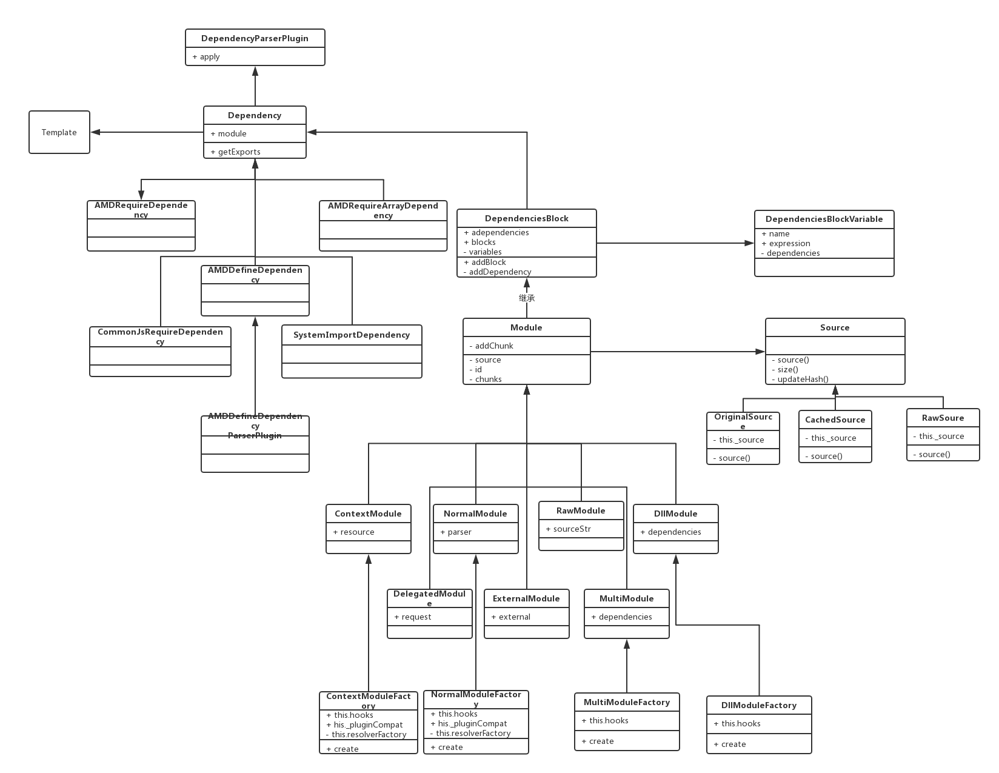
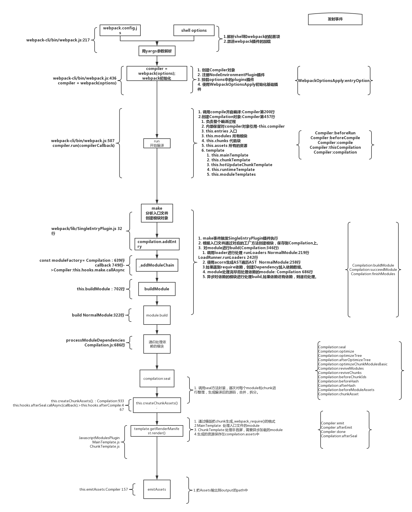
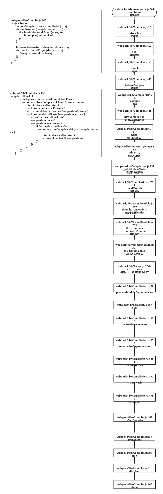

# 一、Tapable

Webpack 本质上是一种事件流的机制，它的工作流程就是将各个插件串联起来，而实现这一切的核心就是 Tapable ，Webpack 中最核心的负责编译的 `Compiler` 和负责创建 bundles 的`Compilation` 都是 Tapable 的实例

> [Tapable](https://github.com/webpack/tapable/tree/master)也是一种`发布订阅模式`的工具库，参考 EventEmitter 记忆。其中 v1 版本是对应 Webapck4，v0.2 版本对应之前版本。

## 1. 钩子类型说明

- 同步 sync
    - SyncHook
        - 普通同步钩子
        - 多个订阅同步执行，相互之间无任何关系
    - SyncBailHook
        - 保险同步钩子(熔断)
        - 多个订阅中，任一个返回值不为 null 则跳过剩下的逻辑
    - SyncWaterfallHook
        - 流式同步钩子
        - 多个订阅存在关系，上一个的返回值是下一个的输入值(回调函数参数)
    - SyncLoopHook
        - 循环同步钩子
        - 一般只声明一个可循环执行的订阅回调，该函数返回 true 表示继续循环，返回 undefine 表示结束循环
- 异步 async
    - 并行 parallel
        - AsyncParallelHook
            - 普通异步并行钩子
            - 多个订阅相互之间无关系，一起开始执行，以执行时间最长的为终点，执行发布(调用钩子)时定义的回调函数
            - 每个订阅的执行结束，以该函数显示调用一个方法来通知外部
                - queue.tapAsync 定义，则回调函数最后一个参数 callback 为结束方法
                - queue.tapPromise 定义，则回调函数返回一个 promise ，以其 resolve 为结束方法
        - AsyncParallelBailHook
            - 熔断异步并行钩子
    - 串行 series
        - AsyncSeriesHook
            - 普通异步串行钩子
            - 和 AsyncParallelHook 不同，此时上一个执行完再执行下一个，执行完也是通过显示调用结束方法来进行通知
        - AsyncSeriesBailHook
            - 熔断异步串行钩子
        - AsyncSeriesWaterfallHook
            - 流式异步串行钩子

## 2. 使用

- 同步钩子只支持 `tap` 注册、`call` 触发
- 异步钩子支持 `tap` `tapAsync` `tapPromise` 注册、`call` `callAsync` `promise` 触发
    - queue.call(data);
    - queue.callAsync(data, () => {});
    - queue.promise(data).then(res => {}, err => {});

```javascript
let { SyncHook } = require('tapable');
// 创建指定类型实例
let queue = new SyncHook(['xxx']);
// 订阅（注册钩子）
queue.tap('+++',function(xxx){
    console.log(xxx);
});
// 发布（调用钩子）
queue.call('data');
```

## 附：说明

先大概了解每个类型的钩子的定义、执行上的区别，方便查看 webpack 源码时的理解。实现细节先略过，没必要一下吃透，等看完 webpack 源码，再回头看具体实现细节。

# 二、通过 VScode 调试 webpack

## 1. 准备工作

- 安装 favorites 插件，可以收藏、快捷查看源码文件
    - 收藏 webpack、webpack-cli 文件夹
- 根目录下添加一段调试脚本，使用 vsc 的 f5 调试（不要用右键 runCode）
    ```javascript
    const path = require('path');

    // 开启一个子进程，衍生一个 shell ，执行命令
    require('child_process').exec("npm config get prefix", function(err, stdout, stderr) {
        // 拿到 node 的全局路径
        // mac：/Users/moonwang/.nvm/versions/node/v8.9.4
        // win：D:\bin\node
        console.log(stdout); 

        // 路径特殊处理 win/*nix support
        let nixLib = (process.platform.indexOf("win") === 0) ? "" : "lib"; 

        // 获取 webpack 全局包的路径，找到入口文件，最新版本应该是 webpacl-cli/bin/cli.js（旧版的曾是 webpack.js）
        let webpackPath = path.resolve(path.join(
            stdout.replace("\n", ""), 
            nixLib, 
            'node_modules', 
            'webpack-cli', 
            'bin', 
            'cli.js'
        ));

        // 如果没有安装全局包，可以直接写本地路径
        // let webpackPath = './node_modules/webpack-cli/bin/cli.js';

        // /Users/moonwang/.nvm/versions/node/v8.9.4/lib/node_modules/webpack-cli/bin/cli.js
        console.log(webpackPath);
        // 虽然引入的是全局包的路径，但是调试的时候会先从本地包找，本地包打上断点开始调试吧
        require(webpackPath);
    });
    ```

## 2. 主要代码说明

> "webpack": "^4.29.6", "webpack-cli": "^3.2.3",

### webpack-cli 入口

> 主要流程节点：`yargs 解析参数`、`初始化 webpack 生成 compiler` 、`开始执行 compiler.run`

```javascript
// webpack-cli/lib/cli.js 是一个自执行函数
(function(){
    // 44 行，引入 yargs
    const yargs = require("yargs").usage();
    // 58 行，配置 yargs
    yargs.options({});
    // 206 行，解析参数
    yargs.parse(process.argv.slice(2), (err, argv, output) => {
        // 413 行， webpack 初始化，调用 webpack 方法生成唯一 compiler 
        // webpack 为 webpack/lib/webpack.js ，进入查看初始化操作详情
        let compiler = webpack(options);

        // 493 行，执行编译，进入 webpack/lib/Compiler.js 文件查看 run 方法
        compiler.run(compilerCallback);
    });
})();
```

### webpack 初始化

```javascript
// webpack/lib/webpack.js
const webpack = (options, callback) => {
    
    // 39 行，创建 compiler 
    // Compiler 最核心的类，进入 webpack/lib/Compiler.js 查看
    compiler = new Compiler(options.context);

    // 41 行，注册 NodeEnvironmentPlugin 插件
    new NodeEnvironmentPlugin().apply(compiler);

    // 42 行，挂载用户配置的 plugins 插件
    if (options.plugins && Array.isArray(options.plugins)) {
        for (const plugin of options.plugins) {
            if (typeof plugin === "function") {
                plugin.call(compiler, compiler);
            } else {
                plugin.apply(compiler);
            }
        }
    }

    // 53 行，使用 WebpackOptionsApply 挂载内部插件
    compiler.options = new WebpackOptionsApply().process(options, compiler);

    return compiler;
};
module.exports = webpack;
```

### Compiler 编译器（唯一）

> - 主要负责创建 Compilation ，管控整个流程
> - 主要流程节点：run -> compile -> make -> seal -> run.onCompiled.emitAssets

```javascript
// webpack/lib/Compiler.js
class Compiler extends Tapable {
	constructor(context) {
		super();
		this.hooks = {
			done: new AsyncSeriesHook(["stats"])
            // ... 定义一系列的不同生命周期、不同类型的钩子
        }
        // 其他初始化操作
    }

    run(callback) {
        // 编译完成后的操作
        const onCompiled = (err, compilation) => {
            // 输出文件资源
			this.emitAssets(compilation, err => {
				this.emitRecords(err => {
					this.hooks.done.callAsync(stats, err => {
						return finalCallback(null, stats);
					});
				});
			});
		};

        // 触发一系列钩子事件
        this.hooks.beforeRun.callAsync(this, err => {
			this.hooks.run.callAsync(this, err => {
                // 读文件，其内部调用了 inputFileSystem 文件读写
				this.readRecords(err => {
                    // 开始编译
					this.compile(onCompiled);
				});
			});
		});
    }

    compile(callback) {
		this.hooks.beforeCompile.callAsync(params, err => {
			this.hooks.compile.call(params);
            // 617 行，每次编译都会重新创建一个 Compilation
			const compilation = this.newCompilation(params);
            // 619 行，make 分析入口文件，创建模块对象 ，进入 webpack/lib/SingleEntryPlugin.js
            /**
            * 1. this.hooks.make.callAsync 单步调试会进入 tapable/lib/Hook.js  lazyCompileHook
            * 2. 在 154 行单步调试会进入调用栈
            * 3. 在 _fn0(compilation 行单步调试会进入 webpack/lib/SingleEntryPlugin.js 43 行
            */
            // 触发 make 钩子
			this.hooks.make.callAsync(compilation, err => {
                compilation.finish();
                // 624 行，分析完入口文件获取了依赖关系后，要开始封装 module 和 chunk 
				compilation.seal(err => {
                    // 编译完成后事件
					this.hooks.afterCompile.callAsync(compilation, err => {
                        // 都编译完成后，回到 run 方法中，执行 onCompiled 方法
						return callback(null, compilation);
					});
				});
			});
		});
	}

    newCompilation(params) {
        // 创建 Compilation ，见 webpack/lib/Compilation.js
		const compilation = new Compilation(this);
		this.hooks.thisCompilation.call(compilation, params);
		this.hooks.compilation.call(compilation, params);
		return compilation;
	}
}
```

### Compilation 编译对象

> 负责整个编译过程

```javascript
// webpack/lib/Compilation.js
class Compilation extends Tapable {
	constructor(compiler) {
        super();
        this.compiler = compiler; //Compiler对象
        this.resolvers = compiler.resolvers; //模块解析器
		this.hooks = {}; // 一系列钩子
        this.entries = []; // 入口
        this.chunks = []; // 所有代码块
        this.preparedChunks = []; // 预先加载的chunk
        this.namedChunks = {}; // 每个都对应一个名字，可以通过 namedChunks[name] 获取 chunk
        this.modules = []; // 模块
        this.assets = {}; // 保存所有生成的文件 资源
        this.children = []; // 保存子 Compilation 对象，子 Compilation 对象依赖它的上级 Compilation 对象生成的结果，所以要等父 Compilation 编译完成才能开始
        // 模板
        this.mainTemplate = new MainTemplate(this.outputOptions); //生成主模块JS
		this.chunkTemplate = new ChunkTemplate(this.outputOptions); //异步加载的模块JS
		this.hotUpdateChunkTemplate = new HotUpdateChunkTemplate(this.outputOptions); //热更新是的代码块模版JS
		this.runtimeTemplate = new RuntimeTemplate(this.outputOptions,this.requestShortener);
		this.moduleTemplates = {
			javascript: new ModuleTemplate(this.runtimeTemplate, "javascript"),
			webassembly: new ModuleTemplate(this.runtimeTemplate, "webassembly")
		};  //入口模块代码
    }
    // 递归获取模块依赖关系
    addEntry(context, entry, name, callback) {
        // 1074 行，添加依赖关系链
        this._addModuleChain()
    }
    _addModuleChain(context, dependency, onModule, callback) {
        // 根据依赖模块的类型获取对应的模块工厂，用于后边创建模块。
        const Dep = /** @type {DepConstructor} */ (dependency.constructor);
		const moduleFactory = this.dependencyFactories.get(Dep);
        // 根据 module 类型，使用对应的工厂函数创建对应类型的模块，这里是 NormalMoudle
        // 并将创建出来的 module 作为参数传给回调方法，就是下边`function(err, module)`的参数
        moduleFactory.create({}, () => {
             // 下面要对 module 进行 build ，包括调用 loader 处理源文件，使用 acorn 生成 AST 
            this.buildModule(module, false, null, null, err => {
                this.semaphore.release();
                // 执行时会判断是否需要递归处理依赖模块 this.processModuleDependencies
                // 遍历 AST 遇到 requirt 等依赖时，创建依赖 (Dependency) 加入依赖数组
                afterBuild(); 
            });
        })
    }
    buildModule(module, optional, origin, dependencies, thisCallback) {
        // 进入 NormalModule.js build 方法，然后调用 doBuild 方法，其中调用 runLoaders 方法(LoaderRunner.js 中)，开始对 source 加工（用户开发的 loader 在这里开始调用）
        module.build(, error => {
                // 触发钩子
                // 执行回调
            }
        )
    }

    // 开始处理 module 和 chunk
    // 调用 seal 方法封装，要逐次对每个 module 和 chunk 进行整理，生成编译后的源码，合并，拆分，生成 hash
    seal(callback) {
        this.createModuleAssets();
        this.createChunkAssets();
    }
    /** 
     * 1. 通过模板把 chunk 生成 webpack_require() 格式的结果代码
     * 2. MainTemplate 处理入口文件的 module
     * 3. ChunkTemplate 处理非首屏、需要异步加载的 module
     * 4. 生成的资源保存在 compilation assets 中
    */
    createChunkAssets() {
        // 如果是入口，则使用 MainTemplate 生成结果，否则使用 ChunkTemplate
        const template = chunk.hasRuntime() ? this.mainTemplate : this.chunkTemplate;
    }
}
```

### SingleEntryPlugin 插件

由 make 事件触发执行，主要作用是分析入口文件、创建模块对象

```javascript
// webpack/lib/SingleEntryPlugin.js
class SingleEntryPlugin {
    apply(compiler) {
        // 注册了对 make 事件的监听，等 compiler 执行 make 时触发
        compiler.hooks.make.tapAsync(
			"SingleEntryPlugin",
			(compilation, callback) => {
                // compile 中 make 进入这里
				const { entry, name, context } = this;
                // 45 行，根据入口文件，通过对饮工程方法创建依赖关系
                const dep = SingleEntryPlugin.createDependency(entry, name);
                // 将依赖关系保存到 compilation 上，进入到 webpack/lib/Compilation.js addEntry 方法
				compilation.addEntry(context, dep, name, callback);
			}
		);
    }
}
```

# 三、流程小结

## 1. 流程概括

- 初始化参数
    - 从配置文件和 Shell 语句中读取与合并参数，得出最终的参数；
- 开始编译
    - 用上一步得到的参数初始化 Compiler 对象，加载所有配置的插件，执行对象的 run 方法开始执行编译
- 确定入口
    - 根据配置中的 entry 找出所有的入口文件
- 编译模块
    - 从入口文件出发，调用所有配置的 Loader 对模块进行翻译，再找出该模块依赖的模块，再递归本步骤直到所有入口依赖的文件都经过了本步骤的处理
- 完成模块编译
    - 在经过上一步使用 Loader 翻译完所有模块后，得到了每个模块被翻译后的最终内容以及它们之间的依赖关系
- 输出资源
    - 根据入口和模块之间的依赖关系，组装成一个个包含多个模块的 Chunk，再把每个 Chunk 转换成一个单独的文件加入到输出列表，这步是可以修改输出内容的最后机会
- 输出完成
    - 在确定好输出内容后，根据配置确定输出的路径和文件名，把文件内容写入到文件系统

## 2. 详细流程

> 代码位置以 "webpack": "^4.29.6", "webpack-cli": "^3.2.3" 版本处理，不同版本代码位置可能有出入，但事件名相同

Webpack 的构建流程可以分为以下三大阶段：

- `初始化`：启动构建，读取与合并配置参数，加载 Plugin，实例化 Compiler。
- `编译`：从 Entry 发出，针对每个 Module 串行调用对应的 Loader 去翻译文件内容，再找到该 Module 依赖的 Module，递归地进行编译处理。
- `输出`：对编译后的 Module 组合成 Chunk，把 Chunk 转换成文件，输出到文件系统

### 2.1 初始化阶段

事件名 | 解释 | 对应代码 | 类型
--- | --- | --- | ---
初始化参数 | 从配置文件和 Shell 语句中读取与合并参数，得出最终的参数 | webpack-cli/bin/webpack.js:413 | 
实例化 Compiler | 用上一步得到的参数初始化 Compiler 实例，Compiler 负责文件监听和启动编译。Compiler 实例中包含了完整的 Webpack 配置，全局只有一个 Compiler 实例 | webpack/lib/webpack.js:39 | 
加载插件 | 依次调用插件的 apply 方法，让插件可以监听后续的所有事件节点。同时给插件传入 compiler 实例的引用，以方便插件通过 compiler 调用 Webpack 提供的 API | webpack/lib/webpack.js:42 | 
environment | 开始应用 Node.js 风格的文件系统到 compiler 对象，以方便后续的文件寻找和读取 | webpack/lib/webpack.js:51 | 
entry-option | 读取配置的 Entrys，为每个 Entry 实例化一个对应的 EntryPlugin，为后面该 Entry 的递归解析工作做准备 | webpack/lib/WebpackOptionsApply.js:307 | SyncHook
after-plugins | 调用完所有内置的和配置的插件的 apply 方法 | webpack/lib/WebpackOptionsApply.js:492 | SyncHook
after-resolvers | 根据配置初始化完 resolver，resolver 负责在文件系统中寻找指定路径的文件 | webpack/lib/WebpackOptionsApply.js:530 | SyncHook

### 2.2 编译阶段

事件名 | 解释 | 对应代码 | 类型
--- | --- | --- | ---
run | 启动一次新的编译 | webpack/lib/Compiler.js:278 | AsyncSeriesHook
watch-run | 和 run 类似，区别在于它是在监听模式下启动的编 | 译，在这个事件中可以获取到是哪些文件发生了变化导致重新启动一次新的编译 | webpack/lib/Watching.js:40 | AsyncSeriesHook
compile | 该事件是为了告诉插件一次新的编译将要启动，同时会给插件带上 compiler 对象 | webpack/lib/Compiler.js:615 | SyncHook
compilation | 当 Webpack 以开发模式运行时，每当检测到文件变化，一次新的 Compilation 将被创建。一个 Compilation 对象包含了当前的模块资源、编译生成资源、变化的文件等。Compilation 对象也提供了很多事件回调供插件做扩展 | webpack/lib/Compiler.js:581 | SyncHook
make | 一个新的 Compilation 创建完毕，即将从 Entry 开始读取文件，根据文件类型和配置的 Loader 对文件进行编译，编译完后再找出该文件依赖的文件，递归的编译和解析 | webpack/lib/Compiler.js:619 | AsyncParallelHook
after-compile | 一次 Compilation 执行完成 | webpack/lib/Compiler.js:627 | AsyncSeriesHook

在编译阶段中，最重要的要数 compilation 事件了，因为在 compilation 阶段调用了 Loader 完成了每个模块的转换操作，在 compilation 阶段又包括很多小的事件，它们分别是：

事件名 | 解释 | 对应代码 | 类型
--- | --- | --- | ---
build-module | 使用对应的 Loader 去转换一个模块 | webpack/lib/Compilation.js:634 | SyncHook
normal-module-loader | 在用 Loader 对一个模块转换完后，使用 acorn 解析转换后的内容，输出对应的抽象语法树（AST），以方便 Webpack 后面对代码的分析 | webpack/lib/NormalModule.js:221 | SyncHook
program | 从配置的入口模块开始，分析其 AST，当遇到 require 等导入其它模块语句时，便将其加入到依赖的模块列表，同时对新找出的依赖模块递归分析，最终搞清所有模块的依赖关系 | webpack/lib/Parser.js:2120 | SyncBailHook
seal | 所有模块及其依赖的模块都通过 Loader 转换完成后，根据依赖关系开始生成 Chunk | webpack/lib/Compilation.js:1189 | SyncHook

### 2.3 输出阶段

事件名 | 解释 | 对应代码 | 类型
--- | --- | --- | ---
should-emit | 所有需要输出的文件已经生成好，询问插件哪些文件需要输出，哪些不需要 | webpack/lib/Compiler.js:230 | SyncBailHook
emit | 确定好要输出哪些文件后，执行文件输出，可以在这里获取和修改输出内容 | webpack/lib/Compiler.js:441 | AsyncSeriesHook
after-emit | 文件输出完毕 | webpack/lib/Compiler.js:432 | AsyncSeriesHook
done | 成功完成一次完成的编译和输出流程 | webpack/lib/Compiler.js:234_250_267 | AsyncSeriesHook
failed | 如果在编译和输出流程中遇到异常导致 Webpack 退出时，就会直接跳转到本步骤，插件可以在本事件中获取到具体的错误原因 | webpack/lib/Compiler.js:217 | SyncHook

## 3. 代码流程

- 通过 `yargs` 获得 shell 中的参数
- 把 `webpack.config.js` 中的参数和 `shell` 参数整合到 `options` 对象上
- 调用 `webpack-cli/bin/webpack.js` 开始编译和打包
- webpack-cli/bin/webpack.js 中返回一个 `compiler` 对象，并调用了 `compiler.run()`
- lib/Compiler.js 中，run 方法触发了 `before-run、run`两个事件，然后通过 `readRecords `读取文件，通过 compile 进行打包,该方法中实例化了一个 `Compilation `类
- 打包时触发 `before-compile、compile、make` 等事件
- make 事件会触发 `SingleEntryPlugin` 监听函数，调用 `compilation.addEntry` 方法
- 这个方法通过调用其私有方法 `_addModuleChain` 完成了两件事：根据模块的类型获取对应的模块工厂并创建模块
    - 调用 `loader` 处理模块之间的依赖
    - 将 loader 处理后的文件通过 `acorn` 抽象成抽象语法树 `AST`
    - 遍历 AST ，构建该模块的所有依赖
- 调用 Compilation 的 `finish、seal` 方法

## 4. 关键事件

- **entry-option**：初始化options
- after-plugins
- after-resolvers
- environment
- after-environment
- before-run
- **run**：开始编译
- watch-run
- normal-module-factory
- context-module-factory
- before-compile
- compile
- this-compilation
- compilation
- **make**：从 entry 开始递归分析依赖并对依赖进行 build
- **build-module**：使用 loader 加载文件并 build 模块
- **normal-module-loader**：对 loader 加载的文件用 acorn 编译，生成抽象语法树 AST
- **program**：开始对 AST 进行遍历，当遇到 require 时触发 call require 事件
- after-compile
- should-emit
- need-additional-pass
- **seal**：所有依赖 build 完成，开始对 chunk 进行优化（抽取公共模块、加 hash 等）
- **optimize-chunk-assets**：优化代码
- **emit**：把各个chunk输出到结果文件
- after-emit
- done
- failed
- invalid
- watch-close

# 附：类图、流程图



注：下面流程图中的源码地址有出入，方法名是对的


